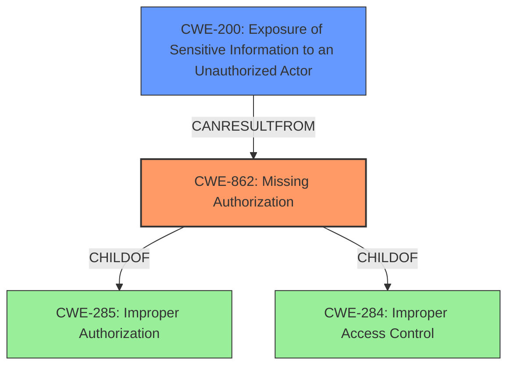

# Raw Analyzer Response for CVE-2022-20104

```markdown
# Summary
| CWE ID  | CWE Name                                                                                                | Confidence | CWE Abstraction Level | CWE Vulnerability Mapping Label | CWE-Vulnerability Mapping Notes |
| :-------- | :-------------------------------------------------------------------------------------------------------- | :----------- | :---------------------- | :-------------------------------- | :-------------------------------- |
| CWE-862   | Missing Authorization                                                                                     | 1          | Class                   | Allowed-with-Review               | Primary CWE                       |
| CWE-200   | Exposure of Sensitive Information to an Unauthorized Actor                                            | 0.7          | Class                   | Discouraged                     | Secondary Candidate               |

## Evidence and Confidence

*   **Confidence Score:** 0.85
*   **Evidence Strength:** HIGH

## Relationship Analysis
The primary relationship impacting the decision is that CWE-862 [Missing Authorization] is a child of both CWE-285 [Improper Authorization] and CWE-284 [Improper Access Control], indicating its role in vulnerabilities related to inadequate permission checks. CWE-200 [Exposure of Sensitive Information to an Unauthorized Actor] can result from missing authorization, making it a potential secondary effect rather than the root cause. The abstraction levels guided selection towards CWE-862 as a Class-level weakness.



## Vulnerability Chain
The vulnerability chain starts with **improper access control** (identified in the vulnerability description and CVE summary) leading to **missing authorization** (CWE-862), which results in **information disclosure**.

## Summary of Analysis
The initial analysis identified **improper access control** as the root cause, leading to the selection of CWE-862 [Missing Authorization] as the primary CWE. The vulnerability description mentions "a possible information disclosure due to **improper access control**." The CVE Reference Links Content Summary confirms this: "Root cause: **Improper access control** in aee daemon. Weaknesses: **Improper access control**. Impact: Local information disclosure."

CWE-862's description, "The product does not perform an authorization check when an actor attempts to access a resource or perform an action," aligns perfectly with the vulnerability description. The evidence strongly supports this classification.

CWE-200 [Exposure of Sensitive Information to an Unauthorized Actor] was considered as a secondary CWE because the impact of the vulnerability is information disclosure. However, CWE-200 is discouraged by MITRE as it is often misused to represent the impact of a vulnerability rather than the root cause. In this case, the **improper access control** is the root cause, and the information disclosure is the result.

The selection of CWE-862 is at the optimal level of specificity because it directly addresses the **missing authorization** aspect of the vulnerability, which is a more precise characterization than the broader **improper access control**.
```