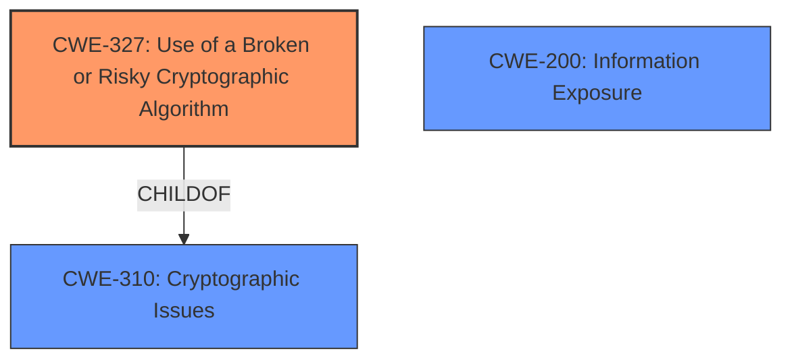

# Analysis for CVE-2022-20117

# Summary
| CWE ID | CWE Name | Confidence | CWE Abstraction Level | CWE Vulnerability Mapping Label | CWE-Vulnerability Mapping Notes |
|---|---|---|---|---|---|
| CWE-327 | Use of a Broken or Risky Cryptographic Algorithm | 0.8 | Base | Primary | Allowed |
| CWE-310 | Cryptographic Issues | 0.4 | Class | Secondary | Allowed-with-Review |
| CWE-200 | Information Exposure | 0.3 | Class | Secondary | Allowed-with-Review |

## Evidence and Confidence

*   **Confidence Score:** 0.8
*   **Evidence Strength:** MEDIUM

## Relationship Analysis
The primary CWE is CWE-327 which is a Base level CWE that is a child of CWE-310 (Class). CWE-310 is a general class of cryptographic issues. CWE-200 is a class level that represents information exposure.

## Vulnerability Chain
The vulnerability chain starts with the **improper use of crypto** (CWE-327), which leads to the ability to decrypt local data (CWE-200).

## Summary of Analysis
The initial assessment identified the **improper use of crypto** as the root cause, which directly leads to information disclosure. The analysis considered CWEs related to cryptographic issues, information exposure, and potential synchronization problems, but the primary focus remained on the **improper crypto** usage as the core weakness.

The evidence from the vulnerability description key phrases states: "**rootcause:** **improperly used crypto**" which aligns well with CWE-327.

The graph relationships helped to confirm that a more specific CWE related to cryptographic algorithms (CWE-327) is more appropriate than the higher-level cryptographic issues (CWE-310). CWE-327 provides a more precise description of the weakness than CWE-310.

The selected CWEs are at the optimal level of specificity because CWE-327 directly addresses the use of broken or risky cryptographic algorithms, which is the core issue described in the vulnerability.
Relevant CWE Information:

# Enhanced Context (25 CWEs)

## CWE-327: Use of a Broken or Risky Cryptographic Algorithm
**Abstraction Level**: Base
**Vulnerability Mapping Notes**: Allowed
The vulnerability description explicitly mentions "**improperly used crypto**," which directly aligns with the characteristics of CWE-327. This is a Base level CWE, which is the preferred level.

## CWE-310: Cryptographic Issues
**Abstraction Level**: Class
**Vulnerability Mapping Notes**: Allowed-with-Review
CWE-310 is a broader category encompassing various cryptographic issues, and while relevant, it is less specific than CWE-327. The vulnerability description focuses on the improper use of crypto, making CWE-327 a more precise fit.

## CWE-200: Information Exposure
**Abstraction Level**: Class
**Vulnerability Mapping Notes**: Allowed-with-Review
The vulnerability ultimately leads to information disclosure, but the root cause is the improper crypto usage. Therefore, CWE-200 is a secondary concern, representing the impact rather than the root cause.

## CWE-667: Improper Locking
**Abstraction Level**: Class
**Vulnerability Mapping Notes**: Allowed-with-Review
This CWE relates to synchronization issues, which are not explicitly mentioned or implied in the vulnerability description.

## CWE-665: Improper Initialization
**Abstraction Level**: Class
**Vulnerability Mapping Notes**: Discouraged
The vulnerability description does not mention issues with initialization, making this CWE less relevant.

## CWE-862: Missing Authorization
**Abstraction Level**: Class
**Vulnerability Mapping Notes**: Allowed-with-Review
This CWE is related to authorization issues, which are not mentioned in the vulnerability description.

## CWE-514: Covert Channel
**Abstraction Level**: Class
**Vulnerability Mapping Notes**: Allowed-with-Review
This CWE describes covert channels, which are not directly related to the vulnerability description.

## CWE-362: Concurrent Execution using Shared Resource with Improper Synchronization ('Race Condition')
**Abstraction Level**: Class
**Vulnerability Mapping Notes**: Allowed-with-Review
This CWE relates to race conditions and concurrent execution issues, which are not described in the vulnerability.

## CWE-203: Observable Discrepancy
**Abstraction Level**: Base
**Vulnerability Mapping Notes**: Allowed
This CWE describes discrepancies in behavior, which are not the primary concern in the vulnerability description.

## CWE-205: Observable Behavioral Discrepancy
**Abstraction Level**: Base
**Vulnerability Mapping Notes**: Allowed
This CWE is similar to CWE-203 and not directly relevant to the vulnerability.

## CWE-908: Use of Uninitialized Resource
**Abstraction Level**: Base
**Vulnerability Mapping Notes**: Allowed
The vulnerability description does not mention the use of uninitialized resources.

## CWE-356: Product UI does not Warn User of Unsafe Actions
**Abstraction Level**: Base
**Vulnerability Mapping Notes**: Allowed
This CWE relates to UI warnings, which are not relevant to the vulnerability.

## CWE-1021: Improper Restriction of Rendered UI Layers or Frames
**Abstraction Level**: Base
**Vulnerability Mapping Notes**: Allowed
This CWE is specific to UI layers and frames, which are not relevant to the vulnerability.