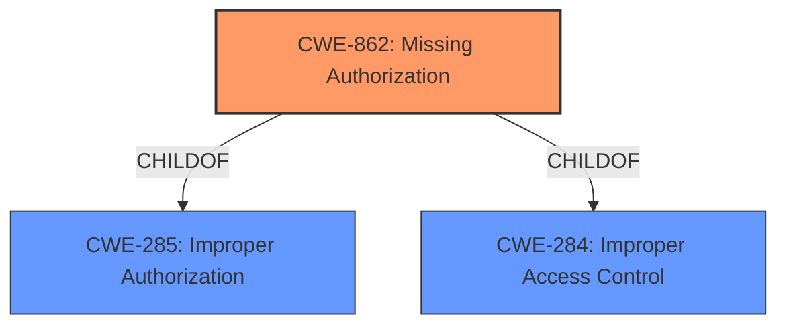

# Raw Analyzer Response for CVE-2022-20138

# Summary

| CWE ID | CWE Name | Confidence | CWE Abstraction Level | CWE Vulnerability Mapping Label | CWE-Vulnerability Mapping Notes |
|---|---|---|---|---|---|
| CWE-862 | Missing Authorization | 1 | Class | Allowed-with-Review | Primary CWE |

## Evidence and Confidence

*   **Confidence Score:** 1
*   **Evidence Strength:** HIGH

## Relationship Analysis
The primary relationship influencing the selection of CWE-862 is its role as a child of CWE-284 (Improper Access Control) and CWE-285 (Improper Authorization). While it's a Class-level CWE, the evidence directly points to a **missing permission check**, which is a clear instance of **missing authorization**. Therefore, despite the recommendation to examine children for a better fit, the directness of the evidence supports using CWE-862 as the most appropriate classification.

## Vulnerability Chain
The chain of events in this vulnerability is straightforward:
  1. **Root Cause:** **Missing permission check** (CWE-862).
  2. **Impact:** An unprivileged app can send a `MANAGED_PROFILE_PROVISIONED` intent, leading to local escalation of privilege.

## Summary of Analysis
The analysis strongly supports the selection of CWE-862 (**Missing Authorization**) as the primary CWE for this vulnerability. The vulnerability description explicitly states the root cause as a **missing permission check**, and the CVE Reference Links Content Summary confirms this by highlighting the **lack of authorization** as the underlying issue.

The evidence from the vulnerability description is: "In ACTION_MANAGED_PROFILE_PROVISIONED of DevicePolicyManagerService.java, there is a possible way for unprivileged app to send MANAGED_PROFILE_PROVISIONED intent due to a **missing permission check**."

The recommendation to examine children of CWE-862 for a better fit was considered, but no child CWE provides a more accurate representation of the described weakness. The confidence in this assessment is high (1.0) due to the explicit nature of the evidence.

Relevant CWE Information:

# Enhanced Context (25 CWEs)
The following CWEs were identified as potentially relevant to this vulnerability:

## CWE-941: Incorrectly Specified Destination in a Communication Channel
**Abstraction Level**: Base
**Similarity Score**: 0.82
**Source**: dense

**Description**:
The product creates a communication channel to initiate an outgoing request to an actor, but it does not correctly specify the intended destination for that actor.

**Mapping Guidance**:
- Usage: Allowed
- Rationale: This CWE entry is at the Base level of abstraction, which is a preferred level of abstraction for mapping to the root causes of vulnerabilities.

*Reason for not using*: This CWE is related to communication channels and destinations. The vulnerability is about a **missing permission check**, not about specifying an incorrect destination.

## CWE-754: Improper Check for Unusual or Exceptional Conditions
**Abstraction Level**: Class
**Similarity Score**: 0.78
**Source**: dense

**Description**:
The product does not check or incorrectly checks for unusual or exceptional conditions that are not expected to occur frequently during day to day operation of the product.

**Mapping Guidance**:
- Usage: Allowed-with-Review
- Rationale: This CWE entry is a Class and might have Base-level children that would be more appropriate

*Reason for not using*: While a **missing permission check** could be considered an improper check, the root cause is more specifically related to authorization, making CWE-862 a better fit.

## CWE-203: Observable Discrepancy
**Abstraction Level**: Base
**Similarity Score**: 0.77
**Source**: dense

**Description**:
The product behaves differently or sends different responses under different circumstances in a way that is observable to an unauthorized actor, which exposes security-relevant information about the state of the product, such as whether a particular operation was successful or not.

**Mapping Guidance**:
- Usage: Allowed
- Rationale: This CWE entry is at the Base level of abstraction, which is a preferred level of abstraction for mapping to the root causes of vulnerabilities.

*Reason for not using*: This CWE is about observable discrepancies that leak information. The vulnerability's main issue is the **missing authorization check**, not an observable discrepancy.

## CWE-451: User Interface (UI) Misrepresentation of Critical Information
**Abstraction Level**: Class
**Similarity Score**: 0.77
**Source**: dense

**Description**:
The user interface (UI) does not properly represent critical information to the user, allowing the information - or its source - to be obscured or spoofed. This is often a component in phishing attacks.

**Mapping Guidance**:
- Usage: Allowed-with-Review
- Rationale: This CWE entry is a Class and might have Base-level children that would be more appropriate

*Reason for not using*: This CWE relates to UI misrepresentation, which is not applicable to the **missing permission check** vulnerability.

## CWE-668: Exposure of Resource to Wrong Sphere
**Abstraction Level**: Class
**Similarity Score**: 0.76
**Source**: dense

**Description**:
The product exposes a resource to the wrong control sphere, providing unintended actors with inappropriate access to the resource.

**Mapping Guidance**:
- Usage: Discouraged
- Rationale: CWE-668 is high-level and is often misused as a catch-all when lower-level CWE IDs might be applicable. It is sometimes used for low-information vulnerability reports [REF-1287]. It is a level-1 Class (i.e., a child of a Pillar). It is not useful for trend analysis.

*Reason for not using*: While the vulnerability could be interpreted as an exposure of the intent to the wrong sphere, CWE-862 (**Missing Authorization**) is a more precise characterization of the root cause.

## CWE-927: Use of Implicit Intent for Sensitive Communication
**Abstraction Level**: Variant
**Similarity Score**: 0.76
**Source**: dense

**Description**:
The Android application uses an implicit intent for transmitting sensitive data to other applications.

**Mapping Guidance**:
- Usage: Allowed
- Rationale: This CWE entry is at the Variant level of abstraction, which is a preferred level of abstraction for mapping to the root causes of vulnerabilities.

*Reason for not using*: This CWE relates to the use of implicit intents, which is not the primary issue. The core problem is the **missing permission check** that allows an unprivileged app to send a specific intent.

## CWE-345: Insufficient Verification of Data Authenticity
**Abstraction Level**: Class
**Similarity Score**: 0.75
**Source**: dense

**Description**:
The product does not sufficiently verify the origin or authenticity of data, in a way that causes it to accept invalid data.

**Mapping Guidance**:
- Usage: Discouraged
- Rationale: This CWE entry is a level-1 Class (i.e., a child of a Pillar). It might have lower-level children that would be more appropriate

*Reason for not using*: This CWE is about verifying data authenticity. The described vulnerability is due to a **missing permission check**, not the authenticity of data.

## CWE-799: Improper Control of Interaction Frequency
**Abstraction Level**: Class
**Similarity Score**: 0.75
**Source**: dense

**Description**:
The product does not properly limit the number or frequency of interactions that it has with an actor, such as the number of incoming requests.

**Mapping Guidance**:
- Usage: Allowed-with-Review
- Rationale: This CWE entry is a Class and might have Base-level children that would be more appropriate

*Reason for not using*: This CWE is about controlling interaction frequency, which is not relevant to the **missing permission check** vulnerability.

## CWE-755: Improper Handling of Exceptional Conditions
**Abstraction Level**: Class
**Similarity Score**: 0.75
**Source**: dense

**Description**:
The product does not handle or incorrectly handles an exceptional condition.

**Mapping Guidance**:
- Usage: Discouraged
- Rationale: This CWE entry is a level-1 Class (i.e., a child of a Pillar). It might have lower-level children that would be more appropriate

*Reason for not using*: The root cause is a **missing authorization check**, which doesn't involve exceptional conditions.

## CWE-300: Channel Accessible by Non-Endpoint
**Abstraction Level**: Class
**Similarity Score**: 0.75
**Source**: dense

**Description**:
The product does not adequately verify the identity of actors at both ends of a communication channel, or does not adequately ensure the