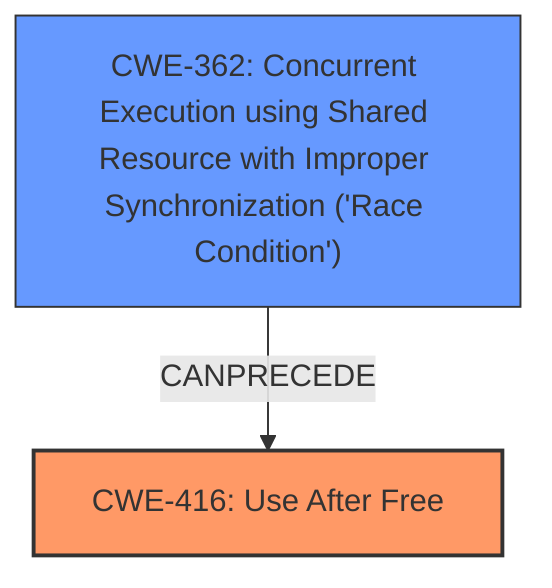

# Raw Analyzer Response for CVE-2022-20154

# Summary
| CWE ID | CWE Name | Confidence | CWE Abstraction Level | CWE Vulnerability Mapping Label | CWE-Vulnerability Mapping Notes |
|---|---|---|---|---|---|
| CWE-416 | Use After Free | 1.0 | Variant | Allowed | Primary CWE. The vulnerability description explicitly mentions a **use-after-free**. |
| CWE-362 | Concurrent Execution using Shared Resource with Improper Synchronization ('Race Condition') | 0.9 | Class | Allowed-with-Review | Secondary CWE. The vulnerability description and CVE reference summary both mention a **race condition** as the root cause of the **use-after-free**. |

## Evidence and Confidence

*   **Confidence Score:** 0.95
*   **Evidence Strength:** HIGH

## Relationship Analysis
The primary weakness is CWE-416, Use After Free, which occurs due to a race condition, CWE-362. CWE-362 is a Class-level CWE, while CWE-416 is a Variant. CWE-362 can precede CWE-416. The selection of CWE-416 is optimal as it directly describes the **use-after-free** vulnerability, while CWE-362 describes the **race condition** that leads to it.

## Vulnerability Chain
The vulnerability chain starts with a **race condition** (CWE-362), which leads to a **use-after-free** vulnerability (CWE-416). The **use-after-free** can then lead to local escalation of privilege.

## Summary of Analysis
The initial assessment identified a **use-after-free** vulnerability caused by a **race condition** in the Android kernel. The analysis was based on the vulnerability description and CVE reference summary, which explicitly mentioned these weaknesses.

The vulnerability description states: "In lock_sock_nested of sock.c, there is a possible **use after free** due to a **race condition**."

The CVE Reference Links Content Summary states: "The vulnerability is a use-after-free issue...The issue arises when...This creates a race condition where the socket can be freed before it is locked, leading to a use-after-free when the lock is acquired later."

The graph relationships show that CWE-362 can precede CWE-416, supporting the classification. The selected CWEs are at the optimal level of specificity, with CWE-416 being a Variant and CWE-362 being a Class.

Other CWEs considered but not used:

*   CWE-667 (Improper Locking): While locking is related to synchronization, the core issue is the race condition itself, not necessarily the improper locking mechanism, so CWE-362 is more appropriate.
*   CWE-413 (Improper Resource Locking): Similar to CWE-667, while improper locking could be a factor, the race condition is the primary cause.
*   CWE-665 (Improper Initialization) and CWE-909 (Missing Initialization of Resource): These are not relevant as the vulnerability is not related to initialization issues.
*   CWE-476 (NULL Pointer Dereference): While a NULL pointer dereference could occur as a result of the use-after-free, it is not the primary vulnerability.
*   CWE-366 (Race Condition within a Thread): This is a more specific type of race condition, but the provided information doesn't specifically limit it to within a single thread, so CWE-362 is a better fit.
*   CWE-415 (Double Free): This is a different type of memory corruption vulnerability and is not applicable here.
*   CWE-662 (Improper Synchronization): While related to the race condition, it's a higher level class.
*   CWE-754 (Improper Check for Unusual or Exceptional Conditions): This CWE is too general and doesn't accurately reflect the specific vulnerability.

Relevant CWE Information: