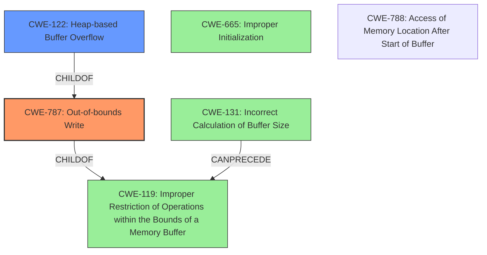

# Raw Analyzer Response for CVE-2022-20166

# Summary
| CWE ID  | CWE Name                                                                      | Confidence | CWE Abstraction Level | CWE Vulnerability Mapping Label | CWE-Vulnerability Mapping Notes |
| :-------- | :---------------------------------------------------------------------------- | :---------- | :--------------------- | :------------------------------ | :------------------------------ |
| CWE-787   | Out-of-bounds Write                                                           | 1          | Base                  | Primary CWE                     | Allowed                       |
| CWE-122   | Heap-based Buffer Overflow                                                    | 0.9         | Variant               | Secondary CWE                   | Allowed                       |
| CWE-119   | Improper Restriction of Operations within the Bounds of a Memory Buffer     | 0.7         | Class                  | Secondary CWE                   | Discouraged                       |
| CWE-665   | Improper Initialization                                                                | 0.6         | Class                  | Secondary CWE                   | Discouraged                       |
| CWE-131   | Incorrect Calculation of Buffer Size                                                           | 0.5         | Base                  | Secondary CWE                   | Allowed                       |

## Evidence and Confidence

*   **Confidence Score:** 0.9
*   **Evidence Strength:** HIGH

## Relationship Analysis
The primary weakness is CWE-787, representing the **out-of-bounds write**. CWE-122 (Heap-based Buffer Overflow) is a more specific variant of a buffer overflow occurring on the heap. CWE-119 is a more general class encompassing various memory buffer boundary issues. CWE-665 represents the broader class of improper initialization. CWE-131 addresses the incorrect sizing of buffers. The relationships between these CWEs help in understanding the specific nature and context of the vulnerability, leading to a more accurate classification.

## Vulnerability Chain
The vulnerability chain starts with a **heap buffer overflow**, leading to an **out-of-bounds write**, which results in local escalation of privilege. 
- Root Cause: **Heap Buffer Overflow**
- Weakness: **Out-of-Bounds Write**
- Impact: Local Escalation of Privilege

## Summary of Analysis
The initial assessment identified CWE-787 as the primary weakness due to the explicit mention of an **out-of-bounds write** in the vulnerability description. The **heap buffer overflow** is the root cause of the **out-of-bounds write**. The description from the CVE Reference Links Content Summary also supports this: "These functions do not inherently prevent buffer overflows when constructing strings for output to the sysfs interface, leading to potential out-of-bounds writes."

CWE-122 is included because the overflow occurs on the heap. CWE-119 is a broader category that could apply but is less specific than CWE-787 or CWE-122.

CWE-665 was considered since the description includes "improper initialization". Although not explicitly stated, it is possible that improper initialization could lead to the buffer overflow.

CWE-131 was considered because incorrect buffer size calculation can lead to buffer overflows.

The selected CWEs provide a detailed and accurate representation of the vulnerability, covering both the root cause and the resulting weakness. CWE-787 is at the optimal level of specificity, as it directly describes the **out-of-bounds write** condition.

Relevant CWE Information:

# Enhanced Context (25 CWEs)
The following CWEs were identified as potentially relevant to this vulnerability:

## CWE-667: Improper Locking
**Abstraction Level**: Class
**Similarity Score**: 0.80
**Source**: dense

**Description**:
The product does not properly acquire or release a lock on a resource, leading to unexpected resource state changes and behaviors.

**Mapping Guidance**:
- Usage: Allowed-with-Review
- Rationale: This CWE entry is a Class and might have Base-level children that would be more appropriate

## CWE-226: Sensitive Information in Resource Not Removed Before Reuse
**Abstraction Level**: Base
**Similarity Score**: 0.78
**Source**: dense

**Description**:
The product releases a resource such as memory or a file so that it can be made available for reuse, but it does not clear or "zeroize" the information contained in the resource before the product performs a critical state transition or makes the resource available for reuse by other entities.

**Mapping Guidance**:
- Usage: Allowed
- Rationale: This CWE entry is at the Base level of abstraction, which is a preferred level of abstraction for mapping to the root causes of vulnerabilities.

## CWE-404: Improper Resource Shutdown or Release
**Abstraction Level**: Class
**Similarity Score**: 0.78
**Source**: dense

**Description**:
The product does not release or incorrectly releases a resource before it is made available for re-use.

**Mapping Guidance**:
- Usage: Allowed-with-Review
- Rationale: This CWE entry is a Class and might have Base-level children that would be more appropriate

## CWE-909: Missing Initialization of Resource
**Abstraction Level**: Class
**Similarity Score**: 0.78
**Source**: dense

**Description**:
The product does not initialize a critical resource.

**Mapping Guidance**:
- Usage: Allowed-with-Review
- Rationale: This CWE entry is a Class and might have Base-level children that would be more appropriate

## CWE-131: Incorrect Calculation of Buffer Size
**Abstraction Level**: Base
**Similarity Score**: 0.77
**Source**: dense

**Description**:
The product does not correctly calculate the size to be used when allocating a buffer, which could lead to a buffer overflow.

**Mapping Guidance**:
- Usage: Allowed
- Rationale: This CWE entry is at the Base level of abstraction, which is a preferred level of abstraction for mapping to the root causes of vulnerabilities.

## CWE-662: Improper Synchronization
**Abstraction Level**: Class
**Similarity Score**: 0.77
**Source**: dense

**Description**:
The product utilizes multiple threads or processes to allow temporary access to a shared resource that can only be exclusive to one process at a time, but it does not properly synchronize these actions, which might cause simultaneous accesses of this resource by multiple threads or processes.

**Mapping Guidance**:
- Usage: Discouraged
- Rationale: This CWE entry is a level-1 Class (i.e., a child of a Pillar). It might have lower-level children that would be more appropriate

## CWE-362: Concurrent Execution using Shared Resource with Improper Synchronization ('Race Condition')
**Abstraction Level**: Class
**Similarity Score**: 0.77
**Source**: dense

**Description**:
The product contains a concurrent code sequence that requires temporary, exclusive access to a shared resource, but a timing window exists in which the shared resource can be modified by another code sequence operating concurrently.

**Mapping Guidance**:
- Usage: Allowed-with-Review
- Rationale: This CWE entry is a Class and might have Base-level children that would be more appropriate

## CWE-665: Improper Initialization
**Abstraction Level**: Class
**Similarity Score**: 0.76
**Source**: dense

**Description**:
The product does not initialize or incorrectly initializes a resource, which might leave the resource in an unexpected state when it is accessed or used.

**Mapping Guidance**:
- Usage: Discouraged
- Rationale: This CWE entry is a level-1 Class (i.e., a child of a Pillar). It might have lower-level children that would be more appropriate

## CWE-908: Use of Uninitialized Resource
**Abstraction Level**: Base
**Similarity Score**: 0.76
**Source**: dense

**Description**:
The product uses or accesses a resource that has not been initialized.

**Mapping Guidance**:
- Usage: Allowed
- Rationale: This CWE entry is at the Base level of abstraction, which is a preferred level of abstraction for mapping to the root causes of vulnerabilities.

## CWE-191: Integer Underflow (Wrap or Wraparound)
**Abstraction Level**: Base
**Similarity Score**: 0.76
**Source**: dense

**Description**:
The product