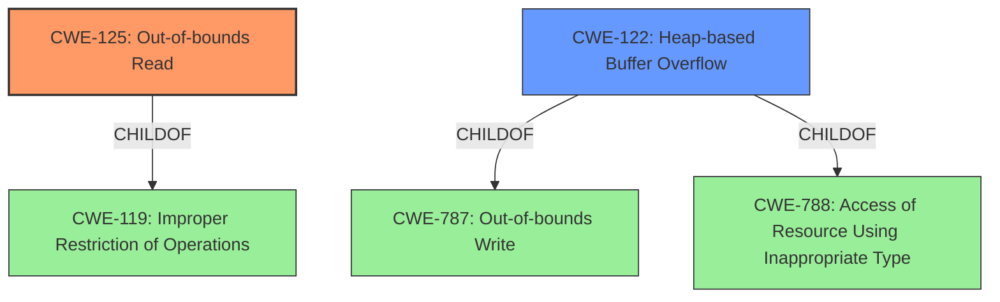

# Analysis for CVE-2022-20209

# Summary
| CWE ID | CWE Name | Confidence | CWE Abstraction Level | CWE Vulnerability Mapping Label | CWE-Vulnerability Mapping Notes |
|---|---|---|---|---|---|
| CWE-125 | Out-of-bounds Read | 0.9 | Base | Allowed | Primary CWE |
| CWE-122 | Heap-based Buffer Overflow | 0.8 | Variant | Allowed | Secondary Candidate |

## Evidence and Confidence

*   **Confidence Score:** 0.85
*   **Evidence Strength:** MEDIUM

## Relationship Analysis
The primary CWE is CWE-125, which is a base-level CWE and child of CWE-119. CWE-122 is a variant and child of CWE-788 and CWE-787. There is no direct relationship between CWE-125 and CWE-122, but both can be related to buffer issues.

## Vulnerability Chain
The vulnerability chain starts with a **heap buffer overflow**, leading to an **out of bounds read**, which results in remote information disclosure.

## Summary of Analysis
The vulnerability description indicates a **heap buffer overflow** leading to an **out of bounds read**. The primary CWE is CWE-125 (Out-of-bounds Read) since the description explicitly mentions it. The secondary CWE is CWE-122 (Heap-based Buffer Overflow) as the root cause is a heap buffer overflow.

The evidence from the vulnerability description key phrases:
- **rootcause:** **heap buffer overflow**
- **weakness:** **out of bounds read**

I am selecting CWE-125 as the primary because the description states, "there is a possible **out of bounds read** due to a **heap buffer overflow**." CWE-125 directly addresses the weakness. CWE-122 is selected as a secondary CWE because it describes the **heap buffer overflow** that caused the out-of-bounds read, which is the root cause.

Relevant CWE Information:

# Enhanced Context (25 CWEs)

## CWE-191: Integer Underflow (Wrap or Wraparound)
**Abstraction Level**: Base
**Similarity Score**: 0.80
**Source**: dense

## CWE-805: Buffer Access with Incorrect Length Value
**Abstraction Level**: Base
**Similarity Score**: 0.79
**Source**: dense

## CWE-131: Incorrect Calculation of Buffer Size
**Abstraction Level**: Base
**Similarity Score**: 0.78
**Source**: dense

## CWE-126: Buffer Over-read
**Abstraction Level**: Variant
**Similarity Score**: 0.77
**Source**: dense

## CWE-124: Buffer Underwrite ('Buffer Underflow')
**Abstraction Level**: Base
**Similarity Score**: 0.77
**Source**: dense

## CWE-127: Buffer Under-read
**Abstraction Level**: Variant
**Similarity Score**: 0.76
**Source**: dense

## CWE-125: Out-of-bounds Read
**Abstraction Level**: Base
**Similarity Score**: 0.76
**Source**: dense

## CWE-190: Integer Overflow or Wraparound
**Abstraction Level**: Base
**Similarity Score**: 0.76
**Source**: dense

## CWE-197: Numeric Truncation Error
**Abstraction Level**: Base
**Similarity Score**: 0.76
**Source**: dense

## CWE-130: Improper Handling of Length Parameter Inconsistency
**Abstraction Level**: Base
**Similarity Score**: 0.76
**Source**: dense

## CWE-190: Integer Overflow or Wraparound
**Abstraction Level**: Base
**Similarity Score**: 5928.34
**Source**: sparse

## CWE-191: Integer Underflow (Wrap or Wraparound)
**Abstraction Level**: Base
**Similarity Score**: 5628.86
**Source**: sparse

## CWE-125: Out-of-bounds Read
**Abstraction Level**: Base
**Similarity Score**: 5488.98
**Source**: sparse

## CWE-1284: Improper Validation of Specified Quantity in Input
**Abstraction Level**: Base
**Similarity Score**: 5298.33
**Source**: sparse

## CWE-839: Numeric Range Comparison Without Minimum Check
**Abstraction Level**: Base
**Similarity Score**: 5267.23
**Source**: sparse

## CWE-128: Wrap-around Error
**Abstraction Level**: base
**Similarity Score**: 5.03
**Source**: graph

## CWE-195: Signed to Unsigned Conversion Error
**Abstraction Level**: variant
**Similarity Score**: 4.53
**Source**: graph

## CWE-839: Numeric Range Comparison Without Minimum Check
**Abstraction Level**: base
**Similarity Score**: 4.33
**Source**: graph

## CWE-170: Improper Null Termination
**Abstraction Level**: base
**Similarity Score**: 4.33
**Source**: graph

## CWE-1284: Improper Validation of Specified Quantity in Input
**Abstraction Level**: base
**Similarity Score**: 4.33
**Source**: graph

## CWE-123: Write-what-where Condition
**Abstraction Level**: base
**Similarity Score**: 3.89
**Source**: graph

## CWE-1339: Insufficient Precision or Accuracy of a Real Number
**Abstraction Level**: base
**Similarity Score**: 3.57
**Source**: graph

## CWE-120: Buffer Copy without Checking Size of Input ('Classic Buffer Overflow')
**Abstraction Level**: base
**Similarity Score**: 3.36
**Source**: graph

## CWE-190: Integer Overflow or Wraparound
**Abstraction Level**: Base
**Similarity Score**: 3.32
**Source**: graph

## CWE-787: Out-of-bounds Write
**Abstraction Level**: base
**Similarity Score**: 3.30
**Source**: graph

**CWE-119 (Improper Restriction of Operations within the Bounds of a Memory Buffer)** was considered, but it is a Class-level CWE, and more specific CWEs like CWE-125 exist. The mapping guidance discourages its use when lower-level CWEs are available.

**CWE-190 (Integer Overflow or Wraparound)** and **CWE-191 (Integer Underflow (Wrap or Wraparound))** were considered because integer overflows can lead to buffer overflows. However, there is no explicit mention of integer overflow in the description.

**CWE-131 (Incorrect Calculation of Buffer Size)** was considered, but there is no information about how the buffer size was calculated.

I am maintaining a confidence score of 0.85, as the description provides clear evidence of an **out of bounds read**, and a likely cause in a **heap buffer overflow**, but the root cause is not detailed in the CVE Reference Links Content Summary.