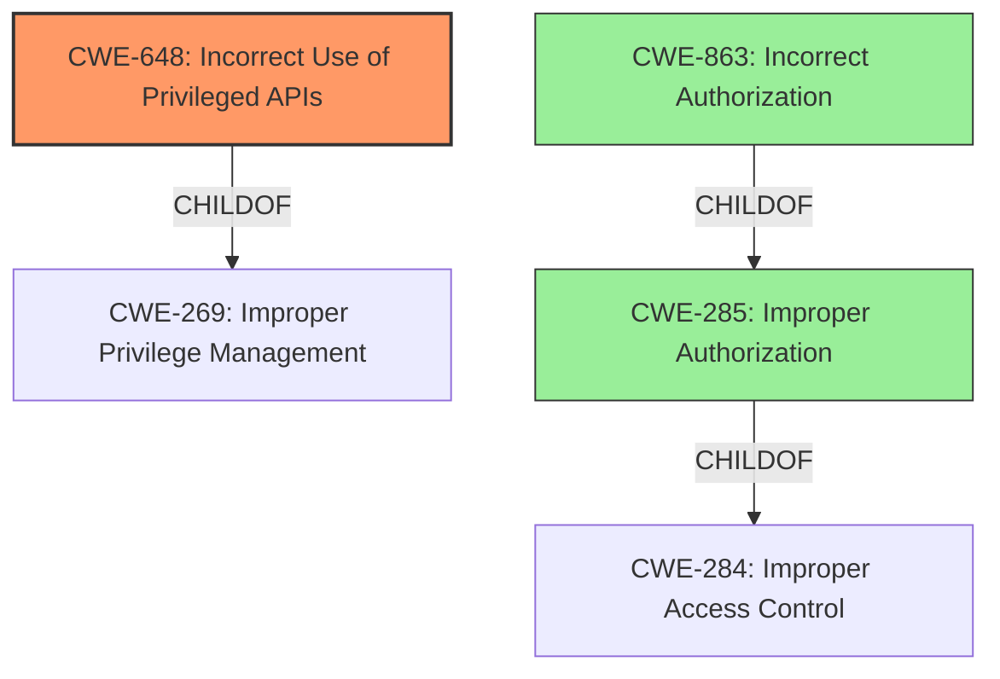

# Raw Analyzer Response for CVE-2022-2023

# Summary
| CWE ID | CWE Name | Confidence | CWE Abstraction Level | CWE Vulnerability Mapping Label | CWE-Vulnerability Mapping Notes |
|---|---|---|---|---|---|
| CWE-648 | Incorrect Use of Privileged APIs | 0.9 | Base | Allowed | Primary CWE |
| CWE-863 | Incorrect Authorization | 0.6 | Class | Allowed-with-Review | Secondary Candidate |
| CWE-285 | Improper Authorization | 0.5 | Class | Discouraged | Secondary Candidate |

## Evidence and Confidence

*   **Confidence Score:** 0.8
*   **Evidence Strength:** HIGH

## Relationship Analysis
The primary relationship considered was the ChildOf relationship, where CWE-648 is a child of CWE-269 (Improper Privilege Management). However, CWE-269 is a Class-level CWE and is discouraged. CWE-648 (Incorrect Use of Privileged APIs) is a Base-level CWE and more accurately describes the vulnerability. CWE-863 (Incorrect Authorization) is a Class-level CWE that could be considered as a more general classification. The chosen CWEs are at the optimal level of specificity, with CWE-648 providing the most detailed and accurate representation of the vulnerability's root cause.

## Vulnerability Chain
The chain of events for this vulnerability can be described as follows:

1.  **Root Cause:** **Incorrect use of privileged APIs** due to using the wrong API endpoint (`/api/v1/users/:username` instead of `/api/v1/profile/`).
2.  **Weakness:** The **incorrect API endpoint** could potentially lead to unauthorized access or data manipulation.
3.  **Impact:** Potential profile update failure, data inconsistency, or unauthorized user modification.

## Summary of Analysis
The initial analysis focused on the provided vulnerability description and CVE reference links. The **root cause** was identified as an **incorrect use of privileged APIs**. This is explicitly mentioned in the "Vulnerability Description Key Phrases" and supported by the CVE reference content summary, which states that the vulnerability stems from an incorrect API endpoint being used in the profile update functionality.

The Retriever Results identified CWE-648 (Incorrect Use of Privileged APIs) as the top candidate. The evidence from the CVE Reference Links Content Summary supports this: "The vulnerability stems from an incorrect API endpoint being used in the profile update functionality."

CWE-863 (Incorrect Authorization) and CWE-285 (Improper Authorization) were also considered because the **incorrect API endpoint** could potentially lead to authorization issues. However, these are higher-level Class CWEs. CWE-648 is a more specific Base-level CWE that better captures the **root cause** of the vulnerability, which is the **incorrect use of the API**, rather than a general authorization failure.

Therefore, CWE-648 is the primary CWE because it accurately reflects the **incorrect use of privileged APIs**. CWE-863 and CWE-285 are secondary considerations due to the potential for authorization-related impacts. The final selection is based on the available evidence and the goal of selecting the most specific and accurate CWE to represent the vulnerability's root cause.