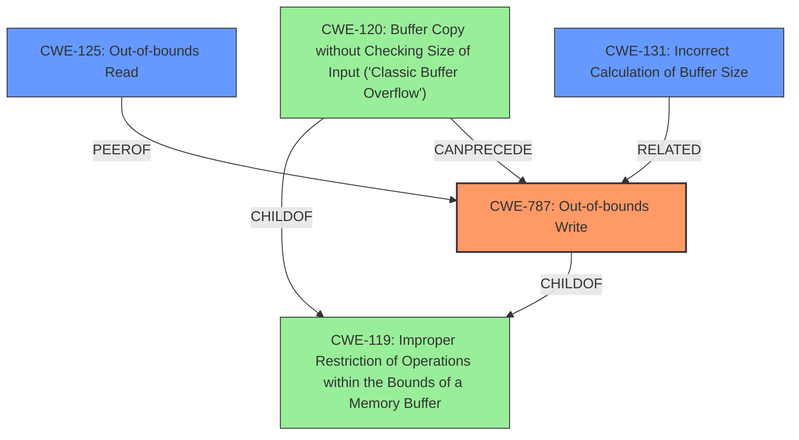

# Analysis for CVE-2022-20237

# Summary
| CWE ID | CWE Name | Confidence | CWE Abstraction Level | CWE Vulnerability Mapping Label | CWE-Vulnerability Mapping Notes |
|---|---|---|---|---|---|
| CWE-787 | Out-of-bounds Write | 1.0 | Base | Allowed | Primary CWE |
| CWE-125 | Out-of-bounds Read | 0.8 | Base | Allowed | Secondary Candidate |
| CWE-131 | Incorrect Calculation of Buffer Size | 0.6 | Base | Allowed | Secondary Candidate |

## Evidence and Confidence

*   **Confidence Score:** 0.9
*   **Evidence Strength:** HIGH

## Relationship Analysis
The primary CWE is CWE-787 **Out-of-bounds Write** which is a base level CWE. This has a child relationship to CWE-119 **Improper Restriction of Operations within the Bounds of a Memory Buffer**, which is a class level CWE. CWE-120 **Buffer Copy without Checking Size of Input ('Classic Buffer Overflow')** is a peer of CWE-787, and both are children of CWE-119. CWE-120 can precede CWE-787. The relationships show how buffer overflows can result in out-of-bounds writes.

## Vulnerability Chain
The vulnerability chain starts with a **missing bounds check**, which leads to an **out of bounds write**, and results in remote code execution.

## Summary of Analysis
The primary weakness is CWE-787 **Out-of-bounds Write**.
The vulnerability description clearly states: "there is a possible **out of bounds write** due to a **missing bounds check**". This aligns directly with the definition of CWE-787, which involves writing data beyond the intended boundaries of a memory buffer. The **missing bounds check** is a clear indicator of the root cause. The impact, remote code execution, is a typical consequence of such a write.
The evidence from the vulnerability description key phrases is:
- **rootcause:** **missing bounds check**
- **weakness:** **out of bounds write**
The retriever results did not have CWE-787 in the top results, but instead focused on concurrency and locking issues, which are not directly supported by the provided description.
CWE-787 is at the base level of abstraction, which is the preferred level of abstraction.

I also considered CWE-125 **Out-of-bounds Read**, since a **missing bounds check** could also lead to reading beyond the intended boundaries of a memory buffer. This is a definite possibility, so I rated it as a secondary candidate with a confidence of 0.8.

I also considered CWE-131 **Incorrect Calculation of Buffer Size**, since the **missing bounds check** could also be a result of calculating the wrong buffer size. This is a plausible, but less direct cause, so I rated it as a secondary candidate with a confidence of 0.6.

I rejected CWE-20 **Improper Input Validation** because the vulnerability is more specific than general input validation. Also, CWE-20 is discouraged.

I rejected CWE-667 **Improper Locking**, CWE-362 **Concurrent Execution using Shared Resource with Improper Synchronization ('Race Condition')**, CWE-413 **Improper Resource Locking** because there is no evidence of concurrency or locking issues in the description.