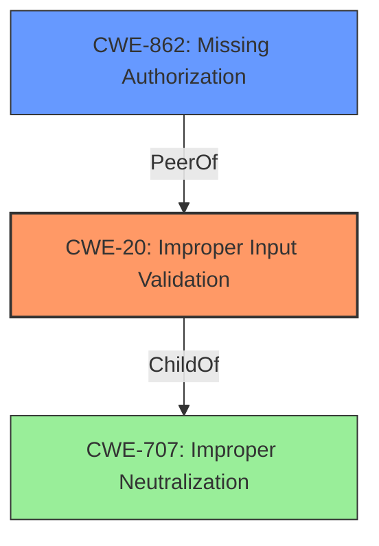

# Enhanced Analysis for CVE-2022-20250

# Summary
| CWE ID | CWE Name | Confidence | CWE Abstraction Level | CWE Vulnerability Mapping Label | CWE-Vulnerability Mapping Notes |
|---|---|---|---|---|---|
| CWE-20 | Improper Input Validation | 0.8 | Class | Primary | Discouraged: Consider lower-level children.  The vulnerability description explicitly mentions **improper input validation** as the root cause. |
| CWE-862 | Missing Authorization | 0.7 | Class | Secondary | Allowed-with-Review: While **improper input validation** is stated, the lack of proper access checks suggests authorization issues. |

## Evidence and Confidence

*   **Confidence Score:** 0.75
*   **Evidence Strength:** MEDIUM

## Relationship Analysis
The primary relationship considered was the child-of relationship. CWE-20 is a child of CWE-707 (Improper Neutralization During Input Validation). However, CWE-707 is too broad. CWE-20 is a class level weakness, and the documentation suggests to consider lower level children. However, given the limited information, I am choosing CWE-20 with a slightly lower confidence.
CWE-862 is related because the **improper input validation** leads to attaching files without proper access checks which falls under missing authorization.



## Vulnerability Chain
The vulnerability chain starts with **improper input validation**, leading to missing access checks, and ultimately resulting in local escalation of privilege.

## Summary of Analysis
The initial assessment focused on identifying the root cause of the vulnerability, which the description explicitly states as **improper input validation**. This directly aligns with CWE-20 (Improper Input Validation). However, the additional context of "attaching files to a message without proper access checks" suggests that CWE-862 (Missing Authorization) could also be a contributing factor.

The decision to include both CWE-20 and CWE-862 reflects a more comprehensive understanding of the vulnerability. While **improper input validation** is the stated root cause, the lack of access checks indicates a failure in authorization mechanisms.

The selection of CWE-20 is based on the explicit statement in the vulnerability description: "In Messaging, there is a possible way to attach files to a message without proper access checks due to **improper input validation**."

The relationship graph influenced the decision by highlighting the connection between input validation and authorization, suggesting that both weaknesses contribute to the vulnerability.

The selected CWEs are at an appropriate level of specificity, given the available information. While CWE-20 is a class-level weakness, the lack of more detailed information prevents a more specific mapping to a base or variant-level CWE.

Relevant CWE Information:
- CWE-20: Improper Input Validation
- CWE-862: Missing Authorization
- CWE-707: Improper Neutralization During Input Validation
- CWE-285: Improper Authorization

I considered CWE-1284 (Improper Validation of Specified Quantity in Input) because it's a child of CWE-20 and more specific. However, there's no evidence in the description that the improper validation is related to quantity. Similarly, I considered CWE-1287 (Improper Validation of Specified Type) but there is no evidence pointing to validation of type.


## CWE Relationship Analysis

Current CWEs represent these abstraction levels: .


### Vulnerability Chain Analysis

**Chain starting from CWE-862:**
- 862 (Missing Authorization) - ROOT


**Chain starting from CWE-20:**
- 20 (Improper Input Validation) - ROOT


### CWE Relationship Diagram

```mermaid
graph TD
    classDef primary fill:#f96,stroke:#333,stroke-width:2px
    classDef secondary fill:#69f,stroke:#333
    classDef tertiary fill:#9e9,stroke:#333
```