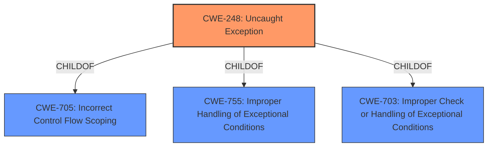

# Raw Analyzer Response for CVE-2022-20253

# Summary
| CWE ID | CWE Name | Confidence | CWE Abstraction Level | CWE Vulnerability Mapping Label | CWE-Vulnerability Mapping Notes |
|---|---|---|---|---|---|
| CWE-248 | Uncaught Exception | 1.0 | Base | Allowed | Primary CWE |

## Evidence and Confidence

*   **Confidence Score:** 1.0
*   **Evidence Strength:** HIGH

## Relationship Analysis
The primary relationship influencing the selection of CWE-248 is its direct match to the root cause described in the vulnerability. CWE-248 is a Base level CWE, which is the preferred level of abstraction. It is also related to other Class and Pillar level CWEs like CWE-755 and CWE-703, but those are less specific and therefore less appropriate.

## Vulnerability Chain
The vulnerability chain starts with the **uncaught exception** (CWE-248) which leads to a remote denial of service. The **uncaught exception** is the root cause and the denial of service is the impact.

## Summary of Analysis
The initial analysis focused on identifying the **root cause** of the vulnerability, which is an **uncaught exception**. The vulnerability description and CVE Reference Links Content Summary clearly indicate that the application fails to properly handle an exception, leading to a denial of service.

The selection of CWE-248 is based on the following evidence:
*   The vulnerability description states "there is a possible cleanup failure due to an **uncaught exception**."
*   The CVE Reference Links Content Summary mentions the **root_cause** as "A denial of service vulnerability exists in the System component."
*   The Retriever Results list CWE-248 as the top combined result with a score of 0.486.
*   CWE-248 is a Base level CWE, which is the preferred level of abstraction according to MITRE mapping guidance.
*   The MITRE mapping guidance for CWE-248 states: "This CWE entry is at the Base level of abstraction, which is a preferred level of abstraction for mapping to the **root causes** of vulnerabilities."

The relationship analysis shows that CWE-248 is a child of CWE-705, CWE-755 and CWE-703. However, these parent CWEs are less specific and do not accurately represent the **root cause** of the vulnerability.

Based on the evidence, relationship analysis, and mapping guidance, CWE-248 is the most appropriate CWE for this vulnerability.

Relevant CWE Information:

# Enhanced Context (25 CWEs)
The following CWEs were identified as potentially relevant to this vulnerability:

## CWE-366: Race Condition within a Thread
**Abstraction Level**: Base
**Similarity Score**: 0.79
**Source**: dense

**Description**:
If two threads of execution use a resource simultaneously, there exists the possibility that resources may be used while invalid, in turn making the state of execution undefined.

**Mapping Guidance**:
- Usage: Allowed
- Rationale: This CWE entry is at the Base level of abstraction, which is a preferred level of abstraction for mapping to the root causes of vulnerabilities.

**Reasons for not selecting:** The vulnerability description and CVE Reference Links Content Summary does not indicate anything about threads of execution, so this is not a good match.

## CWE-662: Improper Synchronization
**Abstraction Level**: Class
**Similarity Score**: 0.79
**Source**: dense

**Description**:
The product utilizes multiple threads or processes to allow temporary access to a shared resource that can only be exclusive to one process at a time, but it does not properly synchronize these actions, which might cause simultaneous accesses of this resource by multiple threads or processes.

**Mapping Guidance**:
- Usage: Discouraged
- Rationale: This CWE entry is a level-1 Class (i.e., a child of a Pillar). It might have lower-level children that would be more appropriate

**Reasons for not selecting:** The vulnerability description and CVE Reference Links Content Summary does not indicate anything about multiple threads or processes, so this is not a good match.

## CWE-667: Improper Locking
**Abstraction Level**: Class
**Similarity Score**: 0.78
**Source**: dense

**Description**:
The product does not properly acquire or release a lock on a resource, leading to unexpected resource state changes and behaviors.

**Mapping Guidance**:
- Usage: Allowed-with-Review
- Rationale: This CWE entry is a Class and might have Base-level children that would be more appropriate

**Reasons for not selecting:** The vulnerability description and CVE Reference Links Content Summary does not indicate anything about locks, so this is not a good match.

## CWE-362: Concurrent Execution using Shared Resource with Improper Synchronization ('Race Condition')
**Abstraction Level**: Class
**Similarity Score**: 0.78
**Source**: dense

**Description**:
The product contains a concurrent code sequence that requires temporary, exclusive access to a shared resource, but a timing window exists in which the shared resource can be modified by another code sequence operating concurrently.

**Mapping Guidance**:
- Usage: Allowed-with-Review
- Rationale: This CWE entry is a Class and might have Base-level children that would be more appropriate

**Reasons for not selecting:** The vulnerability description and CVE Reference Links Content Summary does not indicate anything about concurrent execution, so this is not a good match.

## CWE-367: Time-of-check Time-of-use (TOCTOU) Race Condition
**Abstraction Level**: Base
**Similarity Score**: 0.77
**Source**: dense

**Description**:
The product checks the state of a resource before using that resource, but the resource's state can change between the check and the use in a way that invalidates the results of the check. This can cause the product to perform invalid actions when the resource is in an unexpected state.

**Mapping Guidance**:
- Usage: Allowed
- Rationale: This CWE entry is at the Base level of abstraction, which is a preferred level of abstraction for mapping to the root causes of vulnerabilities.

**Reasons for not selecting:** The vulnerability description and CVE Reference Links Content Summary does not indicate anything about time of check or time of use, so this is not a good match.

## CWE-754: Improper Check for Unusual or Exceptional Conditions
**Abstraction Level**: Class
**Similarity Score**: 0.75
**Source**: dense

**Description**:
The product does not check or incorrectly checks for unusual or exceptional conditions that are not expected to occur frequently during day to day operation of the product.

**Mapping Guidance**:
- Usage: Allowed-with-Review
- Rationale: This CWE entry is a Class and might have Base-level children that would be more appropriate

**Reasons for not selecting:** The vulnerability description and CVE Reference Links Content Summary focuses on the **uncaught exception** not that a check was missing or incorrect.

## CWE-404: Improper Resource Shutdown or Release
**Abstraction Level**: Class
**Similarity Score**: 0.75
**Source**: dense

**Description**:
The product does not release or incorrectly releases a resource before it is made available for re-use.

**Mapping Guidance**:
- Usage: Allowed-with-Review
- Rationale: This CWE entry is a Class and might have Base-level children that would be more appropriate

**Reasons for not selecting:** The vulnerability description and CVE Reference Links Content Summary does not indicate anything about resources not being released, so this is not a good match.

## CWE-226: Sensitive Information in Resource Not Removed Before Reuse
**Abstraction Level**: Base
**Similarity Score**: 0.74
**Source**: dense

**Description**:
The product releases a resource such as memory or a file so that it can be made available for reuse, but it does not clear or "zeroize" the information contained in the resource before the product performs a critical state transition or makes the resource available for reuse by other entities.

**Mapping Guidance**:
- Usage: Allowed
- Rationale: This CWE entry is at the Base level of abstraction, which is a preferred level of abstraction for mapping to the root causes of vulnerabilities.

**Reasons for not selecting:** The vulnerability description and CVE Reference Links Content Summary does not indicate anything about resources not being cleared, so this is not a good match.

## CWE-703: Improper Check or Handling of Exceptional Conditions
**Abstraction Level**: Pillar
**Similarity Score**: