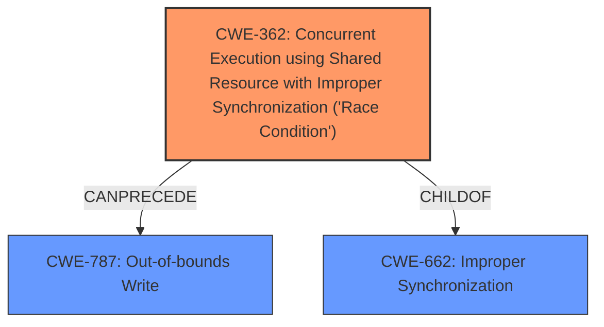

# Enhanced Analysis for CVE-2022-20256

# Summary
| CWE ID | CWE Name | Confidence | CWE Abstraction Level | CWE Vulnerability Mapping Label | CWE-Vulnerability Mapping Notes |
|---|---|---|---|---|---|
| CWE-362 | Concurrent Execution using Shared Resource with Improper Synchronization ('Race Condition') | 0.9 | Class | Allowed-with-Review | Primary CWE: The **race condition** is the root cause of the vulnerability. |
| CWE-787 | Out-of-bounds Write | 0.8 | Base | Allowed | Secondary CWE: The **out-of-bounds write** is a direct consequence of the race condition. |

## Evidence and Confidence

*   **Confidence Score:** 0.85
*   **Evidence Strength:** HIGH

## Relationship Analysis
The primary CWE is CWE-362 (Concurrent Execution using Shared Resource with Improper Synchronization ('Race Condition')), which is a Class-level CWE. It is related to CWE-787 (Out-of-bounds Write) through a chain where a race condition can lead to an out-of-bounds write.



## Vulnerability Chain
The vulnerability chain starts with a **race condition** (CWE-362), which leads to an **out-of-bounds write** (CWE-787). The root cause is the improper synchronization in a concurrent environment, and the weakness is writing data outside the intended buffer.

## Summary of Analysis
The analysis is primarily based on the vulnerability description, which explicitly mentions a **race condition** leading to an **out-of-bounds write**.

> In the Audio HAL, there is a possible **out of bounds write** due to a **race condition**. This could lead to local escalation of privilege with System execution privileges needed.

The "**race condition**" (CWE-362) is the root cause, and "**out of bounds write**" (CWE-787) is the direct consequence. The evidence is strong as both the vulnerability description and the title contain the root cause and weakness.

CWE-362 is a Class, and it can precede CWE-787 according to the relationship data. While it might be ideal to choose a Base CWE, CWE-362 accurately describes the race condition. The description for CWE-362 states "The product contains a concurrent code sequence that requires temporary, exclusive access to a shared resource, but a timing window exists in which the shared resource can be modified by another code sequence operating concurrently."

CWE-787 is a Base CWE. The description is "The product writes data past the end, or before the beginning, of the intended buffer." This matches the vulnerability description of a possible **out of bounds write**.

Other CWEs considered but not selected:

*   CWE-667 (Improper Locking): While related to concurrency issues, the description explicitly identifies the **race condition**, making CWE-362 a better fit.
*   CWE-366 (Race Condition within a Thread): While more specific than CWE-362, it is a ChildOf CWE-362. CWE-362 is selected because it more generally describes the **race condition** without limiting it to threads.
*   CWE-662 (Improper Synchronization): This is a parent of CWE-362, and the guidance discourages its use when more specific children exist.
*   CWE-416 (Use After Free): While race conditions can lead to use-after-free vulnerabilities, the description explicitly states an **out-of-bounds write**.
*   CWE-120 (Buffer Copy without Checking Size): The description for CWE-120 requires "Buffer Copy" operations and no "Checking [the] Size of Input", which is not explicitly described in the vulnerability.

The chosen CWEs are at the optimal level of specificity based on the available evidence.


## CWE Relationship Analysis

Current CWEs represent these abstraction levels: .


### Vulnerability Chain Analysis

**Chain starting from CWE-662:**
- 662 (Improper Synchronization) - ROOT


**Chain starting from CWE-366:**
- 366 (Race Condition within a Thread) - ROOT


### CWE Relationship Diagram

```mermaid
graph TD
    classDef primary fill:#f96,stroke:#333,stroke-width:2px
    classDef secondary fill:#69f,stroke:#333
    classDef tertiary fill:#9e9,stroke:#333
```