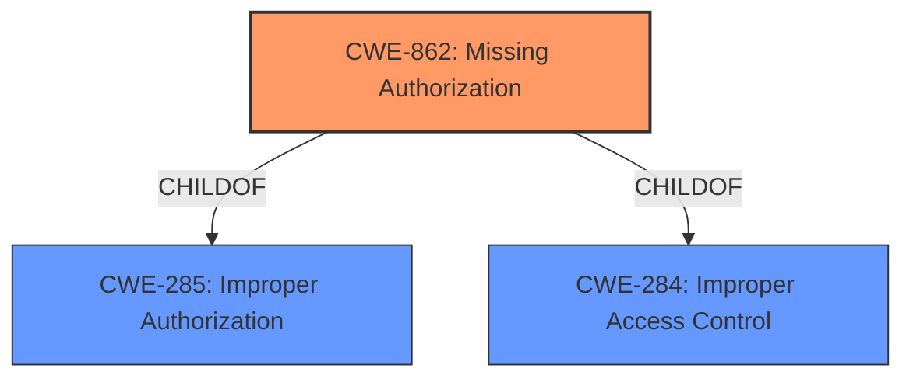

# Analysis for CVE-2022-20262

# Summary
| CWE ID | CWE Name | Confidence | CWE Abstraction Level | CWE Vulnerability Mapping Label | CWE-Vulnerability Mapping Notes |
|---|---|---|---|---|---|
| CWE-862 | Missing Authorization | 0.9 | Class | Primary | Allowed-with-Review |

## Evidence and Confidence

*   **Confidence Score:** 0.9
*   **Evidence Strength:** HIGH

## Relationship Analysis
The primary relationship influencing the decision is the ChildOf relationship of CWE-862 to CWE-284 (Improper Access Control) and CWE-285 (Improper Authorization). This indicates that CWE-862 is a specific type of improper access control focused on missing authorization checks. While CWE-862 is a Class-level CWE, no more specific Base or Variant CWEs were identified that better fit the provided information.

## Vulnerability Chain
The vulnerability chain starts with the **missing permission check** (CWE-862). This leads to the ability to "check another process capabilities," resulting in local information disclosure.

## Summary of Analysis
The primary CWE selected is CWE-862 (Missing Authorization). This selection is based on the **root cause** identified in the vulnerability description: "**missing permission check**." The description explicitly states that there is a **missing permission check** in ActivityManager, which allows unauthorized access to another process's capabilities.

The "CVE Reference Links Content Summary" also supports this by indicating an "information disclosure vulnerability in the Android Framework".

The retriever results listed CWE-862 as the top match with a score of 0.421. The mapping guidance for CWE-862 is "Allowed-with-Review" because it's a Class-level CWE. However, after examining the children of CWE-862 and other related CWEs, no better fit was found at a more specific level of abstraction.

The evidence provided directly points to a **missing permission check**, aligning well with the description of CWE-862: "The product does not perform an authorization check when an actor attempts to access a resource or perform an action."

Other considered CWEs, such as CWE-927 (Use of Implicit Intent for Sensitive Communication) and CWE-925 (Improper Verification of Intent by Broadcast Receiver), were not chosen because they are specific to Android intents, while the **missing permission check** in this vulnerability is a more general authorization issue in ActivityManager.

Therefore, CWE-862 is the most appropriate CWE, representing the **root cause** of the vulnerability.