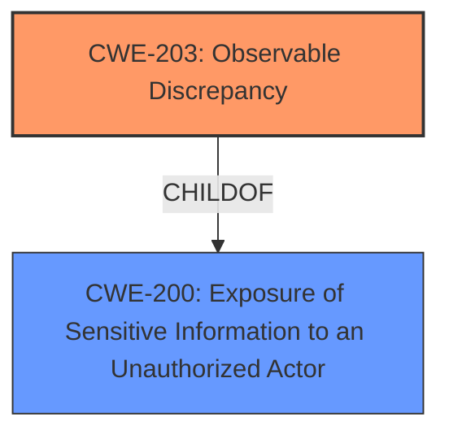

# Enhanced Analysis for CVE-2022-20275

# Summary
| CWE ID | CWE Name | Confidence | CWE Abstraction Level | CWE Vulnerability Mapping Label | CWE-Vulnerability Mapping Notes |
|---|---|---|---|---|---|
| CWE-203 | Observable Discrepancy | 0.9 | Base | Allowed | Primary CWE |
| CWE-200 | Exposure of Sensitive Information to an Unauthorized Actor | 0.6 | Class | Discouraged | Secondary Candidate |

## Evidence and Confidence

*   **Confidence Score:** 0.9
*   **Evidence Strength:** HIGH

## Relationship Analysis
The primary relationship influencing my decision is the ChildOf relationship, where CWE-203 (Observable Discrepancy) is a child of CWE-200 (Exposure of Sensitive Information to an Unauthorized Actor). Because the vulnerability description specifically mentions a "side channel information disclosure," and CWE-203 directly addresses observable discrepancies that can lead to information disclosure, it is a more specific and accurate representation of the weakness than its parent, CWE-200. There are no other relevant relationships that impact the CWE selection.



## Vulnerability Chain
The chain of root cause and weaknesses for the Vulnerability Description:
1.  **Root Cause:** **side channel information disclosure**
2.  **Impact:** determine whether an app is installed

## Summary of Analysis
The initial analysis identified CWE-203 as the primary candidate due to the "**side channel information disclosure**" mentioned in the "Vulnerability Description Key Phrases." This aligns well with the description of CWE-203, which focuses on observable discrepancies that expose security-relevant information. The retriever results also list CWE-203 with a reasonable score.

The vulnerability description states: "In DevicePolicyManager, there is a possible way to determine whether an app is installed, without query permissions, due to **side channel information disclosure**. This could lead to local information disclosure with no additional execution privileges needed."

This statement provides direct evidence of a side channel being exploited to disclose information about installed apps. This matches CWE-203's description: "The product behaves differently or sends different responses under different circumstances in a way that is observable to an unauthorized actor, which exposes security-relevant information about the state of the product, such as whether a particular operation was successful or not."

CWE-200 was also considered as a parent CWE, but the mapping guidance discourages its use as a general "loss of confidentiality" category. The guidance suggests considering children like CWE-203 when applicable. The decision to use CWE-203 is based on its greater specificity and direct alignment with the side-channel nature of the information disclosure.

The selected CWE is at the optimal level of specificity because it accurately captures the root cause – the observable discrepancy – rather than just the impact (information disclosure).

Relevant CWE Information:

# Enhanced Context (25 CWEs)

## CWE-754: Improper Check for Unusual or Exceptional Conditions
**Abstraction Level**: Class
**Similarity Score**: 0.78
**Source**: dense
**Description**: The product does not check or incorrectly checks for unusual or exceptional conditions that are not expected to occur frequently during day to day operation of the product.
**Mapping Guidance**: Usage: Allowed-with-Review, Rationale: This CWE entry is a Class and might have Base-level children that would be more appropriate

## CWE-226: Sensitive Information in Resource Not Removed Before Reuse
**Abstraction Level**: Base
**Similarity Score**: 0.76
**Source**: dense
**Description**: The product releases a resource such as memory or a file so that it can be made available for reuse, but it does not clear or "zeroize" the information contained in the resource before the product performs a critical state transition or makes the resource available for reuse by other entities.
**Mapping Guidance**: Usage: Allowed, Rationale: This CWE entry is at the Base level of abstraction, which is a preferred level of abstraction for mapping to the root causes of vulnerabilities.

## CWE-203: Observable Discrepancy
**Abstraction Level**: Base
**Similarity Score**: 0.76
**Source**: dense
**Description**: The product behaves differently or sends different responses under different circumstances in a way that is observable to an unauthorized actor, which exposes security-relevant information about the state of the product, such as whether a particular operation was successful or not.
**Mapping Guidance**: Usage: Allowed, Rationale: This CWE entry is at the Base level of abstraction, which is a preferred level of abstraction for mapping to the root causes of vulnerabilities.

## CWE-404: Improper Resource Shutdown or Release
**Abstraction Level**: Class
**Similarity Score**: 0.76
**Source**: dense
**Description**: The product does not release or incorrectly releases a resource before it is made available for re-use.
**Mapping Guidance**: Usage: Allowed-with-Review, Rationale: This CWE entry is a Class and might have Base-level children that would be more appropriate

## CWE-703: Improper Check or Handling of Exceptional Conditions
**Abstraction Level**: Pillar
**Similarity Score**: 0.76
**Source**: dense
**Description**: The product does not properly anticipate or handle exceptional conditions that rarely occur during normal operation of the product.
**Mapping Guidance**: Usage: Discouraged, Rationale: This CWE entry is extremely high-level, a Pillar.

## CWE-668: Exposure of Resource to Wrong Sphere
**Abstraction Level**: Class
**Similarity Score**: 0.76
**Source**: dense
**Description**: The product exposes a resource to the wrong control sphere, providing unintended actors with inappropriate access to the resource.
**Mapping Guidance**: Usage: Discouraged, Rationale: CWE-668 is high-level and is often misused as a catch-all when lower-level CWE IDs might be applicable. It is sometimes used for low-information vulnerability reports [REF-1287]. It is a level-1 Class (i.e., a child of a Pillar). It is not useful for trend analysis.

## CWE-667: Improper Locking
**Abstraction Level**: Class
**Similarity Score**: 0.76
**Source**: dense
**Description**: The product does not properly acquire or release a lock on a resource, leading to unexpected resource state changes and behaviors.
**Mapping Guidance**: Usage: Allowed-with-Review, Rationale: This CWE entry is a Class and might have Base-level children that would be more appropriate

## CWE-665: Improper Initialization
**Abstraction Level**: Class
**Similarity Score**: 0.75
**Source**: dense
**Description**: The product does not initialize or incorrectly initializes a resource, which might leave the resource in an unexpected state when it is accessed or used.
**Mapping Guidance**: Usage: Discouraged, Rationale: This CWE entry is a level-1 Class (i.e., a child of a Pillar). It might have lower-level children that would be more appropriate

## CWE-459: Incomplete Cleanup
**Abstraction Level**: Base
**Similarity Score**: 0.75
**Source**: dense
**Description**: The product does not properly "clean up" and remove temporary or supporting resources after they have been used.
**Mapping Guidance**: Usage: Allowed, Rationale: This CWE entry is at the Base level of abstraction, which is a preferred level of abstraction for mapping to the root causes of vulnerabilities.

## CWE-755: Improper Handling of Exceptional Conditions
**Abstraction Level**: Class
**Similarity Score**: 0.75
**Source**: dense
**Description**: The product does not handle or incorrectly handles an exceptional condition.
**Mapping Guidance**: Usage: Discouraged, Rationale: This CWE entry is a level-1 Class (i.e., a child of a Pillar). It might have lower-level children that would be more appropriate

## CWE-941: Incorrectly Specified Destination in a Communication Channel
**Abstraction Level**: Base
**Similarity Score**: 5998.99
**Source**: sparse
**Description**: The product creates a communication channel to initiate an outgoing request to an actor, but it does not correctly specify the intended destination for that actor.
**Mapping Guidance**: Usage: Allowed, Rationale: This CWE entry is at the Base level of abstraction, which is a preferred level of abstraction for mapping to the root causes of vulnerabilities.

## CWE-203: Observable Discrepancy
**Abstraction Level**: Base
**Similarity Score**: 5888.66
**Source**: sparse
**Description**: The product behaves differently or sends different responses under different circumstances in a way that is observable to an unauthorized actor, which exposes security-relevant information about the state of the product, such as whether a particular operation was successful or not.
**Mapping Guidance**: Usage: Allowed, Rationale: This CWE entry is at the Base level of abstraction, which is a preferred level of abstraction for mapping to the root causes of


## CWE Relationship Analysis

Current CWEs represent these abstraction levels: .


### Vulnerability Chain Analysis

**Chain starting from CWE-203:**
- 203 (Observable Discrepancy) - ROOT


**Chain starting from CWE-200:**
- 200 (Exposure of Sensitive Information to an Unauthorized Actor) - ROOT


### CWE Relationship Diagram

```mermaid
graph TD
    classDef primary fill:#f96,stroke:#333,stroke-width:2px
    classDef secondary fill:#69f,stroke:#333
    classDef tertiary fill:#9e9,stroke:#333
```