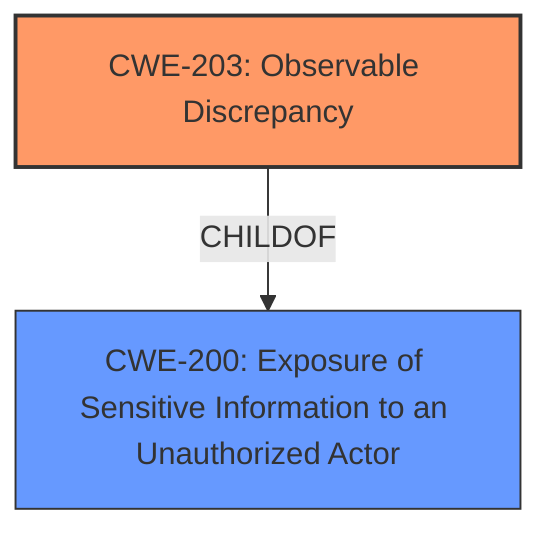

# Analysis for CVE-2022-20279

# Summary
| CWE ID  | CWE Name                                             | Confidence | CWE Abstraction Level | CWE Vulnerability Mapping Label | CWE-Vulnerability Mapping Notes |
| :-------- | :--------------------------------------------------- | :--------- | :---------------------- | :------------------------------ | :------------------------------ |
| CWE-203 | Observable Discrepancy                             | 0.85       | Base                    | Primary CWE                     | Allowed                       |
| CWE-200 | Exposure of Sensitive Information to an Unauthorized Actor | 0.65      | Class                   | Secondary Candidate            | Discouraged                    |

## Evidence and Confidence

*   **Confidence Score:** 0.75
*   **Evidence Strength:** MEDIUM

## Relationship Analysis
The primary CWE selected is CWE-203 (**Observable Discrepancy**), which is a base-level CWE and a child of CWE-200 (**Exposure of Sensitive Information to an Unauthorized Actor**). This hierarchical relationship influenced the decision because the vulnerability involves a side channel, which aligns with the concept of observable discrepancies revealing sensitive information. Although CWE-200 appears as a top result and parent, CWE-203 is preferred due to its higher specificity in describing the root cause as an observable difference in behavior.

## Vulnerability Chain
The vulnerability chain starts with a **side channel information disclosure** (**WEAKNESS**) in the DevicePolicyManager, leading to the ability to determine whether an app is installed (**IMPACT**). The chain is relatively direct:

1.  **Root Cause:** **Side channel information disclosure** (CWE-203)
2.  **Impact:** Ability to determine app installation status, leading to local information disclosure.

## Summary of Analysis
The initial analysis focused on identifying the root cause of the vulnerability, which is described as a **side channel information disclosure**. The provided information and retriever results strongly suggest CWE-203 (**Observable Discrepancy**) as the most appropriate mapping.

The evidence from the vulnerability description and CVE Reference Links Content Summary supports this decision:

*   **Vulnerability Description Key Phrases:** "**weakness:** **side channel information disclosure**"
*   **CVE Reference Links Content Summary:** "An attacker can potentially gain access to sensitive information."

CWE-203 is a base-level CWE that directly addresses the concept of observable discrepancies revealing information about the system's state. This aligns perfectly with the description of a side channel attack, where subtle differences in behavior can be exploited to infer sensitive information.

CWE-200 (**Exposure of Sensitive Information to an Unauthorized Actor**) was also considered but ultimately deemed less specific. While the vulnerability does result in information exposure, the root cause is the observable discrepancy, not the direct exposure of sensitive data. The MITRE mapping guidance for CWE-200 discourages its use when a more specific CWE is available.

The decision to use CWE-203 is based on the direct evidence of a side channel attack and the alignment of the CWE's description with the vulnerability's root cause. The relationships between CWEs, particularly the parent-child relationship between CWE-203 and CWE-200, further support this decision.

Relevant CWE Information:

# Enhanced Context (25 CWEs)
The following CWEs were identified as potentially relevant to this vulnerability:

## CWE-754: Improper Check for Unusual or Exceptional Conditions
**Abstraction Level**: Class
**Similarity Score**: 0.78
**Source**: dense

**Description**:
The product does not check or incorrectly checks for unusual or exceptional conditions that are not expected to occur frequently during day to day operation of the product.

**Mapping Guidance**:
- Usage: Allowed-with-Review
- Rationale: This CWE entry is a Class and might have Base-level children that would be more appropriate

## CWE-226: Sensitive Information in Resource Not Removed Before Reuse
**Abstraction Level**: Base
**Similarity Score**: 0.77
**Source**: dense

**Description**:
The product releases a resource such as memory or a file so that it can be made available for reuse, but it does not clear or "zeroize" the information contained in the resource before the product performs a critical state transition or makes the resource available for reuse by other entities.

**Mapping Guidance**:
- Usage: Allowed
- Rationale: This CWE entry is at the Base level of abstraction, which is a preferred level of abstraction for mapping to the root causes of vulnerabilities.

## CWE-404: Improper Resource Shutdown or Release
**Abstraction Level**: Class
**Similarity Score**: 0.76
**Source**: dense

**Description**:
The product does not release or incorrectly releases a resource before it is made available for re-use.

**Mapping Guidance**:
- Usage: Allowed-with-Review
- Rationale: This CWE entry is a Class and might have Base-level children that would be more appropriate

## CWE-203: Observable Discrepancy
**Abstraction Level**: Base
**Similarity Score**: 0.76
**Source**: dense

**Description**:
The product behaves differently or sends different responses under different circumstances in a way that is observable to an unauthorized actor, which exposes security-relevant information about the state of the product, such as whether a particular operation was successful or not.

**Mapping Guidance**:
- Usage: Allowed
- Rationale: This CWE entry is at the Base level of abstraction, which is a preferred level of abstraction for mapping to the root causes of vulnerabilities.

## CWE-703: Improper Check or Handling of Exceptional Conditions
**Abstraction Level**: Pillar
**Similarity Score**: 0.76
**Source**: dense

**Description**:
The product does not properly anticipate or handle exceptional conditions that rarely occur during normal operation of the product.

**Mapping Guidance**:
- Usage: Discouraged
- Rationale: This CWE entry is extremely high-level, a Pillar.

## CWE-668: Exposure of Resource to Wrong Sphere
**Abstraction Level**: Class
**Similarity Score**: 0.76
**Source**: dense

**Description**:
The product exposes a resource to the wrong control sphere, providing unintended actors with inappropriate access to the resource.

**Mapping Guidance**:
- Usage: Discouraged
- Rationale: CWE-668 is high-level and is often misused as a catch-all when lower-level CWE IDs might be applicable. It is sometimes used for low-information vulnerability reports [REF-1287]. It is a level-1 Class (i.e., a child of a Pillar). It is not useful for trend analysis.

## CWE-667: Improper Locking
**Abstraction Level**: Class
**Similarity Score**: 0.76
**Source**: dense

**Description**:
The product does not properly acquire or release a lock on a resource, leading to unexpected resource state changes and behaviors.

**Mapping Guidance**:
- Usage: Allowed-with-Review
- Rationale: This CWE entry is a Class and might have Base-level children that would be more appropriate

## CWE-665: Improper Initialization
**Abstraction Level**: Class
**Similarity Score**: 0.75
**Source**: dense

**Description**:
The product does not initialize or incorrectly initializes a resource, which might leave the resource in an unexpected state when it is accessed or used.

**Mapping Guidance**:
- Usage: Discouraged
- Rationale: This CWE entry is a level-1 Class (i.e., a child of a Pillar). It might have lower-level children that would be more appropriate

## CWE-459: Incomplete Cleanup
**Abstraction Level**: Base
**Similarity Score**: 0.75
**Source**: dense

**Description**:
The product does not properly "clean up" and remove temporary or supporting resources after they have been used.

**Mapping Guidance**:
- Usage: Allowed
- Rationale: This CWE entry is at the Base level of abstraction, which is a preferred level of abstraction for mapping to the root causes of vulnerabilities.

## CWE-755: Improper Handling of Exceptional Conditions
**Abstraction Level**: Class
**Similarity Score**: 0.75
**Source**: dense

**Description**:
The product does not handle or incorrectly handles an exceptional condition.

**Mapping Guidance**:
- Usage: Discouraged
- Rationale: This CWE entry is a level-1 Class (i.e., a child of a Pillar). It might have lower-level children that would be more appropriate

## CWE-941: Incorrectly Specified Destination in a Communication Channel
**Abstraction Level**: Base
**Similarity Score**: 5846.62
**Source**: sparse

**Description**:
The product creates a communication channel to initiate an outgoing request to an actor, but it does not correctly specify the intended destination for that actor.

**Mapping Guidance**:
- Usage: Allowed
- Rationale: This CWE entry is at the Base level