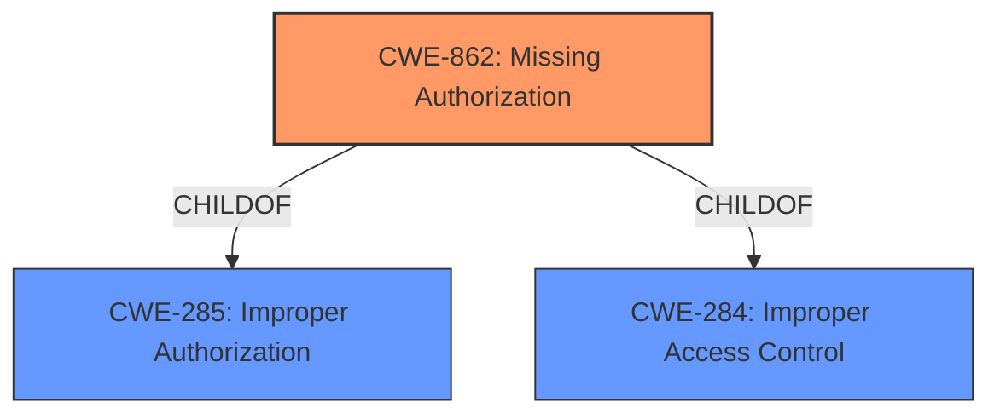

# Raw Analyzer Response for CVE-2022-20281

# Summary
| CWE ID | CWE Name | Confidence | CWE Abstraction Level | CWE Vulnerability Mapping Label | CWE-Vulnerability Mapping Notes |
|---|---|---|---|---|---|
| CWE-862 | Missing Authorization | 1.0 | Class | Allowed-with-Review | Primary CWE |

## Evidence and Confidence

*   **Confidence Score:** 1.0
*   **Evidence Strength:** HIGH

## Relationship Analysis
The primary CWE is CWE-862 **Missing Authorization**, which is a Class-level CWE. It is a child of CWE-285 Improper Authorization and CWE-284 Improper Access Control. The vulnerability description clearly indicates a **missing permission check**, which directly aligns with the concept of missing authorization.

## Vulnerability Chain
The chain of events is:
1.  **Root Cause:** **Missing permission check** (CWE-862 **Missing Authorization**)
2.  **Impact:** Starting an activity from the background, leading to potential local escalation of privilege.

## Summary of Analysis
The analysis is based on the provided evidence, which clearly states a **missing permission check**. This directly aligns with CWE-862 **Missing Authorization**.

The vulnerability description states: "In Core, there is a possible way to start an activity from the background due to a **missing permission check**. This could lead to local escalation of privilege with User execution privileges needed. User interaction is not needed for exploitation."

The phrase "**missing permission check**" is a direct indicator of a **Missing Authorization** vulnerability (CWE-862). The impact is that an activity can be started from the background without proper authorization, potentially leading to privilege escalation.

CWE-862 is a Class-level CWE. The mapping guidance suggests reviewing its children for a better fit. However, in this case, the description is general and accurately described by the Class CWE, so selecting a specific variant may not be appropriate based on the information in the description.

CWE-732 **Incorrect Permission Assignment for Critical Resource** was considered but deemed less appropriate. While it involves permissions, the root cause is not an incorrect assignment of permissions but rather the absence of a permission check altogether. The mapping guidance for CWE-732 also indicates that it is often misused when "permissions" are not checked, and that an "authorization" weakness (CWE-285 or descendants) would be more appropriate.

Therefore, CWE-862 **Missing Authorization** is the most accurate and specific CWE based on the available evidence.