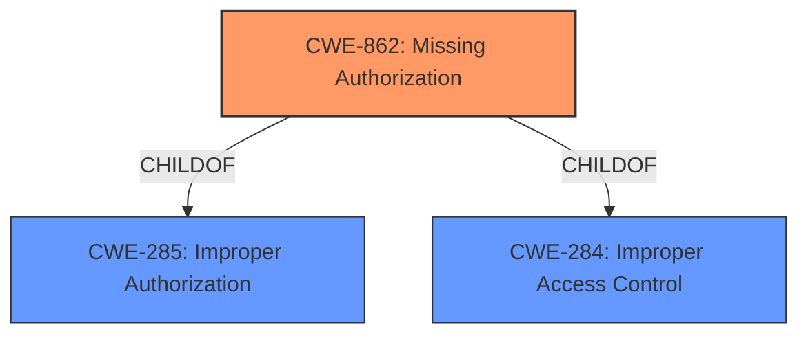

# Enhanced Analysis for CVE-2022-20284

# Summary
| CWE ID | CWE Name | Confidence | CWE Abstraction Level | CWE Vulnerability Mapping Label | CWE-Vulnerability Mapping Notes |
|---|---|---|---|---|---|
| CWE-862 | Missing Authorization | 1 | Class | Allowed-with-Review | Primary CWE |

## Evidence and Confidence

*   **Confidence Score:** 1
*   **Evidence Strength:** HIGH

## Relationship Analysis
The primary relationship that influenced the decision was the ChildOf relationship between CWE-862 and its parents, indicating a need to check for more specific Base or Variant level CWEs. However, the information provided was insufficient to identify a more specific CWE.



## Vulnerability Chain
The vulnerability chain consists of a **missing permission check** (CWE-862), leading to information disclosure of phone accounts. The chain is relatively simple, with the **missing authorization** being the direct cause of the information disclosure.

## Summary of Analysis
The analysis is primarily based on the vulnerability description which explicitly states "**missing permission check**." This aligns directly with the definition of CWE-862 (Missing Authorization). The "Vulnerability Description Key Phrases" section also highlights this as the root cause.

The retriever results listed CWE-862 as the top candidate. While the mapping guidance suggests reviewing child entries for a more specific match, the provided information does not allow for a more granular classification. Therefore, CWE-862 is the most appropriate CWE based on the available evidence.

# Relevant CWE Information:

## CWE-862: Missing Authorization
**Abstraction:** Class

### Description
The product does not perform an authorization check when an actor attempts to access a resource or perform an action.

## Considered but not used:
*   CWE-514: Covert Channel - This CWE relates to transferring information in a way not intended by the system's designers. It is not applicable because the vulnerability is due to a **missing check**, not a covert way of communication.
*   CWE-927: Use of Implicit Intent for Sensitive Communication - This CWE is specific to Android applications using implicit intents for transmitting sensitive data. While the vulnerable product is Android, the vulnerability is not related to implicit intents.
*   CWE-665: Improper Initialization - This CWE concerns the incorrect initialization of a resource. The vulnerability is not related to initialization of any resource.
*   CWE-908: Use of Uninitialized Resource - The vulnerability is not related to use of uninitialized resources.
*   CWE-223: Omission of Security-relevant Information - This CWE relates to not recording or displaying information. It does not fit the **missing permission check** aspect of the vulnerability.
*   CWE-205: Observable Behavioral Discrepancy - The vulnerability is not related to observable differences in behavior.
*   CWE-1021: Improper Restriction of Rendered UI Layers or Frames - This is UI related issue and not applicable.
*   CWE-191: Integer Underflow (Wrap or Wraparound) - The vulnerability does not involve any integer operations.
*   CWE-941: Incorrectly Specified Destination in a Communication Channel - The vulnerability does not concern destination specification of a communication channel.


## CWE Relationship Analysis

Current CWEs represent these abstraction levels: .


### Vulnerability Chain Analysis

**Chain starting from CWE-862:**
- 862 (Missing Authorization) - ROOT


**Chain starting from CWE-941:**
- 941 (Incorrectly Specified Destination in a Communication Channel) - ROOT


### CWE Relationship Diagram

```mermaid
graph TD
    classDef primary fill:#f96,stroke:#333,stroke-width:2px
    classDef secondary fill:#69f,stroke:#333
    classDef tertiary fill:#9e9,stroke:#333
```