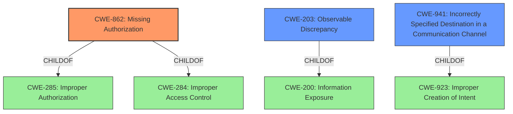

# Analysis for CVE-2022-20295

# Summary
| CWE ID  | CWE Name                      | Confidence | CWE Abstraction Level | CWE Vulnerability Mapping Label | CWE-Vulnerability Mapping Notes |
| :------- | :----------------------------- | :--------- | :-------------------- | :------------------------------ | :---------------------------- |
| CWE-862  | Missing Authorization         | 1          | Class                | Primary CWE                     | Allowed-with-Review            |
| CWE-203  | Observable Discrepancy        | 0.6        | Base                 | Secondary Candidate             | Allowed                       |
| CWE-941  | Incorrectly Specified Destination in a Communication Channel | 0.5        | Base                 | Secondary Candidate             | Allowed                       |

## Evidence and Confidence

*   **Confidence Score:** 0.8
*   **Evidence Strength:** HIGH

## Relationship Analysis
The primary CWE selected is CWE-862 **Missing Authorization**. The relationships of this CWE include being a child of CWE-285 and CWE-284. The retriever results suggest CWE-203 **Observable Discrepancy** and CWE-941 **Incorrectly Specified Destination in a Communication Channel** as alternative classifications. CWE-203 is a child of CWE-200, while CWE-941 is a child of CWE-923. CWE-862 is a class level, while CWE-203 and CWE-941 are base level. Selecting CWE-862 is the most appropriate classification because the vulnerability description highlights a **missing permission check**, which directly relates to the concept of missing authorization.

## Vulnerability Chain
The vulnerability chain starts with a **missing permission check** (CWE-862). This leads to a potential information disclosure, where an attacker can check if an account exists on the device.
Missing permission check -> Information Disclosure

## Summary of Analysis
The analysis is primarily based on the provided evidence. The key phrase "missing permission check" in the vulnerability description directly supports the selection of CWE-862. The "CVE Reference Links Content Summary" confirms that the vulnerability is related to an information disclosure issue. The graph relationships influenced the selection by highlighting the hierarchical structure, but the direct match with the vulnerability description was the deciding factor.

The selected CWE is at the optimal level of specificity. While CWE-862 is a Class, it accurately represents the **missing authorization** issue. The vulnerability description doesn't provide enough information to select a more specific Base-level CWE.

CWE-203 **Observable Discrepancy** and CWE-941 **Incorrectly Specified Destination in a Communication Channel** were considered but not used as the primary CWE because the root cause is a **missing permission check**.
CWE-125 **Out-of-bounds Read**, CWE-787 **Out-of-bounds Write**, CWE-191 **Integer Underflow (Wrap or Wraparound)**, CWE-197 **Numeric Truncation Error**, CWE-681 **Incorrect Conversion between Numeric Types**, CWE-754 **Improper Check for Unusual or Exceptional Conditions**, CWE-131 **Incorrect Calculation of Buffer Size**, CWE-667 **Improper Locking**, CWE-362 **Concurrent Execution using Shared Resource with Improper Synchronization ('Race Condition')**, CWE-682 **Incorrect Calculation**, CWE-703 **Improper Check or Handling of Exceptional Conditions**, CWE-367 **Time-of-check Time-of-use (TOCTOU) Race Condition**, CWE-1284 **Improper Validation of Specified Quantity in Input**, CWE-927 **Use of Implicit Intent for Sensitive Communication**, CWE-476 **NULL Pointer Dereference**, CWE-190 **Integer Overflow or Wraparound**, CWE-123 **Write-what-where Condition**, CWE-120 **Buffer Copy without Checking Size of Input ('Classic Buffer Overflow')**, CWE-416 **Use After Free**

Relevant CWE Information:

# Enhanced Context (25 CWEs)

## CWE-191: Integer Underflow (Wrap or Wraparound)
**Abstraction Level**: Base
**Similarity Score**: 0.80
**Source**: dense

**Description**:
The product subtracts one value from another, such that the result is less than the minimum allowable integer value, which produces a value that is not equal to the correct result.

**Mapping Guidance**:
- Usage: Allowed
- Rationale: This CWE entry is at the Base level of abstraction, which is a preferred level of abstraction for mapping to the root causes of vulnerabilities.

## CWE-197: Numeric Truncation Error
**Abstraction Level**: Base
**Similarity Score**: 0.77
**Source**: dense

**Description**:
Truncation errors occur when a primitive is cast to a primitive of a smaller size and data is lost in the conversion.

**Mapping Guidance**:
- Usage: Allowed
- Rationale: This CWE entry is at the Base level of abstraction, which is a preferred level of abstraction for mapping to the root causes of vulnerabilities.

## CWE-681: Incorrect Conversion between Numeric Types
**Abstraction Level**: Base
**Similarity Score**: 0.76
**Source**: dense

**Description**:
When converting from one data type to another, such as long to integer, data can be omitted or translated in a way that produces unexpected values. If the resulting values are used in a sensitive context, then dangerous behaviors may occur.

**Mapping Guidance**:
- Usage: Allowed
- Rationale: This CWE entry is at the Base level of abstraction, which is a preferred level of abstraction for mapping to the root causes of vulnerabilities.

## CWE-754: Improper Check for Unusual or Exceptional Conditions
**Abstraction Level**: Class
**Similarity Score**: 0.76
**Source**: dense

**Description**:
The product does not check or incorrectly checks for unusual or exceptional conditions that are not expected to occur frequently during day to day operation of the product.

**Mapping Guidance**:
- Usage: Allowed-with-Review
- Rationale: This CWE entry is a Class and might have Base-level children that would be more appropriate

## CWE-131: Incorrect Calculation of Buffer Size
**Abstraction Level**: Base
**Similarity Score**: 0.75
**Source**: dense

**Description**:
The product does not correctly calculate the size to be used when allocating a buffer, which could lead to a buffer overflow.

**Mapping Guidance**:
- Usage: Allowed
- Rationale: This CWE entry is at the Base level of abstraction, which is a preferred level of abstraction for mapping to the root causes of vulnerabilities.

## CWE-667: Improper Locking
**Abstraction Level**: Class
**Similarity Score**: 0.75
**Source**: dense

**Description**:
The product does not properly acquire or release a lock on a resource, leading to unexpected resource state changes and behaviors.

**Mapping Guidance**:
- Usage: Allowed-with-Review
- Rationale: This CWE entry is a Class and might have Base-level children that would be more appropriate

## CWE-362: Concurrent Execution using Shared Resource with Improper Synchronization ('Race Condition')
**Abstraction Level**: Class
**Similarity Score**: 0.74
**Source**: dense

**Description**:
The product contains a concurrent code sequence that requires temporary, exclusive access to a shared resource, but a timing window exists in which the shared resource can be modified by another code sequence operating concurrently.

**Mapping Guidance**:
- Usage: Allowed-with-Review
- Rationale: This CWE entry is a Class and might have Base-level children that would be more appropriate

## CWE-682: Incorrect Calculation
**Abstraction Level**: Pillar
**Similarity Score**: 0.74
**Source**: dense

**Description**:
The product performs a calculation that generates incorrect or unintended results that are later used in security-critical decisions or resource management.

**Mapping Guidance**:
- Usage: Discouraged
- Rationale: This