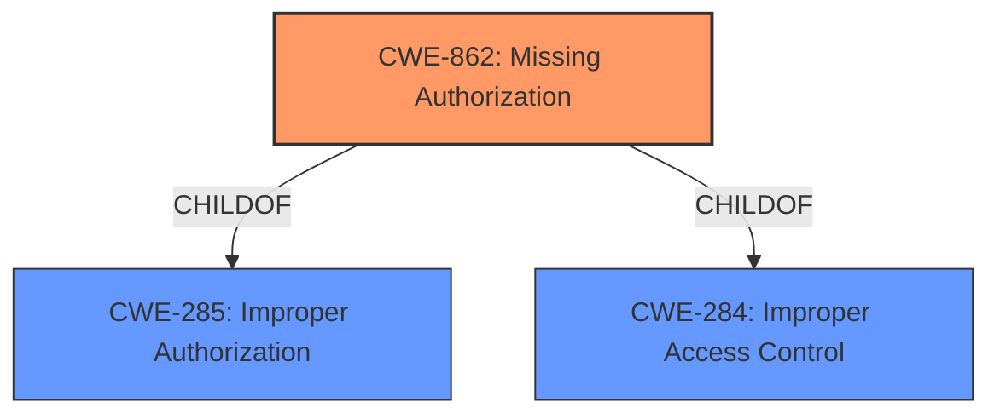

# Analysis Report for CVE-2022-20296

# Vulnerability Analysis Report: CVE-2022-20296

## Description


## Analysis (with Relationship Data)

# Summary
| CWE ID  | CWE Name                      | Confidence | CWE Abstraction Level | CWE Vulnerability Mapping Label | CWE-Vulnerability Mapping Notes |
| :-------- | :---------------------------- | :--------- | :-------------------- | :------------------------------ | :------------------------------ |
| CWE-862 | Missing Authorization         | 1.0        | Class                 | Primary                         | Allowed-with-Review              |

## Evidence and Confidence

*   **Confidence Score:** 1.0
*   **Evidence Strength:** HIGH

## Relationship Analysis
The primary CWE selected is CWE-862 which is a Class level CWE. The description for CWE-862 indicates that it represents the **missing authorization** check to access a resource. The other candidate CWEs either represent impacts or are not related to the **missing authorization** check.



## Vulnerability Chain
The vulnerability chain starts with the **missing permission check** in the ContentService which allows a local user to check if an account exists on the device leading to local information disclosure.

## Summary of Analysis
The initial analysis focused on identifying the root cause of the vulnerability which is the **missing permission check**. The vulnerability description clearly states "**missing permission check**" as the root cause. The CVE Reference Links Content Summary confirms the "Information Disclosure" due to "An unspecified vulnerability exists in the Framework component.".

The primary CWE match from the provided information is CWE-862 (Missing Authorization), which aligns with the **missing permission check** mentioned in the vulnerability description.

Based on the evidence, the selection of CWE-862 is at the optimal level of specificity, representing the root cause of the vulnerability.

Relevant CWE Information:

# Enhanced Context (25 CWEs)
The following CWEs were identified as potentially relevant to this vulnerability:

## CWE-191: Integer Underflow (Wrap or Wraparound)
**Abstraction Level**: Base
**Similarity Score**: 0.80
**Source**: dense
- Not applicable to the vulnerability description.

## CWE-197: Numeric Truncation Error
**Abstraction Level**: Base
**Similarity Score**: 0.77
**Source**: dense
- Not applicable to the vulnerability description.

## CWE-681: Incorrect Conversion between Numeric Types
**Abstraction Level**: Base
**Similarity Score**: 0.76
**Source**: dense
- Not applicable to the vulnerability description.

## CWE-754: Improper Check for Unusual or Exceptional Conditions
**Abstraction Level**: Class
**Similarity Score**: 0.75
**Source**: dense
- Not applicable to the vulnerability description.

## CWE-131: Incorrect Calculation of Buffer Size
**Abstraction Level**: Base
**Similarity Score**: 0.75
**Source**: dense
- Not applicable to the vulnerability description.

## CWE-667: Improper Locking
**Abstraction Level**: Class
**Similarity Score**: 0.75
**Source**: dense
- Not applicable to the vulnerability description.

## CWE-362: Concurrent Execution using Shared Resource with Improper Synchronization ('Race Condition')
**Abstraction Level**: Class
**Similarity Score**: 0.74
**Source**: dense
- Not applicable to the vulnerability description.

## CWE-682: Incorrect Calculation
**Abstraction Level**: Pillar
**Similarity Score**: 0.74
**Source**: dense
- Not applicable to the vulnerability description.

## CWE-703: Improper Check or Handling of Exceptional Conditions
**Abstraction Level**: Pillar
**Similarity Score**: 0.74
**Source**: dense
- Not applicable to the vulnerability description.

## CWE-203: Observable Discrepancy
**Abstraction Level**: Base
**Similarity Score**: 0.74
**Source**: dense
- Not applicable to the vulnerability description.

## CWE-941: Incorrectly Specified Destination in a Communication Channel
**Abstraction Level**: Base
**Similarity Score**: 5485.05
**Source**: sparse
- Not applicable to the vulnerability description.

## CWE-203: Observable Discrepancy
**Abstraction Level**: Base
**Similarity Score**: 5218.67
**Source**: sparse
- Not applicable to the vulnerability description.

## CWE-1284: Improper Validation of Specified Quantity in Input
**Abstraction Level**: Base
**Similarity Score**: 5047.16
**Source**: sparse
- Not applicable to the vulnerability description.

## CWE-367: Time-of-check Time-of-use (TOCTOU) Race Condition
**Abstraction Level**: Base
**Similarity Score**: 5046.43
**Source**: sparse
- Not applicable to the vulnerability description.

## CWE-927: Use of Implicit Intent for Sensitive Communication
**Abstraction Level**: Variant
**Similarity Score**: 5037.13
**Source**: sparse
- Not applicable to the vulnerability description.

## CWE-941: Incorrectly Specified Destination in a Communication Channel
**Abstraction Level**: base
**Similarity Score**: 4.33
**Source**: graph
- Not applicable to the vulnerability description.

## CWE-205: Observable Behavioral Discrepancy
**Abstraction Level**: base
**Similarity Score**: 4.33
**Source**: graph
- Not applicable to the vulnerability description.

## CWE-476: NULL Pointer Dereference
**Abstraction Level**: base
**Similarity Score**: 4.33
**Source**: graph
- Not applicable to the vulnerability description.

## CWE-1284: Improper Validation of Specified Quantity in Input
**Abstraction Level**: base
**Similarity Score**: 4.33
**Source**: graph
- Not applicable to the vulnerability description.

## CWE-787: Out-of-bounds Write
**Abstraction Level**: base
**Similarity Score**: 3.89
**Source**: graph
- Not applicable to the vulnerability description.

## CWE-190: Integer Overflow or Wraparound
**Abstraction Level**: base
**Similarity Score**: 3.80
**Source**: graph
- Not applicable to the vulnerability description.

## CWE-123: Write-what-where Condition
**Abstraction Level**: base
**Similarity Score**: 3.36
**Source**: graph
- Not applicable to the vulnerability description.

## CWE-120: Buffer Copy without Checking Size of Input ('Classic Buffer Overflow')
**Abstraction Level**: base
**Similarity Score**: 3.36
**Source**: graph
- Not applicable to the vulnerability description.

## CWE-367: Time-of-check Time-of-use (TOCTOU) Race Condition
**Abstraction Level**: base
**Similarity Score**: 3.27
**Source**: graph
- Not applicable to the vulnerability description.

## CWE-416: Use After Free
**Abstraction Level**: variant
**Similarity Score**: 3.24
**Source**: graph
- Not applicable to the vulnerability description.

CWE-862: Missing Authorization
- The product does not perform an authorization check when an actor attempts to access a resource or perform an action.
- The vulnerability description indicates that there is a **missing permission check** in ContentService, which allows a local user to check if an account exists on the device. This aligns with the CWE-862 description.
- Security Implications: An attacker can bypass intended access restrictions and potentially gain unauthorized access to sensitive information or functionality.
- Relationship: CWE-862 is a child of CWE-285 (Improper Authorization) and CWE-284 (Improper Access Control).
- Mapping Guidance: The Usage is Allowed-with-Review because this is a Class-level CWE. However, based on the available information, it is the most appropriate CWE.


## CWE Relationship Analysis

Current CWEs represent these abstraction levels: .


### Vulnerability Chain Analysis

**Chain starting from CWE-203:**
- 203 (Observable Discrepancy) - ROOT


**Chain starting from CWE-123:**
- 123 (Write-what-where Condition) - ROOT


### CWE Relationship Diagram

```mermaid
graph TD
    classDef primary fill:#f96,stroke:#333,stroke-width:2px
    classDef secondary fill:#69f,stroke:#333
    classDef tertiary fill:#9e9,stroke:#333
```


*Report generated on 2025-03-31 10:46:39*
