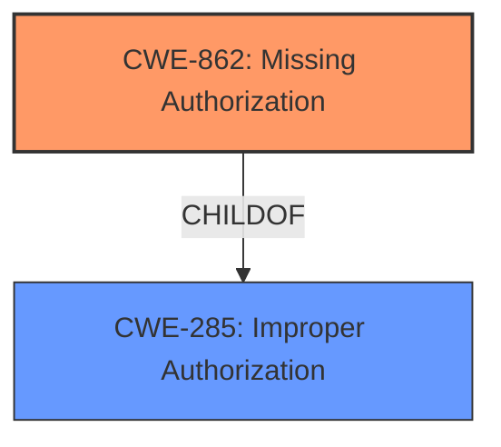

# Raw Analyzer Response for CVE-2022-20300

# Summary

| CWE ID | CWE Name | Confidence | CWE Abstraction Level | CWE Vulnerability Mapping Label | CWE-Vulnerability Mapping Notes |
|---|---|---|---|---|---|
| CWE-862 | Missing Authorization | 1.0 | Class | Allowed-with-Review | Primary CWE |

## Evidence and Confidence

*   **Confidence Score:** 1.0
*   **Evidence Strength:** HIGH

## Relationship Analysis
The primary relationship that influenced the decision was the ChildOf relationship of CWE-862 **Missing Authorization** to CWE-285 **Improper Authorization**. While CWE-862 is a Class, it directly reflects the **missing permission check**, making it the most appropriate choice. The other CWEs, like CWE-514 and CWE-1021, had weaker connections to the root cause.

## Vulnerability Chain
The vulnerability chain begins with a **missing permission check** (CWE-862), leading to local information disclosure.

## Summary of Analysis
The initial analysis pointed to CWE-862 **Missing Authorization** as the primary candidate based on the **rootcause**, **"missing permission check"**, and the similar CVE descriptions.

The Retriever Results further supported this choice, with CWE-862 having the highest relevance score.

The analysis confirmed that CWE-862 is the most specific and accurate representation of the vulnerability, as it directly addresses the **missing permission check**.

Relevant CWE Information:

# Enhanced Context (25 CWEs)

## CWE-862: Missing Authorization
**Abstraction:** Class
**Status:** Incomplete

### Description
The product does not perform an authorization check when an actor attempts to access a resource or perform an action.

### Extended Description
Not provided

### Alternative Terms
AuthZ: "AuthZ" is typically used as an abbreviation of "authorization" within the web application security community. It is distinct from "AuthN" (or, sometimes, "AuthC") which is an abbreviation of "authentication." The use of "Auth" as an abbreviation is discouraged, since it could be used for either authentication or authorization.

### Relationships
ChildOf -> CWE-285
ChildOf -> CWE-284

### Mapping Guidance
**Usage:** Allowed-with-Review
**Rationale:** This CWE entry is a Class and might have Base-level children that would be more appropriate
**Comments:** Examine children of this entry to see if there is a better fit
**Reasons:**
- Abstraction

### Additional Notes
**[Terminology]** Assuming a user with a given identity, authorization is the process of determining whether that user can access a given resource, based on the user's privileges and any permissions or other access-control specifications that apply to the resource.

### Observed Examples
- **CVE-2022-24730:** Go-based continuous deployment product does not check that a user has certain privileges to update or create an app, allowing adversaries to read sensitive repository information
- **CVE-2009-3168:** Web application does not restrict access to admin scripts, allowing authenticated users to reset administrative passwords.
- **CVE-2009-3597:** Web application stores database file under the web root with insufficient access control (CWE-219), allowing direct request.

CWE-862 **Missing Authorization** is the most appropriate choice because the **root cause** is a **missing permission check**. This directly aligns with the CWE description: "The product does not perform an authorization check when an actor attempts to access a resource or perform an action." The vulnerability leads to local information disclosure, which is a direct consequence of the missing authorization. The CWE is at the Class level, and while the mapping guidance suggests examining children for a better fit, none of the children CWEs are relevant.

CWE-514 **Covert Channel** was considered but rejected as it is not directly related to the **missing permission check**. A covert channel involves unintended paths for information transfer, which is not the case here.

CWE-1021 **Improper Restriction of Rendered UI Layers or Frames** was also considered but deemed irrelevant. This CWE focuses on UI-related vulnerabilities like clickjacking, which is not applicable to the described vulnerability.

CWE-1284 **Improper Validation of Specified Quantity in Input** was considered but rejected. This CWE is about validating input quantities, which is unrelated to the **missing permission check** in the vulnerability description.

CWE-941 **Incorrectly Specified Destination in a Communication Channel** was considered but rejected. This CWE is about communication channels having incorrect destinations, which does not match the described vulnerability.

CWE-927 **Use of Implicit Intent for Sensitive Communication** was considered. While this CWE is related to Android applications, the vulnerability is caused by **missing permission check**, not the use of implicit intents.

CWE-203 **Observable Discrepancy** was considered and rejected. This CWE relates to behavioral differences that expose information, which is not the primary **root cause** of the vulnerability.

CWE-362 **Concurrent Execution using Shared Resource with Improper Synchronization ('Race Condition')** was considered and rejected as concurrency is not mentioned in the description.

CWE-665 **Improper Initialization** was considered and rejected as initialization is not mentioned in the description.