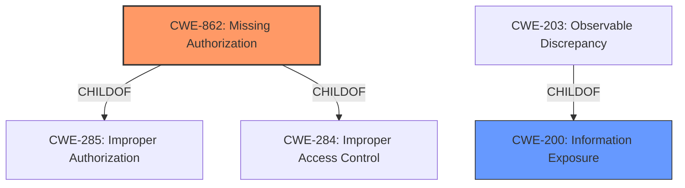

# Enhanced Analysis for CVE-2022-20301

# Summary
| CWE ID | CWE Name | Confidence | CWE Abstraction Level | CWE Vulnerability Mapping Label | CWE-Vulnerability Mapping Notes |
|---|---|---|---|---|---|
| CWE-862 | Missing Authorization | 1.0 | Class | Primary | Allowed-with-Review |
| CWE-200 | Information Exposure | 0.4 | Class | Secondary | Discouraged |

## Evidence and Confidence

*   **Confidence Score:** 0.9
*   **Evidence Strength:** HIGH

## Relationship Analysis
The primary relationship that influenced my decision was the ChildOf relationship between CWE-862 and its parents CWE-285 and CWE-284. This indicates that CWE-862 is a specific type of access control issue. No chain relationships were apparent in the description. CWE-200 was also considered, and it has a child relationship with CWE-203 which could also be considered as part of the vulnerability



## Vulnerability Chain
The chain of events in this vulnerability is as follows:
  1. **Root Cause:** **Missing permission check** (CWE-862)
  2. **Impact:** Ability to check if an account exists on the device (Information Disclosure)

## Summary of Analysis
The vulnerability description indicates a **missing permission check** that allows a user to check if an account exists on the device. This aligns directly with the description of CWE-862, "Missing Authorization," which occurs when "the product does not perform an authorization check when an actor attempts to access a resource or perform an action."
The vulnerability description includes the key phrase "**missing permission check**," which strongly suggests an authorization issue. The impact is local information disclosure, which results from the **missing check**.

The CWE for similar CVE Descriptions lists CWE-862 as the Primary CWE Match. The retriever results also list CWE-862 as the top match. The mapping guidance for CWE-862 suggests examining its children for a better fit, but none seem more appropriate given the available information.

CWE-200, "Information Exposure," could be a secondary weakness, as the **missing permission check** leads to information about account existence being exposed. However, CWE-200 is a high-level class, and the root cause is better captured by CWE-862.

I am selecting CWE-862 as the primary CWE because the vulnerability description explicitly states a **missing permission check**, which directly corresponds to the definition of CWE-862. This is at the Class abstraction level, but there are no more specific children that fit better. CWE-200 is considered but not used as the primary CWE because it is a higher-level classification of the impact rather than the root cause. Other CWEs such as race conditions do not fit the description, because there's no evidence of concurrent execution issues.


## CWE Relationship Analysis

Current CWEs represent these abstraction levels: .


### Vulnerability Chain Analysis

**Chain starting from CWE-862:**
- 862 (Missing Authorization) - ROOT


**Chain starting from CWE-200:**
- 200 (Exposure of Sensitive Information to an Unauthorized Actor) - ROOT


### CWE Relationship Diagram

```mermaid
graph TD
    classDef primary fill:#f96,stroke:#333,stroke-width:2px
    classDef secondary fill:#69f,stroke:#333
    classDef tertiary fill:#9e9,stroke:#333
```