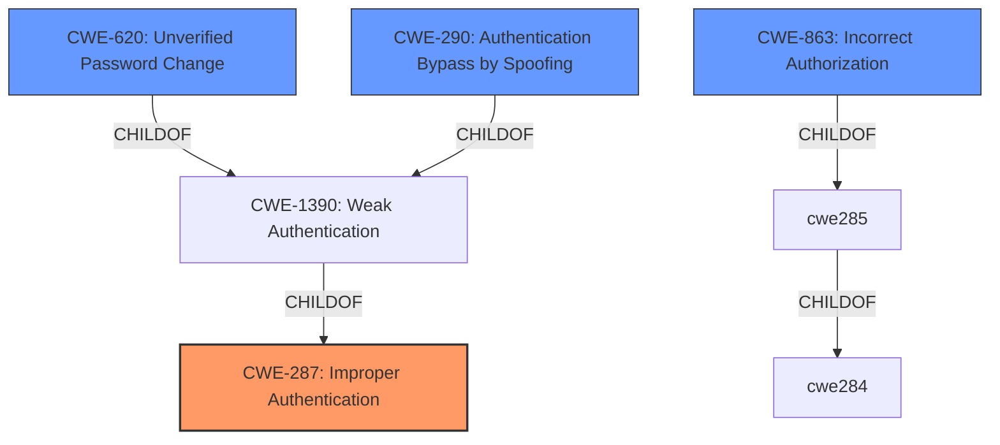

# Analysis for CVE-2022-2031

# Summary
| CWE ID  | CWE Name                                      | Confidence | CWE Abstraction Level | CWE Vulnerability Mapping Label | CWE-Vulnerability Mapping Notes |
| :-------- | :--------------------------------------------- | :---------- | :----------------------- | :-------------------------------- | :------------------------------ |
| CWE-287   | Improper Authentication                       | 0.85        | Class                   | Primary                           | Discouraged                  |
| CWE-620   | Unverified Password Change                    | 0.75        | Base                    | Secondary                         | Allowed                      |
| CWE-290   | Authentication Bypass by Spoofing             | 0.6         | Base                    | Secondary                         | Allowed                      |
| CWE-863   | Incorrect Authorization                       | 0.5         | Class                   | Secondary                         | Allowed-with-Review          |

## Evidence and Confidence

*   **Confidence Score:** 0.75
*   **Evidence Strength:** HIGH

## Relationship Analysis
The primary relationship that influenced the selection was the hierarchical relationship between CWE-287 (Improper Authentication) and its child CWE-1390 (Weak Authentication) and CWE-620 (Unverified Password Change). Although CWE-287 is discouraged, the description of the vulnerability closely aligns with its general concept of failing to properly prove a claimed identity. CWE-620 is also relevant because the vulnerability allows password changes without proper verification of the user's identity. CWE-290 (Authentication Bypass by Spoofing) was also considered, as the vulnerability allows users to obtain tickets for services they are not authorized to use, effectively spoofing their identity. CWE-863 (Incorrect Authorization) was considered because the KDC incorrectly authorizes access to services based on improperly issued tickets.

## Vulnerability Chain
The vulnerability chain starts with the **misconfiguration** of the KDC and kpasswd service sharing a single account and set of keys. This leads to **improper authentication** (CWE-287) and the ability to obtain unauthorized tickets, potentially resulting in **authentication bypass** (CWE-290) and **incorrect authorization** (CWE-863), ultimately leading to **elevation of privilege** and **account control**.

## Summary of Analysis
The initial assessment identified CWE-287 as the primary weakness due to the **improper authentication** mechanism allowing unauthorized access. The "CVE Reference Links Content Summary" clearly states that the KDC "incorrectly accepted kpasswd tickets as if they were TGTs," which directly violates proper authentication procedures. While CWE-287 is discouraged, the evidence strongly supports its relevance, making it the most appropriate high-level classification.

The analysis also considered CWE-620 because the vulnerability allows users with expired passwords to obtain tickets, essentially changing their access without proper verification. This aligns with the "Unverified Password Change" concept.

CWE-290 was considered due to the bypass of authentication via spoofing. The ability to obtain TGTs or service tickets meant for other services allows a user to effectively spoof their identity and gain unauthorized access.

CWE-863 was considered because the KDC performs an authorization check, but does so incorrectly, allowing unauthorized access.

The final selection prioritizes CWE-287 as the central authentication failure, with CWE-620, CWE-290, and CWE-863 representing contributing factors or consequences of the initial authentication flaw. The confidence level is high due to the clear articulation of the authentication failure in the vulnerability description and supporting evidence.