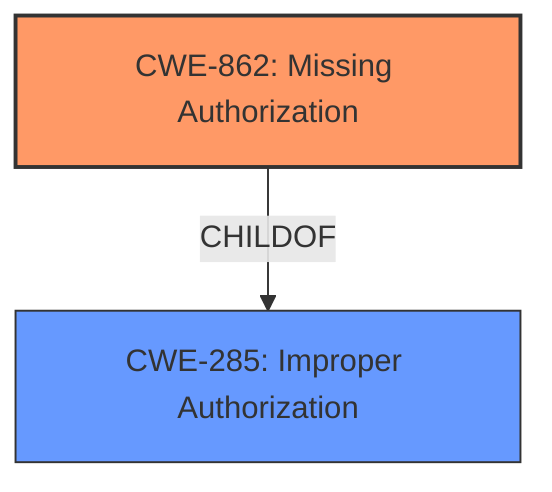

# Analysis for CVE-2022-20311

# Summary
| CWE ID | CWE Name | Confidence | CWE Abstraction Level | CWE Vulnerability Mapping Label | CWE-Vulnerability Mapping Notes |
|---|---|---|---|---|---|
| CWE-862 | Missing Authorization | 1.0 | Class | Allowed-with-Review | Primary CWE |

## Evidence and Confidence

*   **Confidence Score:** 1.0
*   **Evidence Strength:** HIGH

## Relationship Analysis
CWE-862 is a Class-level CWE, which means that it might have more specific Base-level children. However, the provided information does not have the information to narrow it down to a more specific CWE. CWE-862 is a child of CWE-285 (Improper Authorization).

## Vulnerability Chain
The vulnerability chain starts with the **missing permission check** (CWE-862), which leads to the disclosure of registered self-managed phone accounts.

## Summary of Analysis
The vulnerability description clearly states a **missing permission check** as the root cause. The primary CWE match from similar CVE descriptions is CWE-862 (Missing Authorization), which aligns directly with this root cause.

The vulnerability description states: "In Telecomm, there is a possible disclosure of registered self managed phone accounts due to a **missing permission check**."
The description for CWE-862 states: "The product does not perform an authorization check when an actor attempts to access a resource or perform an action."

Given the direct match between the vulnerability description and the CWE description, and the confirmation from similar CVEs, I am confident in assigning CWE-862 as the primary CWE.

Relevant CWE Information:

# Enhanced Context (25 CWEs)

## CWE-862: Missing Authorization
**Abstraction:** Class
**Status:** Incomplete

### Description
The product does not perform an authorization check when an actor attempts to access a resource or perform an action.

### Extended Description
Not provided

### Alternative Terms
AuthZ: "AuthZ" is typically used as an abbreviation of "authorization" within the web application security community. It is distinct from "AuthN" (or, sometimes, "AuthC") which is an abbreviation of "authentication." The use of "Auth" as an abbreviation is discouraged, since it could be used for either authentication or authorization.

### Relationships
ChildOf -> CWE-285
ChildOf -> CWE-284

### Mapping Guidance
**Usage:** Allowed-with-Review
**Rationale:** This CWE entry is a Class and might have Base-level children that would be more appropriate
**Comments:** Examine children of this entry to see if there is a better fit
**Reasons:**
- Abstraction

### Additional Notes
**[Terminology]** Assuming a user with a given identity, authorization is the process of determining whether that user can access a given resource, based on the user's privileges and any permissions or other access-control specifications that apply to the resource.

### Observed Examples
- **CVE-2022-24730:** Go-based continuous deployment product does not check that a user has certain privileges to update or create an app, allowing adversaries to read sensitive repository information
- **CVE-2009-3168:** Web application does not restrict access to admin scripts, allowing authenticated users to reset administrative passwords.
- **CVE-2009-3597:** Web application stores database file under the web root with insufficient access control (CWE-219), allowing direct request.

CWEs Considered but Not Used:

*   CWE-927 (Use of Implicit Intent for Sensitive Communication): This CWE is specific to Android applications using implicit intents, which is not mentioned in the vulnerability description.
*   CWE-514 (Covert Channel): This CWE is about unintended paths for information transfer, which is not the case here. The **missing permission check** is a direct flaw, not a covert channel.
*   CWE-665 (Improper Initialization): This CWE refers to resources not being initialized correctly, which is different from a **missing authorization check**.
*   CWE-1021 (Improper Restriction of Rendered UI Layers or Frames): This CWE relates to UI-based vulnerabilities like clickjacking, which are irrelevant to the described vulnerability.
*   CWE-223 (Omission of Security-relevant Information): This CWE is about not recording or displaying security-relevant information, which is not the primary issue here.
*   CWE-205 (Observable Behavioral Discrepancy): This CWE relates to behavioral differences revealing internal state, which is not the core weakness.
*   CWE-908 (Use of Uninitialized Resource): This CWE relates to using a resource before it's initialized, not a **missing permission check**.
*   CWE-191 (Integer Underflow (Wrap or Wraparound)): This CWE is about arithmetic errors, not authorization issues.
*   CWE-941 (Incorrectly Specified Destination in a Communication Channel): This CWE is about communication channels being directed to the wrong destination, which isn't the case here.