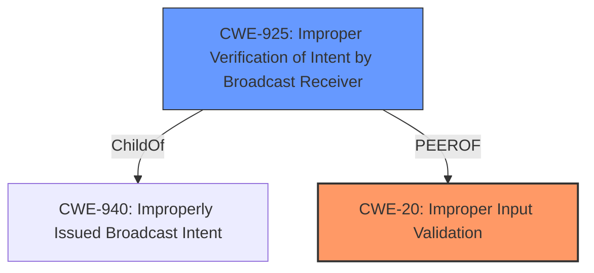

# Analysis Report for CVE-2022-20314

# Vulnerability Analysis Report: CVE-2022-20314

## Description


## Analysis (with Relationship Data)

# Summary
| CWE ID | CWE Name | Confidence | CWE Abstraction Level | CWE Vulnerability Mapping Label | CWE-Vulnerability Mapping Notes |
|---|---|---|---|---|---|
| CWE-20 | Improper Input Validation | 0.8 | Class | Primary | Discouraged |
| CWE-925 | Improper Verification of Intent by Broadcast Receiver | 0.7 | Variant | Secondary | Allowed |

## Evidence and Confidence

*   **Confidence Score:** 0.8
*   **Evidence Strength:** MEDIUM

## Relationship Analysis
The primary CWE is CWE-20, which is a class-level CWE and discouraged. CWE-20 has child CWEs that are more specific. CWE-925 is a variant-level CWE that is a child of CWE-940.



## Vulnerability Chain
The chain of root cause and weaknesses that followed for the Vulnerability Description:
  - **Root Cause:** **Improper Input Validation** (CWE-20) in KeyChain.
  - **Impact:** Spoof keychain chooser activity request leading to local escalation of privilege.

## Summary of Analysis
The vulnerability description states that there is a possible spoof keychain chooser activity request due to **improper input validation**. The key phrase section also lists the root cause as **improper input validation**. The CVE Reference Links Content Summary states that the root cause of the vulnerability is not directly described. However, since the vulnerability description and key phrases both state **improper input validation**, this will be considered as sufficient evidence.

The retriever results show that CWE-20, Improper Input Validation, is a candidate CWE. The CWE-20 is a Class-level CWE and the mapping guidance states that it is discouraged. The retriever results also show that CWE-925, Improper Verification of Intent by Broadcast Receiver, is a candidate CWE. CWE-925 is a Variant-level CWE.

CWE-20 is selected as the primary CWE because the vulnerability description explicitly states **improper input validation**. CWE-925 is selected as a secondary CWE because it is a more specific CWE that is related to the vulnerability.

Relevant CWE Information:

# Enhanced Context (25 CWEs)
The following CWEs were identified as potentially relevant to this vulnerability:

## CWE-1289: Improper Validation of Unsafe Equivalence in Input
**Abstraction Level**: Base
**Similarity Score**: 0.78

The product receives an input value that is used as a resource identifier or other type of reference, but it does not validate or incorrectly validates that the input is equivalent to a potentially-unsafe value.

This CWE was not selected because the vulnerability description does not state that the input is used as a resource identifier or other type of reference.

## CWE-1288: Improper Validation of Consistency within Input
**Abstraction Level**: Base
**Similarity Score**: 0.75

The product receives a complex input with multiple elements or fields that must be consistent with each other, but it does not validate or incorrectly validates that the input is actually consistent.

This CWE was not selected because the vulnerability description does not state that the input is complex or that there are multiple elements or fields that must be consistent with each other.

## CWE-807: Reliance on Untrusted Inputs in a Security Decision
**Abstraction Level**: Base
**Similarity Score**: 0.75

The product uses a protection mechanism that relies on the existence or values of an input, but the input can be modified by an untrusted actor in a way that bypasses the protection mechanism.

This CWE was not selected because the vulnerability description does not state that the product uses a protection mechanism that relies on the existence or values of an input.

## CWE-404: Improper Resource Shutdown or Release
**Abstraction Level**: Class
**Similarity Score**: 0.74

The product does not release or incorrectly releases a resource before it is made available for re-use.

This CWE was not selected because the vulnerability description does not state that the product does not release or incorrectly releases a resource before it is made available for re-use.

## CWE-667: Improper Locking
**Abstraction Level**: Class
**Similarity Score**: 0.74

The product does not properly acquire or release a lock on a resource, leading to unexpected resource state changes and behaviors.

This CWE was not selected because the vulnerability description does not state that the product does not properly acquire or release a lock on a resource.

## CWE-754: Improper Check for Unusual or Exceptional Conditions
**Abstraction Level**: Class
**Similarity Score**: 0.74

The product does not check or incorrectly checks for unusual or exceptional conditions that are not expected to occur frequently during day to day operation of the product.

This CWE was not selected because the vulnerability description does not state that the product does not check or incorrectly checks for unusual or exceptional conditions.

## CWE-799: Improper Control of Interaction Frequency
**Abstraction Level**: Class
**Similarity Score**: 0.74

The product does not properly limit the number or frequency of interactions that it has with an actor, such as the number of incoming requests.

This CWE was not selected because the vulnerability description does not state that the product does not properly limit the number or frequency of interactions.

## CWE-664: Improper Control of a Resource Through its Lifetime
**Abstraction Level**: Pillar
**Similarity Score**: 0.74

The product does not maintain or incorrectly maintains control over a resource throughout its lifetime of creation, use, and release.

This CWE was not selected because the vulnerability description does not state that the product does not maintain or incorrectly maintains control over a resource.

## CWE-345: Insufficient Verification of Data Authenticity
**Abstraction Level**: Class
**Similarity Score**: 0.74

The product does not sufficiently verify the origin or authenticity of data, in a way that causes it to accept invalid data.

This CWE was not selected because the vulnerability description does not state that the product does not sufficiently verify the origin or authenticity of data.

## CWE-691: Insufficient Control Flow Management
**Abstraction Level**: Pillar
**Similarity Score**: 0.74

The code does not sufficiently manage its control flow during execution, creating conditions in which the control flow can be modified in unexpected ways.

This CWE was not selected because the vulnerability description does not state that the code does not sufficiently manage its control flow.

## CWE-1284: Improper Validation of Specified Quantity in Input
**Abstraction Level**: Base
**Similarity Score**: 5833.70

The product receives input that is expected to specify a quantity (such as size or length), but it does not validate or incorrectly validates that the quantity has the required properties.

This CWE was not selected because the vulnerability description does not state that the input is expected to specify a quantity.

## CWE-22: Improper Limitation of a Pathname to a Restricted Directory ('Path Traversal')
**Abstraction Level**: Base
**Similarity Score**: 5749.41

The product uses external input to construct a pathname that is intended to identify a file or directory that is located underneath a restricted parent directory, but the product does not properly neutralize special elements within the pathname that can cause the pathname to resolve to a location that is outside of the restricted directory.

This CWE was not selected because the vulnerability description does not state that the product uses external input to construct a pathname.

## CWE-116: Improper Encoding or Escaping of Output
**Abstraction Level**: Class
**Similarity Score**: 5646.07

The product prepares a structured message for communication with another component, but encoding or escaping of the data is either missing or done incorrectly. As a result, the intended structure of the message is not preserved.

This CWE was not selected because the vulnerability description does not state that the product prepares a structured message for communication with another component.

## CWE-367: Time-of-check Time-of-use (TOCTOU) Race Condition
**Abstraction Level**: Base
**Similarity Score**: 5631.22

The product checks the state of a resource before using that resource, but the resource's state can change between the check and the use in a way that invalidates the results of the check. This can cause the product to perform invalid actions when the resource is in an unexpected state.

This CWE was not selected because the vulnerability description does not state that the product checks the state of a resource before using that resource.

## CWE-190: Integer Overflow or Wraparound
**Abstraction Level**: Base
**Similarity Score**: 5628.65

The product performs a calculation that can
         produce an integer overflow or wraparound when the logic
         assumes that the resulting


## CWE Relationship Analysis

Current CWEs represent these abstraction levels: .


### Vulnerability Chain Analysis

**Chain starting from CWE-190:**
- 190 (Integer Overflow or Wraparound) - ROOT


**Chain starting from CWE-925:**
- 925 (Improper Verification of Intent by Broadcast Receiver) - ROOT


### CWE Relationship Diagram

```mermaid
graph TD
    classDef primary fill:#f96,stroke:#333,stroke-width:2px
    classDef secondary fill:#69f,stroke:#333
    classDef tertiary fill:#9e9,stroke:#333
```


*Report generated on 2025-03-31 03:40:12*
