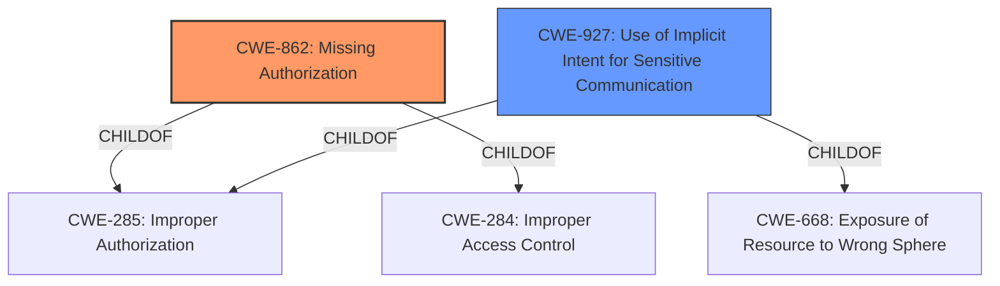

# Analysis Report for CVE-2022-20335

# Vulnerability Analysis Report: CVE-2022-20335

## Description


## Analysis (with Relationship Data)

# Summary
| CWE ID | CWE Name | Confidence | CWE Abstraction Level | CWE Vulnerability Mapping Label | CWE-Vulnerability Mapping Notes |
|---|---|---|---|---|---|
| CWE-862 | Missing Authorization | 1.0 | Class | Allowed-with-Review | Primary CWE |
| CWE-927 | Use of Implicit Intent for Sensitive Communication | 0.6 | Variant | Allowed | Secondary Candidate |

## Evidence and Confidence

*   **Confidence Score:** 0.8
*   **Evidence Strength:** HIGH

## Relationship Analysis
The primary CWE, CWE-862 [Missing Authorization], is a Class-level CWE with the relationships ChildOf -> CWE-285 and ChildOf -> CWE-284. This indicates that it is related to both Improper Authorization and Access Control and Permissions, which fits the description of the vulnerability. CWE-927 [Use of Implicit Intent for Sensitive Communication] is a Variant-level CWE, which is a child of both CWE-285 and CWE-668 [Exposure of Resource to Wrong Sphere].



## Vulnerability Chain
The chain of events for this vulnerability is:
1.  **Root Cause:** **Missing permission check** (CWE-862 [Missing Authorization])
2.  Impact: Adjust Wi-Fi settings even when the permission has been disabled.

## Summary of Analysis
The vulnerability description clearly states a **missing permission check**, which directly corresponds to CWE-862 [Missing Authorization]. The vulnerability allows adjustment of Wi-Fi settings when the permission should be disabled. This is a direct result of the authorization **missing**, making CWE-862 [Missing Authorization] the most appropriate primary CWE.

The "Retriever Results" list CWE-862 [Missing Authorization] as the top candidate, which supports the choice. The Abstraction Level of Class is acceptable, but the guidance suggests looking for more specific Base-level children. However, none of the children of CWE-862 [Missing Authorization] are a better fit than CWE-862 [Missing Authorization] itself.

CWE-927 [Use of Implicit Intent for Sensitive Communication] was considered because of the Android context and potential for sensitive data exposure via intents, but the description focuses on the **missing permission check** rather than the specifics of intent handling. Therefore, CWE-927 [Use of Implicit Intent for Sensitive Communication] is a less direct match but still potentially relevant as a secondary concern.

The choice of CWE-862 [Missing Authorization] is primarily based on the phrase "**missing permission check**" in the "Vulnerability Description Key Phrases".

Other CWEs were considered but deemed less relevant:

*   CWE-20 [Improper Input Validation]: While input validation could be related, the core issue is the **missing** authorization check, not necessarily the validation of input.
*   CWE-770 [Allocation of Resources Without Limits or Throttling]: This is not relevant as there is no indication of resource allocation issues.
*   CWE-1284 [Improper Validation of Specified Quantity in Input]: Similar to CWE-20 [Improper Input Validation], this is not directly related to the described **missing permission check**.
*   CWE-908 [Use of Uninitialized Resource]: This is not relevant as there is no mention of resources being uninitialized.
*   CWE-73 [External Control of File Name or Path]: This is not relevant as there is no indication of file name or path manipulation.
*   CWE-514 [Covert Channel]: This is not relevant as there is no indication of covert communication channels.
*   CWE-667 [Improper Locking]: This is not relevant as there is no indication of locking issues.


## CWE Relationship Analysis

Current CWEs represent these abstraction levels: .


### Vulnerability Chain Analysis

**Chain starting from CWE-862:**
- 862 (Missing Authorization) - ROOT


**Chain starting from CWE-908:**
- 908 (Use of Uninitialized Resource) - ROOT


### CWE Relationship Diagram

```mermaid
graph TD
    classDef primary fill:#f96,stroke:#333,stroke-width:2px
    classDef secondary fill:#69f,stroke:#333
    classDef tertiary fill:#9e9,stroke:#333
```


*Report generated on 2025-03-31 08:09:37*
