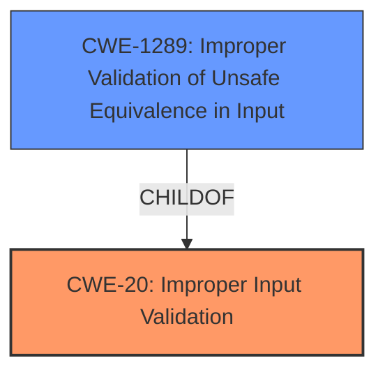

# Raw Analyzer Response for CVE-2022-20338

# Summary
| CWE ID | CWE Name | Confidence | CWE Abstraction Level | CWE Vulnerability Mapping Label | CWE-Vulnerability Mapping Notes |
|---|---|---|---|---|---|
| CWE-20 | Improper Input Validation | 0.9 | Class | Primary | Allowed-with-Review |
| CWE-1289 | Improper Validation of Unsafe Equivalence in Input | 0.6 | Base | Secondary | Allowed |

## Evidence and Confidence

*   **Confidence Score:** 0.9
*   **Evidence Strength:** HIGH

## Relationship Analysis
The primary relationship to consider is that CWE-1289 is a child of CWE-20. Because the vulnerability description indicates that the **improper input validation** specifically relates to how the URI path is handled based on the presence of scheme and authority components, and that this **improper input validation** leads to an unsafe equivalence, CWE-1289 can be considered as a more specific weakness than CWE-20. However, given that the description does not provide sufficient detail to fully confirm that unsafe equivalence is the root cause, CWE-20 will be the primary CWE.

## Vulnerability Chain
The chain of events is as follows:
1.  **Root Cause:** **Improper input validation** (CWE-20) in `HierarchicalUri.readFrom` of `Uri.java`.
2.  **Vulnerability:** Failure to validate the scheme and authority components of a URI when determining its path during unparceling, leading to a malformed URI object.
3.  **Impact:** Local escalation of privilege.

## Summary of Analysis
The initial assessment identified CWE-20 as the primary candidate due to the **improper input validation**. The supporting evidence in "Vulnerability Description Key Phrases" section includes the key phrase "**improper input validation**". The "CVE Reference Links Content Summary" confirms the **root cause** stems from **improper handling of URIs** and **failure to validate or account for the scheme and authority components of a URI when determining its path during unparceling.**

The retriever results also list CWE-20 with a significant score. While other CWEs like CWE-862 (Missing Authorization), CWE-73 (External Control of File Name or Path), and CWE-1284 (Improper Validation of Specified Quantity in Input) were considered, they did not directly address the **improper input validation** of the URI components.

CWE-1289 (Improper Validation of Unsafe Equivalence in Input) was considered as a more specific variant of CWE-20, and while it is possible that this is the case, there is insufficient evidence to support this conclusion with high confidence. As such, it is added as a secondary candidate.

The final decision to use CWE-20 as the primary weakness and CWE-1289 as the secondary weakness is based on the available evidence and the abstraction levels of the candidate CWEs. CWE-20 serves as the broader classification, while CWE-1289 is a more focused option given the specific details of the vulnerability.

Relevant CWE Information:

# Enhanced Context (25 CWEs)
The following CWEs were identified as potentially relevant to this vulnerability:

## CWE-1289: Improper Validation of Unsafe Equivalence in Input
**Abstraction Level**: Base
**Similarity Score**: 0.77
**Source**: dense

**Description**:
The product receives an input value that is used as a resource identifier or other type of reference, but it does not validate or incorrectly validates that the input is equivalent to a potentially-unsafe value.

**Mapping Guidance**:
- Usage: Allowed
- Rationale: This CWE entry is at the Base level of abstraction, which is a preferred level of abstraction for mapping to the root causes of vulnerabilities.

**Technical Explanation for CWE-20:**

*   How the vulnerability's details match the CWE's characteristics: The vulnerability lies in the **improper validation** of the URI components, leading to a malformed URI object. This aligns directly with CWE-20's description: "The product receives input or data, but it does not validate or incorrectly validates that the input has the properties that are required to process the data safely and correctly."
*   The security implications and potential impact: The impact is a local escalation of privilege, which stems from the inability to properly validate URIs.
*   Any parent-child relationships or chain patterns that influenced your mapping: CWE-20 is a class-level CWE, and while there may be more specific child CWEs, the provided information does not strongly support a more specific classification.
*   Whether the weakness is primary or secondary in the vulnerability: This is the primary weakness, as the **improper input validation** is the root cause of the vulnerability.
*   How the official MITRE mapping guidance influenced your decision: The MITRE mapping guidance discourages the use of CWE-20 when lower-level CWEs are available. While CWE-1289 is considered, the evidence is insufficient to use it as the primary CWE.

**Technical Explanation for CWE-1289:**

*   How the vulnerability's details match the CWE's characteristics: The unparceling process does not properly account for the scheme and authority components when determining the URI's path. This can be seen as validating the input as equivalent to an unsafe value.
*   The security implications and potential impact: The impact is a local escalation of privilege, which stems from the inability to properly validate URIs.
*   Any parent-child relationships or chain patterns that influenced your mapping: CWE-1289 is a child of CWE-20, indicating that it is a more specific form of **improper input validation**.
*   Whether the weakness is primary or secondary in the vulnerability: This is a secondary weakness, as the **improper input validation** is the root cause of the vulnerability, and the lack of validation around "Unsafe Equivalence" is what leads to the vulnerability.
*   How the official MITRE mapping guidance influenced your decision: The MITRE mapping guidance lists Usage: Allowed.

**CWEs Considered But Not Used:**

*   CWE-862 (Missing Authorization): While the vulnerability leads to a privilege escalation, the root cause is not a missing authorization check, but rather the **improper validation** of URI components.
*   CWE-73 (External Control of File Name or Path): The vulnerability does not involve direct external control of file names or paths, but rather **improper validation** of internal URI components.
*   CWE-789 (Memory Allocation with Excessive Size Value) and CWE-190 (Integer Overflow or Wraparound): The vulnerability description does not provide evidence that these conditions are met.