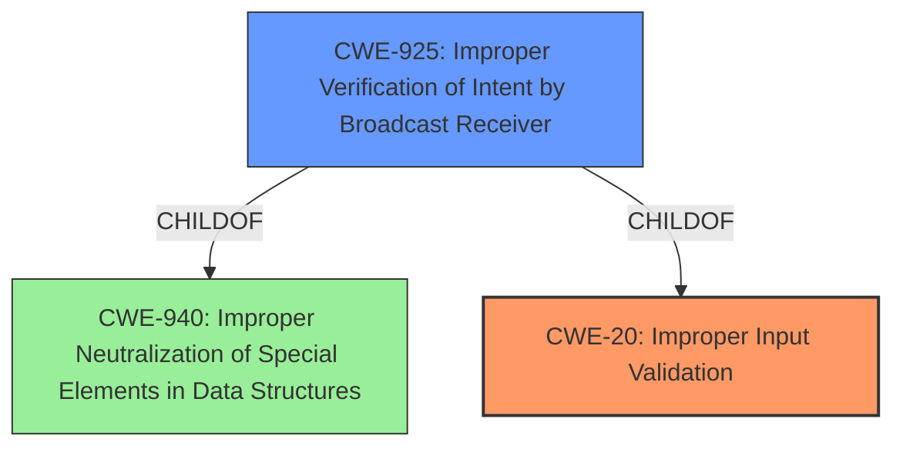

# Analysis Report for CVE-2022-20350

# Vulnerability Analysis Report: CVE-2022-20350

## Description


## Analysis (with Relationship Data)

# Summary
| CWE ID | CWE Name | Confidence | CWE Abstraction Level | CWE Vulnerability Mapping Label | CWE-Vulnerability Mapping Notes |
|---|---|---|---|---|---|
| CWE-20 (Improper Input Validation) | Improper Input Validation | 0.8 | Class | Primary | The primary weakness is the **improper input validation** that leads to the vulnerability. |
| CWE-925 (Improper Verification of Intent by Broadcast Receiver) | Improper Verification of Intent by Broadcast Receiver | 0.6 | Variant | Secondary |  The vulnerability could be seen as an **improper verification of intent** since the application is not properly validating the intent that is received. |

## Evidence and Confidence

*   **Confidence Score:** 0.8
*   **Evidence Strength:** MEDIUM

## Relationship Analysis
The primary relationship that influenced my decision was the parent-child relationship. CWE-20 (Improper Input Validation) is a broad class, while CWE-925 (Improper Verification of Intent by Broadcast Receiver) is a more specific variant.
Here's a breakdown:

*   **Parent-Child:** CWE-925 is a child of CWE-940 (Improper Neutralization of Special Elements in Data Structures), which suggests the potential for exploiting data structures due to the lack of proper intent verification.
*   **Abstraction Levels:** CWE-20 is a Class, while CWE-925 is a Variant. Since the evidence points to a specific type of input validation issue related to intent verification, the variant (CWE-925) is considered.
*   **Peer Relationships:** None applicable



## Vulnerability Chain
The vulnerability chain is relatively simple:

1.  **Root Cause:** **Improper Input Validation** (CWE-20) in `NotificationAccessConfirmationActivity.java`. The root cause is explicitly stated in the description
2.  **Weakness:** The application's failure to validate the intent by broadcast receiver, may lead to user's confusion for granting notification access (CWE-925)
3.  **Impact:** Local Information Disclosure.

## Summary of Analysis
The initial analysis identified **improper input validation** as the root cause, which aligns with CWE-20.
However, the description also points to a specific type of input (**intent**) that is not being properly verified.
Therefore, CWE-925, which is a more specific variant related to intent verification, was considered.

The evidence supporting this analysis comes directly from the vulnerability description: "**improper input validation**" and "**trick the victim to grant notification access to the wrong app**".
The CVE Reference Links Content Summary confirms that the vulnerability stems from how the system extracts and displays application labels, suggesting a problem with handling and validating the component name.

The decision to include both CWEs is based on the need to capture both the general input validation issue (CWE-20) and the more specific problem related to intent verification (CWE-925).
CWE-20 is considered the primary weakness, as it represents the fundamental flaw, while CWE-925 provides additional context about the specific type of input that is not being properly validated.

CWE-20 is a Class level of abstraction, while CWE-925 is a Variant. Variant is preferred when evidence supports it.

Several other CWEs were considered but ultimately not used:

*   CWE-862 (Missing Authorization): While the vulnerability involves granting access, it's more about tricking the user into granting access to the wrong app rather than a complete lack of authorization.
*   CWE-770 (Allocation of Resources Without Limits or Throttling) and CWE-789 (Memory Allocation with Excessive Size Value): These are related to resource management and memory allocation, which are not directly relevant to the described vulnerability.
*   CWE-416 (Use After Free): This is related to memory management issues, which are not directly relevant to the described vulnerability.
*   CWE-665 (Improper Initialization) and CWE-908 (Use of Uninitialized Resource): These are related to initialization issues, which are not directly relevant to the described vulnerability.
*   CWE-362 (Concurrent Execution using Shared Resource with Improper Synchronization ('Race Condition')): This is related to concurrent execution issues, which are not directly relevant to the described vulnerability.
*   CWE-1284 (Improper Validation of Specified Quantity in Input): This is related to quantity validation, not intent validation.


## CWE Relationship Analysis

Current CWEs represent these abstraction levels: .


### Vulnerability Chain Analysis

**Chain starting from CWE-862:**
- 862 (Missing Authorization) - ROOT


**Chain starting from CWE-925:**
- 925 (Improper Verification of Intent by Broadcast Receiver) - ROOT


### CWE Relationship Diagram

```mermaid
graph TD
    classDef primary fill:#f96,stroke:#333,stroke-width:2px
    classDef secondary fill:#69f,stroke:#333
    classDef tertiary fill:#9e9,stroke:#333
```


*Report generated on 2025-03-30 19:16:43*
