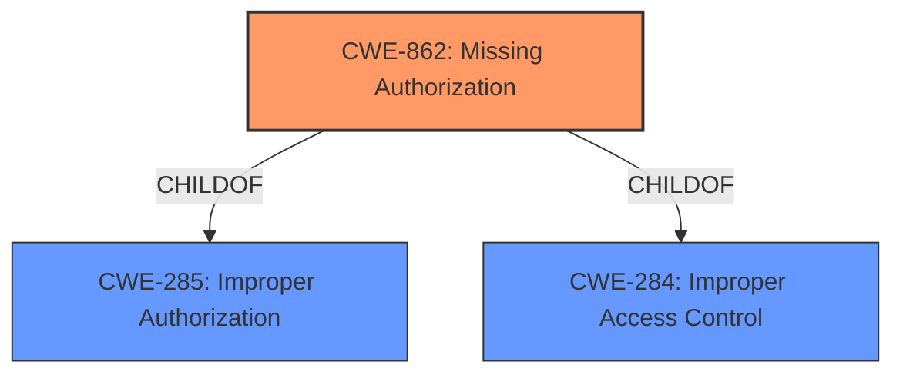

# Analysis for CVE-2022-20352

# Summary
| CWE ID | CWE Name | Confidence | CWE Abstraction Level | CWE Vulnerability Mapping Label | CWE-Vulnerability Mapping Notes |
|---|---|---|---|---|---|
| CWE-862 | Missing Authorization | 1.0 | Class | Allowed-with-Review | Primary CWE |

## Evidence and Confidence

*   **Confidence Score:** 1.0
*   **Evidence Strength:** HIGH

## Relationship Analysis
The primary relationship that influenced my decision was the parent-child relationship where CWE-862 (Missing Authorization) can have more specific Base-level children. However, given the information provided, the general `Missing Authorization` is the most accurate and supported classification.

## Vulnerability Chain
The vulnerability chain starts with the **missing permission check** in the `LocationManagerService.java`, which leads to the impact of learning which packages request location information, resulting in local information disclosure.

## Summary of Analysis
The initial analysis focused on the **missing permission check** as the root cause of the vulnerability. The provided evidence from the vulnerability description and the CVE reference link summary strongly supports this.

The vulnerability description clearly states, "In addProviderRequestListener of LocationManagerService.java, there is a possible way to learn which packages request location information due to a **missing permission check**." The CVE reference link summary further reinforces this by stating, "The vulnerability stems from a lack of proper permissions checks in `LocationManagerService`."

The Retriever Results also listed CWE-862 (Missing Authorization) as the top candidate.

Based on the evidence, relationship analysis, and retriever results, CWE-862 (Missing Authorization) is the most appropriate classification at the Class level. While the mapping guidance suggests examining children for a better fit, the current evidence does not point to a more specific Base-level CWE.

Relevant CWE Information:

# Enhanced Context (25 CWEs)
The following CWEs were identified as potentially relevant to this vulnerability:

## CWE-862: Missing Authorization
**Abstraction:** Class
**Status:** Incomplete

### Description
The product does not perform an authorization check when an actor attempts to access a resource or perform an action.

### Extended Description
Not provided

### Alternative Terms
AuthZ: "AuthZ" is typically used as an abbreviation of "authorization" within the web application security community. It is distinct from "AuthN" (or, sometimes, "AuthC") which is an abbreviation of "authentication." The use of "Auth" as an abbreviation is discouraged, since it could be used for either authentication or authorization.

### Relationships
ChildOf -> CWE-285
ChildOf -> CWE-284

### Mapping Guidance
**Usage:** Allowed-with-Review
**Rationale:** This CWE entry is a Class and might have Base-level children that would be more appropriate
**Comments:** Examine children of this entry to see if there is a better fit
**Reasons:**
- Abstraction

### Additional Notes
**[Terminology]** Assuming a user with a given identity, authorization is the process of determining whether that user can access a given resource, based on the user's privileges and any permissions or other access-control specifications that apply to the resource.

### Observed Examples
- **CVE-2022-24730:** Go-based continuous deployment product does not check that a user has certain privileges to update or create an app, allowing adversaries to read sensitive repository information
- **CVE-2009-3168:** Web application does not restrict access to admin scripts, allowing authenticated users to reset administrative passwords.
- **CVE-2009-3597:** Web application stores database file under the web root with insufficient access control (CWE-219), allowing direct request.