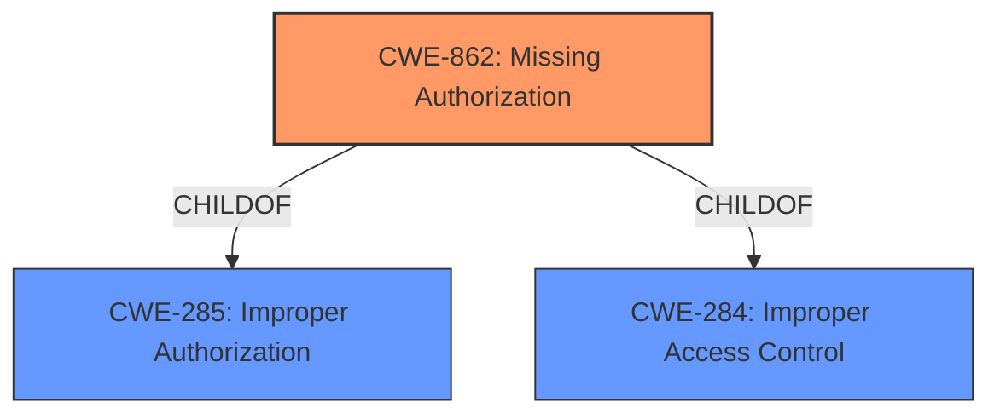

# Analysis Report for CVE-2022-20358

# Vulnerability Analysis Report: CVE-2022-20358

## Description


## Analysis (with Relationship Data)

# Summary
| CWE ID | CWE Name | Confidence | CWE Abstraction Level | CWE Vulnerability Mapping Label | CWE-Vulnerability Mapping Notes |
|---|---|---|---|---|---|
| CWE-862 | Missing Authorization | 1.0 | Class | Allowed-with-Review | Primary CWE |

## Evidence and Confidence

*   **Confidence Score:** 1.0
*   **Evidence Strength:** HIGH

## Relationship Analysis
The primary relationship influencing the CWE selection is the ChildOf relationship between CWE-862 and CWE-285 (Improper Authorization) and CWE-284 (Improper Access Control). CWE-862 is a more specific class of authorization issues where a check is entirely missing. The evidence clearly indicates a **missing permission check**, which directly aligns with the definition of CWE-862.



## Vulnerability Chain
The vulnerability chain starts with the **missing permission check** (CWE-862), leading to the ability to access protected content of content providers, resulting in local information disclosure.

## Summary of Analysis
The initial analysis focused on identifying the root cause of the vulnerability. The vulnerability description and the CVE Reference Links Content Summary clearly point to a **missing permission check** in `startSync` of `AbstractThreadedSyncAdapter.java`. This **missing check** allows unauthorized access to protected content.

The Retriever Results listed CWE-862 (Missing Authorization) as the top candidate. The detailed description of CWE-862 perfectly aligns with the vulnerability, as it explicitly states: "The product does not perform an authorization check when an actor attempts to access a resource or perform an action."

The CVE Reference Links Content Summary confirms this: "The vulnerability stems from insufficient restrictions on which processes can connect to sync adapters. Specifically, the code did not properly enforce that only the system server should be allowed to establish these connections." This evidence strongly supports the selection of CWE-862.

The other CWEs were considered but deemed less appropriate:

*   CWE-927 (Use of Implicit Intent for Sensitive Communication): While related to Android and communication, it's specific to implicit intents, which isn't the case here. The vulnerability is due to a **missing check**, not the use of a specific communication method.
*   CWE-665 (Improper Initialization): This is about resources not being initialized correctly, which isn't the core issue. The problem is the lack of an authorization check, regardless of initialization.
*   CWE-1021 (Improper Restriction of Rendered UI Layers or Frames): This is specific to UI rendering issues like clickjacking, which is not relevant here.
*   CWE-514 (Covert Channel): This is about unintended communication channels, not about **missing permission checks**.
*   CWE-926 (Improper Export of Android Application Components): This relates to components being improperly exported, but the core issue is the **missing authorization check**, not the export itself.
*   CWE-205 (Observable Behavioral Discrepancy): This is about information leaks through different behaviors, not a **missing permission check**.
*   CWE-732 (Incorrect Permission Assignment for Critical Resource): While related to permissions, it focuses on *incorrect* assignments, not the complete absence of a check.
*   CWE-908 (Use of Uninitialized Resource): Similar to CWE-665, this focuses on uninitialized resources, not authorization.
*   CWE-941 (Incorrectly Specified Destination in a Communication Channel): This is about specifying the wrong destination, not about authorization failures.

The selection of CWE-862 is at the Class level, as there are no specific Base or Variant CWEs that better represent the **missing permission check** in this context. The MITRE mapping guidance recommends examining children of CWE-862 for a better fit, but none of the children are more specific to this situation.

Relevant CWE Information:

# Enhanced Context (25 CWEs)
The following CWEs were identified as potentially relevant to this vulnerability:

## CWE-941: Incorrectly Specified Destination in a Communication Channel
**Abstraction Level**: Base
**Similarity Score**: 0.82
**Source**: dense

**Description**:
The product creates a communication channel to initiate an outgoing request to an actor, but it does not correctly specify the intended destination for that actor.

**Mapping Guidance**:
- Usage: Allowed
- Rationale: This CWE entry is at the Base level of abstraction, which is a preferred level of abstraction for mapping to the root causes of vulnerabilities.


## CWE-203: Observable Discrepancy
**Abstraction Level**: Base
**Similarity Score**: 0.78
**Source**: dense

**Description**:
The product behaves differently or sends different responses under different circumstances in a way that is observable to an unauthorized actor, which exposes security-relevant information about the state of the product, such as whether a particular operation was successful or not.

**Mapping Guidance**:
- Usage: Allowed
- Rationale: This CWE entry is at the Base level of abstraction, which is a preferred level of abstraction for mapping to the root causes of vulnerabilities.


## CWE-754: Improper Check for Unusual or Exceptional Conditions
**Abstraction Level**: Class
**Similarity Score**: 0.77
**Source**: dense

**Description**:
The product does not check or incorrectly checks for unusual or exceptional conditions that are not expected to occur frequently during day to day operation of the product.

**Mapping Guidance**:
- Usage: Allowed-with-Review
- Rationale: This CWE entry is a Class and might have Base-level children that would be more appropriate


## CWE-451: User Interface (UI) Misrepresentation of Critical Information
**Abstraction Level**: Class
**Similarity Score**: 0.77
**Source**: dense

**Description**:
The user interface (UI) does not properly represent critical information to the user, allowing the information - or its source - to be obscured or spoofed. This is often a component in phishing attacks.

**Mapping Guidance**:
- Usage: Allowed-with-Review
- Rationale: This CWE entry is a Class and might have Base-level children that would be more appropriate


## CWE-668: Exposure of Resource to Wrong Sphere
**Abstraction Level**: Class
**Similarity Score**: 0.77
**Source**: dense

**Description**:
The product exposes a resource to the wrong control sphere, providing unintended actors with inappropriate access to the resource.

**Mapping Guidance**:
- Usage: Discouraged
- Rationale: CWE-668 is high-level and is often misused as a catch-all when lower-level CWE IDs might be applicable. It is sometimes used for low-information vulnerability reports [REF-1287]. It is a level-1 Class (i.e., a child of a Pillar). It is not useful for trend analysis.


## CWE-345: Insufficient Verification of Data Authenticity
**Abstraction Level**: Class
**Similarity Score**: 0.76
**Source**: dense

**Description**:
The product does not sufficiently verify the origin or authenticity of data, in a way that causes it to accept invalid data.

**Mapping Guidance**:
- Usage: Discouraged
- Rationale: This CWE entry is a level-1 Class (i.e., a child of a Pillar). It might have lower-level children that would be more appropriate


## CWE-755: Improper Handling of Exceptional Conditions
**Abstraction Level**: Class
**Similarity Score**: 0.76
**Source**: dense

**Description**:
The product does not handle or incorrectly handles an exceptional condition.

**Mapping Guidance**:
- Usage: Discouraged
- Rationale: This CWE entry is a level-1 Class (i.e., a child of a Pillar). It might have lower-level children that would be more appropriate


## CWE-404: Improper Resource Shutdown or Release
**Abstraction Level**: Class
**Similarity Score**: 0.75
**Source**: dense

**Description**:
The product does not release or incorrectly releases a resource before it is made available for re-use.

**Mapping Guidance**:
- Usage: Allowed-with-Review
- Rationale: This CWE entry is a Class and might have Base-level children that would be more appropriate


## CWE-799: Improper Control of Interaction Frequency
**Abstraction Level**: Class
**Similarity Score**: 0.75
**Source**: dense

**Description**:
The product does not properly limit the number or frequency of interactions that it has with an actor, such as the number of incoming requests.

**Mapping Guidance**:
- Usage: Allowed-with-Review
- Rationale: This CWE


## CWE Relationship Analysis

Current CWEs represent these abstraction levels: .


### Vulnerability Chain Analysis

**Chain starting from CWE-203:**
- 203 (Observable Discrepancy) - ROOT


**Chain starting from CWE-908:**
- 908 (Use of Uninitialized Resource) - ROOT


### CWE Relationship Diagram

```mermaid
graph TD
    classDef primary fill:#f96,stroke:#333,stroke-width:2px
    classDef secondary fill:#69f,stroke:#333
    classDef tertiary fill:#9e9,stroke:#333
```


*Report generated on 2025-03-30 13:25:07*
