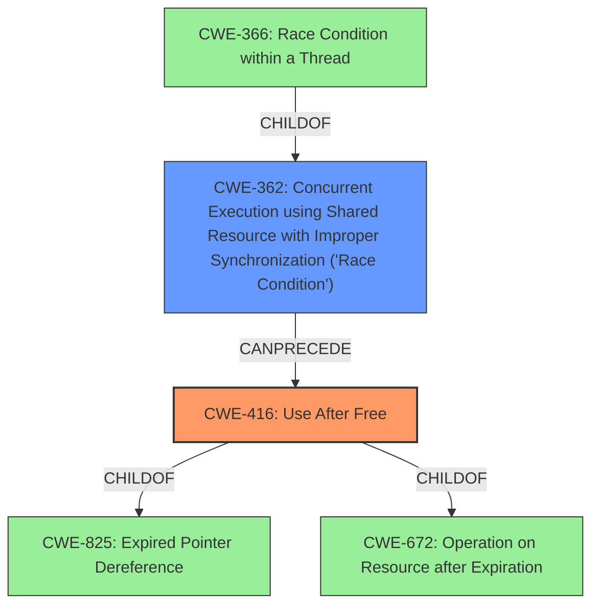

# Analysis Report for CVE-2022-20371

# Vulnerability Analysis Report: CVE-2022-20371

## Description


## Analysis (with Relationship Data)

# Summary
| CWE ID  | CWE Name   | Confidence | CWE Abstraction Level | CWE Vulnerability Mapping Label | CWE-Vulnerability Mapping Notes |
|-----------------|---------------------------------------------------------------------------------------------------|------------------|---------------------------|------------------------------------|-----------------------------------------------------------------------------------------------------------------------------------|
| **CWE-416** | Use After Free | 0.9 | Variant | Allowed | Primary CWE |
| CWE-362 | Concurrent Execution using Shared Resource with Improper Synchronization ('Race Condition') | 0.8 | Class | Allowed-with-Review | Secondary Candidate |

## Evidence and Confidence

*   **Confidence Score:** 0.85
*   **Evidence Strength:** HIGH

## Relationship Analysis
The primary CWE is CWE-416, which is a Variant of CWE-825 (Expired Pointer Dereference) and CWE-672 (Operation on Resource after Expiration). CWE-416 represents the **use after free** condition explicitly mentioned in the vulnerability description. The secondary CWE is CWE-362, which is a Class, and a parent of CWE-366 (Race Condition within a Thread). CWE-362 captures the root cause of the **race condition** that leads to the **use after free**. The "CanPrecede" relationship exists from CWE-362 to CWE-416, illustrating how a **race condition** can lead to a **use after free**.



## Vulnerability Chain
The vulnerability chain begins with a **race condition** (CWE-362) where multiple threads or processes concurrently access and modify a shared resource without proper synchronization. This leads to a situation where memory is freed by one thread but still accessed by another, resulting in a **use after free** (CWE-416).

## Summary of Analysis
The vulnerability description explicitly states a **use after free** due to a **race condition**. The CVE Reference Links Content Summary reinforces this by mentioning the lack of proper protection for ranges fetched and erased from the RB tree, which leads to incorrect memory management.

CWE-416 (Use After Free) is the primary weakness because it directly describes the memory corruption issue. The evidence for this is the phrase "use after free" in the "Vulnerability Description Key Phrases" and the "Weaknesses/vulnerabilities present" section of the "CVE Reference Links Content Summary".

CWE-362 (Concurrent Execution using Shared Resource with Improper Synchronization ('Race Condition')) is a secondary weakness, representing the root cause. The evidence for this is the phrase "**race condition**" in the "Vulnerability Description Key Phrases" and the description of the root cause in the "CVE Reference Links Content Summary" as the lack of proper protection for ranges being accessed concurrently.

The relationship analysis supports this choice, as CWE-362 can precede CWE-416. The retriever results also list CWE-362, CWE-416, and related synchronization issues as potential candidates.

CWEs like CWE-415 (Double Free), CWE-667 (Improper Locking), CWE-366 (Race Condition within a Thread), CWE-909 (Missing Initialization of Resource), and CWE-364 (Signal Handler Race Condition) were considered, but they were not selected because they did not directly reflect the specific vulnerability described, which involves a **race condition** leading to a **use after free**. The evidence points to a concurrency issue resulting in memory corruption due to improper resource management, making CWE-362 and CWE-416 the most appropriate choices.

The selected CWEs are at the optimal level of specificity. CWE-416 is a Variant that accurately describes the **use after free** condition. CWE-362 is a Class that captures the general **race condition** without being overly specific about the type of synchronization failure.


## CWE Relationship Analysis

Current CWEs represent these abstraction levels: .


### Vulnerability Chain Analysis

**Chain starting from CWE-825:**
- 825 (Expired Pointer Dereference) - ROOT


**Chain starting from CWE-672:**
- 672 (Operation on a Resource after Expiration or Release) - ROOT


### CWE Relationship Diagram

```mermaid
graph TD
    classDef primary fill:#f96,stroke:#333,stroke-width:2px
    classDef secondary fill:#69f,stroke:#333
    classDef tertiary fill:#9e9,stroke:#333
```


*Report generated on 2025-03-30 21:28:20*
