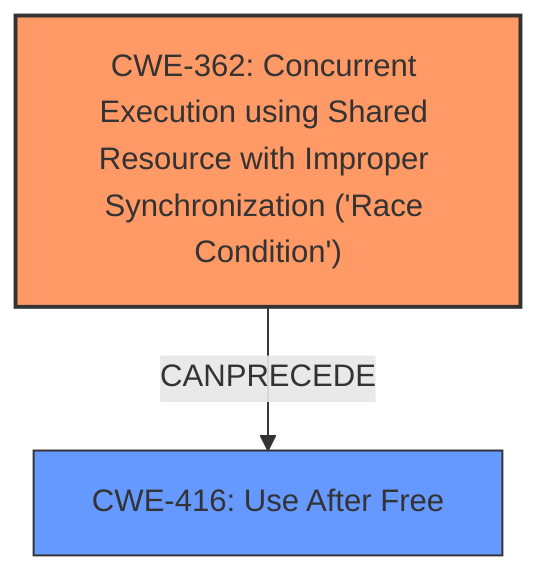

# Raw Analyzer Response for CVE-2022-20422

# Summary
| CWE ID | CWE Name | Confidence | CWE Abstraction Level | CWE Vulnerability Mapping Label | CWE-Vulnerability Mapping Notes |
|---|---|---|---|---|---|
| CWE-362 | Concurrent Execution using Shared Resource with Improper Synchronization ('**Race Condition**') | 1.0 | Class | Allowed-with-Review | Primary CWE: The core issue is a **race condition** due to improper synchronization. |
| CWE-416 | Use After Free | 0.6 | Variant | Allowed | Secondary CWE: The race condition can lead to a use-after-free condition, which results in memory corruption. |

## Evidence and Confidence

*   **Confidence Score:** 0.9
*   **Evidence Strength:** HIGH

## Relationship Analysis
The primary weakness is CWE-362 (**Race Condition**), which is a Class-level CWE. A potential consequence of this **race condition** is CWE-416 (Use After Free), a Variant-level CWE, indicating a more specific type of memory corruption. The relationship CANPRECEDE from CWE-362 to CWE-416 reinforces this potential chain of events. The abstraction levels influenced the decision to prioritize the root cause (CWE-362) and then consider a potential consequence (CWE-416).

## Vulnerability Chain
The vulnerability chain starts with a **race condition** (CWE-362) due to **improper synchronization** when modifying sysctls. This leads to a null pointer dereference, which could potentially lead to memory corruption. A likely memory corruption that can follow a race condition is the Use-After-Free.

## Summary of Analysis
The initial analysis correctly identified the primary **weakness** as a **race condition**. The evidence for this is strong, based on the vulnerability description and the CVE Reference Links Content Summary, which specifically mentions the lack of proper synchronization when modifying sysctls related to the ARMv8 emulator, allowing concurrent access.

The analysis considered CWE-362 and other related CWEs.

The selection of CWE-362 is based on the following evidence:
*   **Vulnerability Description Key Phrases:** "**rootcause:** **race condition**"
*   **CVE Reference Links Content Summary:** "The vulnerability is a **race condition** in the instruction emulator for 64-bit Arm systems... The primary weakness is the **lack of proper synchronization** when modifying sysctls related to the ARMv8 emulator, allowing concurrent access."

The analysis also considered the potential for a Use-After-Free condition (CWE-416) as a consequence of the **race condition**. The root cause is the lack of proper synchronization, which leads to a **race condition**.

Relevant CWE Information:
* CWE-362: Concurrent Execution using Shared Resource with Improper Synchronization ('**Race Condition**')
* CWE-416: Use After Free

The selection of CWE-362 and CWE-416 is at the optimal level of specificity because it addresses the root cause **race condition** and one likely memory corruption that can follow this race condition.