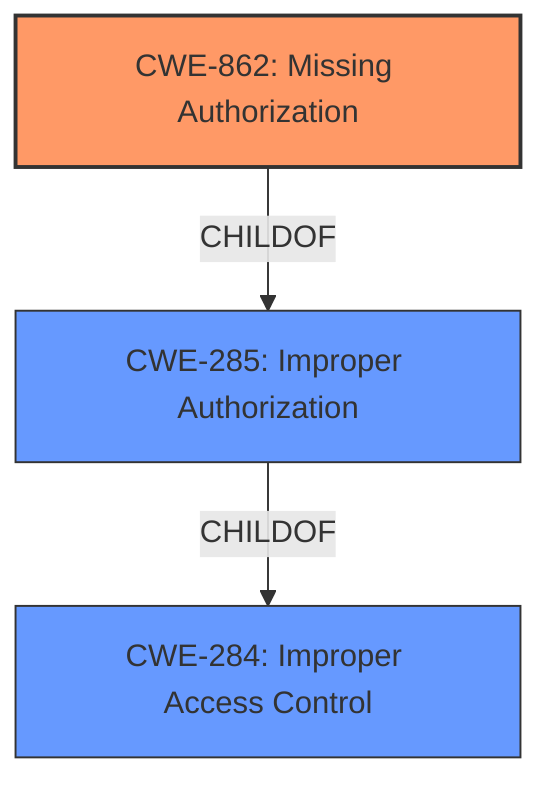

# Analysis Report for CVE-2022-20431

# Vulnerability Analysis Report: CVE-2022-20431

## Description


## Analysis (with Relationship Data)

# Summary
| CWE ID | CWE Name | Confidence | CWE Abstraction Level | CWE Vulnerability Mapping Label | CWE-Vulnerability Mapping Notes |
|---|---|---|---|---|---|
| CWE-862 | Missing Authorization | 1.0 | Class | Allowed-with-Review | Primary CWE |

## Evidence and Confidence

*   **Confidence Score:** 1.0
*   **Evidence Strength:** HIGH

## Relationship Analysis
The primary relationship that influenced the decision was the ChildOf relationship between CWE-862 and CWE-285 and CWE-284. While CWE-284 and CWE-285 were considered, CWE-862 was chosen as a more specific classification aligning with the **missing authorization** **root cause**.



## Vulnerability Chain
The vulnerability chain begins with the **missing authorization** check in the system service (CWE-862), leading to a local elevation of privilege.

## Summary of Analysis
The initial analysis focused on identifying the root cause of the vulnerability, which was explicitly stated as a **missing authorization** check. The evidence from the vulnerability description, specifically the phrase "**missing authorization** issue," strongly supports the selection of CWE-862.

The "CWE for similar CVE Descriptions" section also lists CWE-862 as the Primary CWE Match and the Top CWE.

The "CVE Reference Links Content Summary" section confirms that the vulnerability exists within a UNISOC telephony component and could lead to local escalation of privilege.

The Retriever Results also lists CWE-862.

CWE-284 and CWE-285 were considered but deemed too high-level. CWE-862 provides a more specific and accurate representation of the vulnerability.

Relevant CWE Information:

# Enhanced Context (25 CWEs)
The following CWEs were identified as potentially relevant to this vulnerability:

## CWE-284: Improper Access Control
**Abstraction Level**: Pillar
**Similarity Score**: 0.80
**Source**: dense

**Description**:
The product does not restrict or incorrectly restricts access to a resource from an unauthorized actor.

**Mapping Guidance**:
- Usage: Discouraged
- Rationale: CWE-284 is extremely high-level... It is not useful for trend analysis.
- Suggested Alternatives: CWE-862: Missing Authorization

## CWE-862: Missing Authorization
**Abstraction Level**: Class
**Similarity Score**: 0.286
**Source**: sparse

**Description**:
The product does not perform an authorization check when an actor attempts to access a resource or perform an action.

**Mapping Guidance**:
- Usage: Allowed-with-Review
- Rationale: This CWE entry is a Class and might have Base-level children that would be more appropriate

The choice of CWE-862 is based on the clear evidence of a **missing authorization** check, making it the most specific and accurate classification among the available options.


## CWE Relationship Analysis

Current CWEs represent these abstraction levels: .


### Vulnerability Chain Analysis

**Chain starting from CWE-862:**
- 862 (Missing Authorization) - ROOT


**Chain starting from CWE-285:**
- 285 (Improper Authorization) - ROOT


### CWE Relationship Diagram

```mermaid
graph TD
    classDef primary fill:#f96,stroke:#333,stroke-width:2px
    classDef secondary fill:#69f,stroke:#333
    classDef tertiary fill:#9e9,stroke:#333
```


*Report generated on 2025-03-30 22:25:51*
