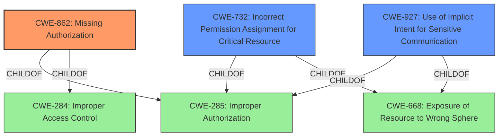

# Analysis Report for CVE-2022-20446

# Vulnerability Analysis Report: CVE-2022-20446

## Description


## Analysis (with Relationship Data)

# Summary
| CWE ID | CWE Name | Confidence | CWE Abstraction Level | CWE Vulnerability Mapping Label | CWE-Vulnerability Mapping Notes |
|---|---|---|---|---|---|
| CWE-862 | Missing Authorization | 1.0 | Class | Allowed-with-Review | Primary CWE |
| CWE-732 | Incorrect Permission Assignment for Critical Resource | 0.7 | Class | Allowed-with-Review | Secondary Candidate |
| CWE-927 | Use of Implicit Intent for Sensitive Communication | 0.6 | Variant | Allowed | Secondary Candidate |

## Evidence and Confidence

*   **Confidence Score:** 1.0
*   **Evidence Strength:** HIGH

## Relationship Analysis
The primary CWE, CWE-862 (Missing Authorization), is a class-level CWE, with potential for more specific base-level children. The relationship of CWE-862 being a child of CWE-285 (Improper Authorization) and CWE-284 (Improper Access Control) indicates a broader context of authorization and access control issues. CWE-732 (Incorrect Permission Assignment for Critical Resource) is also a child of CWE-285 and CWE-668 (Exposure of Resource to Wrong Sphere), indicating a permission-related issue. CWE-927 (Use of Implicit Intent for Sensitive Communication) is related to CWE-285 and CWE-668 as well, suggesting a weakness in authorization within the context of intent-based communication. The abstraction levels influenced the selection, with a preference for more specific variants if the evidence directly supports it.



## Vulnerability Chain
The chain of events starts with the **missing permission check**, which allows unauthorized access to the microphone, ultimately leading to a local escalation of privilege.

## Summary of Analysis
The initial assessment identified CWE-862 (Missing Authorization) as the primary candidate due to the "**missing permission check**" root cause. The CVE Reference Links Content Summary confirms the lack of proper permission checks as the central issue. This aligns directly with the description of CWE-862: "The product does not perform an authorization check when an actor attempts to access a resource or perform an action."

The relationships between CWEs further solidify this assessment. CWE-862 is a child of CWE-285 (Improper Authorization) and CWE-284 (Improper Access Control), which highlights the broader context of authorization and access control failures. The description and observed examples support this selection. The vulnerability description specifically mentions that there is a **missing permission check**, which allows unauthorized access to the microphone. The mapping guidance for CWE-862 suggests examining children for a better fit. However, the provided information does not indicate a more specific type of authorization issue, so the class-level CWE-862 is the most appropriate choice.

CWE-732 (Incorrect Permission Assignment for Critical Resource) was considered as a secondary candidate. The "Incorrect Permission Assignment" aspect is less accurate than a **missing check**.

CWE-927 (Use of Implicit Intent for Sensitive Communication) could be a secondary issue if the microphone was being used for communication purposes, but the evidence suggests it's primarily an authorization failure leading to unauthorized access.

The selected CWE, CWE-862, is at the optimal level of specificity because it accurately captures the root cause of the vulnerability, which is the **missing permission check**. While more specific variants might exist, the current evidence does not support a more granular classification. The decision is based on direct evidence from the vulnerability description and the CVE Reference Links Content Summary.

Relevant CWE Information:

# Enhanced Context (25 CWEs)

## CWE-754: Improper Check for Unusual or Exceptional Conditions
**Abstraction Level**: Class
**Similarity Score**: 0.76

## CWE-667: Improper Locking
**Abstraction Level**: Class
**Similarity Score**: 0.76

## CWE-404: Improper Resource Shutdown or Release
**Abstraction Level**: Class
**Similarity Score**: 0.76

## CWE-362: Concurrent Execution using Shared Resource with Improper Synchronization ('Race Condition')
**Abstraction Level**: Class
**Similarity Score**: 0.75

## CWE-668: Exposure of Resource to Wrong Sphere
**Abstraction Level**: Class
**Similarity Score**: 0.75

## CWE-226: Sensitive Information in Resource Not Removed Before Reuse
**Abstraction Level**: Base
**Similarity Score**: 0.74

## CWE-703: Improper Check or Handling of Exceptional Conditions
**Abstraction Level**: Pillar
**Similarity Score**: 0.74

## CWE-755: Improper Handling of Exceptional Conditions
**Abstraction Level**: Class
**Similarity Score**: 0.74

## CWE-662: Improper Synchronization
**Abstraction Level**: Class
**Similarity Score**: 0.73

## CWE-653: Improper Isolation or Compartmentalization
**Abstraction Level**: Class
**Similarity Score**: 0.73

## CWE-667: Improper Locking
**Abstraction Level**: Class
**Similarity Score**: 5153.75

## CWE-362: Concurrent Execution using Shared Resource with Improper Synchronization ('Race Condition')
**Abstraction Level**: Class
**Similarity Score**: 5119.06

## CWE-367: Time-of-check Time-of-use (TOCTOU) Race Condition
**Abstraction Level**: Base
**Similarity Score**: 5070.11

## CWE-927: Use of Implicit Intent for Sensitive Communication
**Abstraction Level**: Variant
**Similarity Score**: 4977.90

## CWE-863: Incorrect Authorization
**Abstraction Level**: Class
**Similarity Score**: 4908.97

## CWE-386: Symbolic Name not Mapping to Correct Object
**Abstraction Level**: base
**Similarity Score**: 4.50

## CWE-476: NULL Pointer Dereference
**Abstraction Level**: base
**Similarity Score**: 4.33

## CWE-416: Use After Free
**Abstraction Level**: variant
**Similarity Score**: 3.24

## CWE-609: Double-Checked Locking
**Abstraction Level**: base
**Similarity Score**: 2.87

## CWE-364: Signal Handler Race Condition
**Abstraction Level**: base
**Similarity Score**: 2.87

## CWE-1265: Unintended Reentrant Invocation of Non-reentrant Code Via Nested Calls
**Abstraction Level**: base
**Similarity Score**: 2.87

## CWE-252: Unchecked Return Value
**Abstraction Level**: base
**Similarity Score**: 2.87

## CWE-619: Dangling Database Cursor ('Cursor Injection')
**Abstraction Level**: base
**Similarity Score**: 2.73

## CWE-1325: Improperly Controlled Sequential Memory Allocation
**Abstraction Level**: base
**Similarity Score**: 2.73

## CWE-123: Write-what-where Condition
**Abstraction Level**: base
**Similarity Score**: 2.70


## CWE Relationship Analysis

Current CWEs represent these abstraction levels: .


### Vulnerability Chain Analysis

**Chain starting from CWE-668:**
- 668 (Exposure of Resource to Wrong Sphere) - ROOT


**Chain starting from CWE-619:**
- 619 (Dangling Database Cursor ('Cursor Injection')) - ROOT


### CWE Relationship Diagram

```mermaid
graph TD
    classDef primary fill:#f96,stroke:#333,stroke-width:2px
    classDef secondary fill:#69f,stroke:#333
    classDef tertiary fill:#9e9,stroke:#333
```


*Report generated on 2025-03-31 01:06:40*
