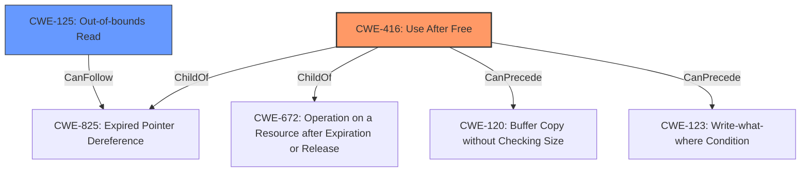

# Raw Analyzer Response for CVE-2022-20447

# Summary
| CWE ID | CWE Name | Confidence | CWE Abstraction Level | CWE Vulnerability Mapping Label | CWE-Vulnerability Mapping Notes |
|---|---|---|---|---|---|
| CWE-416 | Use After Free | 1.0 | Variant | Allowed | Primary CWE |
| CWE-125 | Out-of-bounds Read | 0.7 | Base | Allowed | Secondary Candidate |

## Evidence and Confidence

*   **Confidence Score:** 0.9
*   **Evidence Strength:** HIGH

## Relationship Analysis
The primary CWE is CWE-416, which is a Variant. It is related to CWE-825 (Expired Pointer Dereference) as a child. It can precede CWE-120 (Buffer Copy without Checking Size) and CWE-123 (Write-what-where Condition). CWE-125 (Out-of-bounds Read) is a potential secondary CWE and is a base level CWE.

## Vulnerability Chain
The vulnerability chain starts with a **use after free** (CWE-416), which leads to an **out of bounds read** (CWE-125), resulting in remote information disclosure.

## Summary of Analysis
The vulnerability description clearly states "**out of bounds read** due to a **use after free**." The CVE Reference Links Content Summary also highlights that the root cause is in the Bluetooth component.

The primary CWE is CWE-416 (Use After Free), which is a Variant level CWE. The description of CWE-416 matches the vulnerability description, as it involves reusing memory after it has been freed. The "Vulnerability Description Key Phrases" section states that the root cause is "**use after free**". The "CVE Reference Links Content Summary" confirms the root cause and impact.

CWE-125 (Out-of-bounds Read) is considered a secondary CWE, as the **use after free** leads to the **out of bounds read**. The vulnerability description mentions an "**out of bounds read**". The "CVE Reference Links Content Summary" also mentions "Information Disclosure (ID)" as a weakness, which can result from an out-of-bounds read.

CWE-908 (Use of Uninitialized Resource) was considered but not selected as the root cause is explicitly identified as a **use after free**, not a use of an uninitialized resource.

CWE-362 (Concurrent Execution using Shared Resource with Improper Synchronization ('Race Condition')) was considered but not selected as there is no mention of concurrent execution or synchronization issues in the provided information.

CWE-191 (Integer Underflow (Wrap or Wraparound)) was considered but not selected as there is no indication of integer manipulation issues.

CWE-862 (Missing Authorization) was considered but not selected as there is no mention of authorization issues.

CWE-126 (Buffer Over-read) was considered but determined that CWE-125 (Out-of-bounds Read) is a more appropriate match given that the description does not specify writing to the buffer.