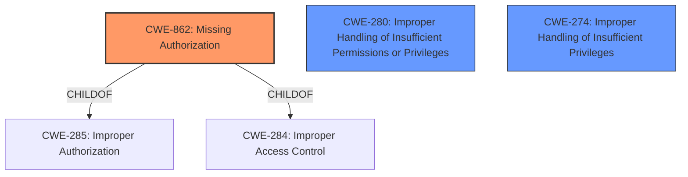

# Enhanced Analysis for CVE-2022-20451

# Summary
| CWE ID | CWE Name | Confidence | CWE Abstraction Level | CWE Vulnerability Mapping Label | CWE-Vulnerability Mapping Notes |
|---|---|---|---|---|---|
| **CWE-862** | **Missing Authorization** | 0.9 | Class | Primary | Allowed-with-Review |
| CWE-280 | Improper Handling of Insufficient Permissions or Privileges | 0.6 | Base | Secondary | Allowed |
| CWE-274 | Improper Handling of Insufficient Privileges | 0.5 | Base | Secondary | Discouraged |

## Evidence and Confidence

*   **Confidence Score:** 0.9
*   **Evidence Strength:** HIGH

## Relationship Analysis
The primary CWE is CWE-862, Missing Authorization (Class). It is a child of CWE-285 and CWE-284. The secondary candidates, CWE-280 (Improper Handling of Insufficient Permissions or Privileges) and CWE-274 (Improper Handling of Insufficient Privileges), represent related concepts but are less precise. CWE-280 and CWE-274 are both Base level and have some overlap in meaning, but CWE-862 more accurately reflects the described **missing permission check**.



## Vulnerability Chain
The vulnerability chain starts with a **missing permission check** in `onCallRedirectionComplete` of `CallsManager.java`. This leads to a permissions bypass, resulting in local escalation of privilege.

Root Cause: **Missing permission check** (CWE-862)
Impact: Local escalation of privilege

## Summary of Analysis
The initial analysis focused on identifying the root cause of the vulnerability, which is a **missing permission check**. The retriever results and the vulnerability description both strongly suggested CWE-862 (Missing Authorization).

The vulnerability description clearly states: "there is a possible permissions bypass due to a **missing permission check**." The CVE Reference Links Content Summary further emphasizes this point, stating, "There is a missing authorization check that would ensure that the call redirection is only allowed within the same user context."

CWE-862 is a Class-level CWE, and the mapping guidance suggests examining its children for a better fit. However, none of the children CWEs provide a more precise match for the described vulnerability. Therefore, CWE-862 is the most appropriate choice.

I considered CWE-280 (Improper Handling of Insufficient Permissions or Privileges) and CWE-274 (Improper Handling of Insufficient Privileges) because these are related to permissions. However, the core issue is not the *handling* of insufficient privileges, but the complete *absence* of an authorization check. The description explicitly mentions "**missing permission check**".

Relevant CWE Information:
- **CWE-862: Missing Authorization** - The product does not perform an authorization check when an actor attempts to access a resource or perform an action.
- **CWE-280: Improper Handling of Insufficient Permissions or Privileges** - The product does not handle or incorrectly handles when it has insufficient privileges to access resources or functionality as specified by their permissions.
- **CWE-274: Improper Handling of Insufficient Privileges** - The product does not handle or incorrectly handles when it has insufficient privileges to perform an operation, leading to resultant weaknesses.

I am reasonably confident (Confidence: 0.9) that CWE-862 is the most accurate classification based on the available information.


## CWE Relationship Analysis

Current CWEs represent these abstraction levels: .


### Vulnerability Chain Analysis

**Chain starting from CWE-862:**
- 862 (Missing Authorization) - ROOT


**Chain starting from CWE-280:**
- 280 (Improper Handling of Insufficient Permissions or Privileges ) - ROOT


### CWE Relationship Diagram

```mermaid
graph TD
    classDef primary fill:#f96,stroke:#333,stroke-width:2px
    classDef secondary fill:#69f,stroke:#333
    classDef tertiary fill:#9e9,stroke:#333
```