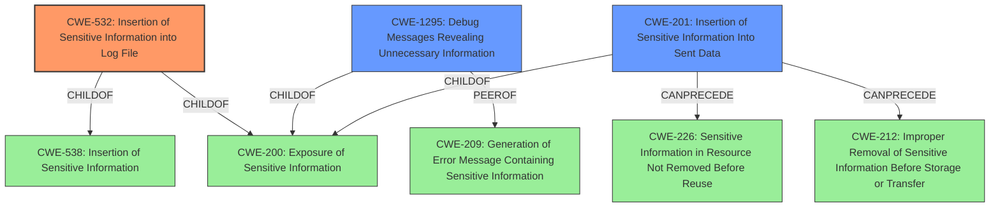

# Raw Analyzer Response for CVE-2022-20458

# Summary
| CWE ID  | CWE Name                                         | Confidence | CWE Abstraction Level | CWE Vulnerability Mapping Label | CWE-Vulnerability Mapping Notes |
| :-------- | :----------------------------------------------- | :--------- | :---------------------- | :------------------------------ | :------------------------------ |
| CWE-532   | Insertion of Sensitive Information into Log File | 1          | Base                    | Allowed                       | Primary CWE                     |
| CWE-1295  | Debug Messages Revealing Unnecessary Information | 0.7        | Base                    | Allowed                       | Secondary Candidate             |
| CWE-201   | Insertion of Sensitive Information Into Sent Data | 0.6        | Base                    | Allowed                       | Secondary Candidate             |

## Evidence and Confidence

*   **Confidence Score:** 0.9
*   **Evidence Strength:** HIGH

## Relationship Analysis
The primary CWE is CWE-532, a Base level weakness, which is a child of CWE-538 and CWE-200. CWE-1295 is a peer of CWE-209 and child of CWE-200, indicating that both CWE-532 and CWE-1295 involve the exposure of sensitive information (CWE-200). CWE-201 can precede CWE-226 and CWE-212. The base level abstraction accurately represents the vulnerability.

## Vulnerability Chain
The vulnerability chain involves the logging of potentially sensitive information (PII) through `StatusBarNotification.getKey()` in the `CarNotificationListener.java` component of Android 12L.
  - **Root Cause:** The **StatusBarNotification.getKey() could contain sensitive information**.
  - **Weakness:** Failure to prevent the logging of this sensitive information in user builds.
  - **Impact:** Exposure of users account names or other PII in logs.

## Summary of Analysis
The initial assessment identified CWE-532 as the primary weakness due to the direct logging of sensitive information. This is supported by the vulnerability description: "prints out the StatusBarNotification.getKey() directly in logs, which could contain users account name (i.e. PII), in Android user build." The retriever results also strongly support CWE-532. The relationship analysis confirmed that CWE-532 is a base-level weakness related to the exposure of sensitive information and insertion of sensitive information.

CWE-1295 was considered as an additional weakness, as the logging occurs in debug messages. However, the description does not specifically mention debug builds. It states, "in Android user build", so the logging of PII is not limited to debugging scenarios.
CWE-201 was considered because sensitive information is inserted into sent data. The log file represents the sent data.

The final selection of CWE-532 is based on the evidence that sensitive information is directly written to log files. The abstraction level is appropriate because it is a base-level CWE.

Relevant CWE Information:
# Enhanced Context (25 CWEs)
The following CWEs were identified as potentially relevant to this vulnerability:

## CWE-226: Sensitive Information in Resource Not Removed Before Reuse
**Abstraction Level**: Base
**Similarity Score**: 0.78
**Source**: dense

**Description**:
The product releases a resource such as memory or a file so that it can be made available for reuse, but it does not clear or "zeroize" the information contained in the resource before the product performs a critical state transition or makes the resource available for reuse by other entities.

**Mapping Guidance**:
- Usage: Allowed
- Rationale: This CWE entry is at the Base level of abstraction, which is a preferred level of abstraction for mapping to the root causes of vulnerabilities.

## CWE-754: Improper Check for Unusual or Exceptional Conditions
**Abstraction Level**: Class
**Similarity Score**: 0.78
**Source**: dense

**Description**:
The product does not check or incorrectly checks for unusual or exceptional conditions that are not expected to occur frequently during day to day operation of the product.

**Mapping Guidance**:
- Usage: Allowed-with-Review
- Rationale: This CWE entry is a Class and might have Base-level children that would be more appropriate

## CWE-404: Improper Resource Shutdown or Release
**Abstraction Level**: Class
**Similarity Score**: 0.76
**Source**: dense

**Description**:
The product does not release or incorrectly releases a resource before it is made available for re-use.

**Mapping Guidance**:
- Usage: Allowed-with-Review
- Rationale: This CWE entry is a Class and might have Base-level children that would be more appropriate

## CWE-668: Exposure of Resource to Wrong Sphere
**Abstraction Level**: Class
**Similarity Score**: 0.76
**Source**: dense

**Description**:
The product exposes a resource to the wrong control sphere, providing unintended actors with inappropriate access to the resource.

**Mapping Guidance**:
- Usage: Discouraged
- Rationale: CWE-668 is high-level and is often misused as a catch-all when lower-level CWE IDs might be applicable. It is sometimes used for low-information vulnerability reports [REF-1287]. It is a level-1 Class (i.e., a child of a Pillar). It is not useful for trend analysis.

## CWE-703: Improper Check or Handling of Exceptional Conditions
**Abstraction Level**: Pillar
**Similarity Score**: 0.76
**Source**: dense

**Description**:
The product does not properly anticipate or handle exceptional conditions that rarely occur during normal operation of the product.

**Mapping Guidance**:
- Usage: Discouraged
- Rationale: This CWE entry is extremely high-level, a Pillar.

## CWE-667: Improper Locking
**Abstraction Level**: Class
**Similarity Score**: 0.75
**Source**: dense

**Description**:
The product does not properly acquire or release a lock on a resource, leading to unexpected resource state changes and behaviors.

**Mapping Guidance**:
- Usage: Allowed-with-Review
- Rationale: This CWE entry is a Class and might have Base-level children that would be more appropriate

## CWE-941: Incorrectly Specified Destination in a Communication Channel
**Abstraction Level**: Base
**Similarity Score**: 0.75
**Source**: dense

**Description**:
The product creates a communication channel to initiate an outgoing request to an actor, but it does not correctly specify the intended destination for that actor.

**Mapping Guidance**:
- Usage: Allowed
- Rationale: This CWE entry is at the Base level of abstraction, which is a preferred level of abstraction for mapping to the root causes of vulnerabilities.

## CWE-212: Improper Removal of Sensitive Information Before Storage or Transfer
**Abstraction Level**: Base
**Similarity Score**: 0.75
**Source**: dense

**Description**:
The product stores, transfers, or shares a resource that contains sensitive information, but it does not properly remove that information before the product makes the resource available to unauthorized actors.

**Mapping Guidance**:
- Usage: Allowed
- Rationale: This CWE entry is at the Base level of abstraction, which is a preferred level of abstraction for mapping to the root causes of vulnerabilities.

## CWE-755: Improper Handling of Exceptional Conditions
**Abstraction Level**: Class
**Similarity Score**: 0.75
**Source**: dense

**Description**:
The product does not handle or incorrectly