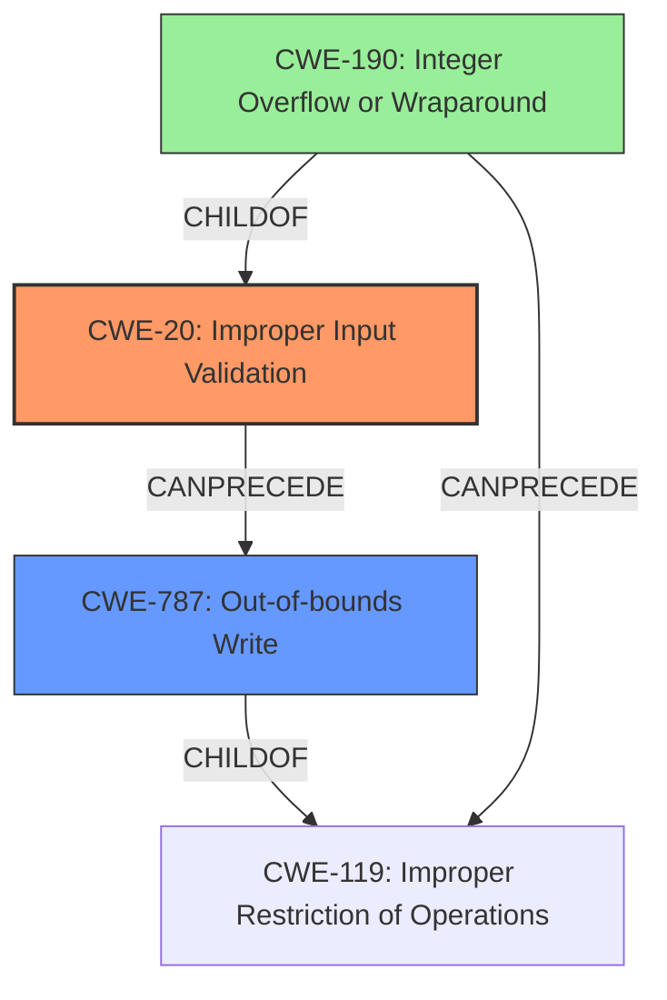

# Raw Analyzer Response for CVE-2022-20460

# Summary
| CWE ID | CWE Name | Confidence | CWE Abstraction Level | CWE Vulnerability Mapping Label | CWE-Vulnerability Mapping Notes |
|---|---|---|---|---|---|
| CWE-20 | Improper Input Validation | 0.8 | Class | Primary | Discouraged |
| CWE-787 | Out-of-bounds Write | 0.5 | Base | Secondary | Allowed |

## Evidence and Confidence

*   **Confidence Score:** 0.8
*   **Evidence Strength:** MEDIUM

## Relationship Analysis
The primary relationship impacting my decision is that CWE-20 is a Class-level CWE, while CWE-787 is a Base-level CWE. The description indicates **improper input validation**, which is directly covered by CWE-20. However, the impact is memory corruption, which could be a consequence of an out-of-bounds write (CWE-787). I am listing both CWEs because the root cause is **improper input validation**, but the consequence points to a memory corruption issue like CWE-787.

## Vulnerability Chain
The vulnerability chain starts with **improper input validation** (CWE-20) which then leads to corrupt memory mapping, potentially through an out-of-bounds write (CWE-787).

## Summary of Analysis
The vulnerability description indicates **improper input validation**, which could lead to corrupt memory mapping.

The primary assessment is CWE-20 (Improper Input Validation) since the description explicitly mentions **improper input validation** as the root cause. However, CWE-20 is discouraged.

The impact of the vulnerability is memory corruption which can be caused by many different types of errors.

The CWE for similar CVE descriptions also lists CWE-787 (Out-of-bounds Write) as the primary CWE match.

Based on the provided information, I'm choosing CWE-20 as the primary cause, but recognizing that the impact is likely memory corruption. I am also including CWE-787 as a secondary candidate based on the impact of memory corruption and the CWE for similar CVE descriptions.

Relevant CWE Information:

# Enhanced Context (25 CWEs)

## CWE-1021: Improper Restriction of Rendered UI Layers or Frames
**Abstraction Level**: Base
**Similarity Score**: 0.78
**Source**: dense
This CWE is not relevant as the vulnerability is not related to UI layers or frames.

## CWE-451: User Interface (UI) Misrepresentation of Critical Information
**Abstraction Level**: Class
**Similarity Score**: 0.77
**Source**: dense
This CWE is not relevant as the vulnerability is not related to UI misrepresentation.

## CWE-1289: Improper Validation of Unsafe Equivalence in Input
**Abstraction Level**: Base
**Similarity Score**: 0.77
**Source**: dense
This CWE is not relevant as the vulnerability description is high level and does not talk about equivalence in input.

## CWE-807: Reliance on Untrusted Inputs in a Security Decision
**Abstraction Level**: Base
**Similarity Score**: 0.76
**Source**: dense
This CWE is not relevant as the vulnerability description is high level and does not talk about security decisions based on untrusted inputs.

## CWE-356: Product UI does not Warn User of Unsafe Actions
**Abstraction Level**: Base
**Similarity Score**: 0.76
**Source**: dense
This CWE is not relevant as the vulnerability is not related to the UI warning users of unsafe actions.

## CWE-667: Improper Locking
**Abstraction Level**: Class
**Similarity Score**: 0.76
**Source**: dense
This CWE is not relevant as the vulnerability is not related to locking.

## CWE-404: Improper Resource Shutdown or Release
**Abstraction Level**: Class
**Similarity Score**: 0.75
**Source**: dense
This CWE is not relevant as the vulnerability is not related to resource shutdown or release.

## CWE-184: Incomplete List of Disallowed Inputs
**Abstraction Level**: Base
**Similarity Score**: 0.75
**Source**: dense
This CWE is not relevant as the vulnerability description is high level and does not talk about list of disallowed inputs.

## CWE-653: Improper Isolation or Compartmentalization
**Abstraction Level**: Class
**Similarity Score**: 0.75
**Source**: dense
This CWE is not relevant as the vulnerability is not related to isolation or compartmentalization.

## CWE-754: Improper Check for Unusual or Exceptional Conditions
**Abstraction Level**: Class
**Similarity Score**: 0.75
**Source**: dense
This CWE is not relevant as the vulnerability is not related to checking for unusual or exceptional conditions.

## CWE-364: Signal Handler Race Condition
**Abstraction Level**: Base
**Similarity Score**: 7697.77
**Source**: sparse
This CWE is not relevant as the vulnerability is not related to signal handler race conditions.

## CWE-362: Concurrent Execution using Shared Resource with Improper Synchronization ('Race Condition')
**Abstraction Level**: Class
**Similarity Score**: 6871.42
**Source**: sparse
This CWE is not relevant as the vulnerability is not related to concurrent execution.

## CWE-667: Improper Locking
**Abstraction Level**: Class
**Similarity Score**: 6867.85
**Source**: sparse
This CWE is not relevant as the vulnerability is not related to locking.

## CWE-367: Time-of-check Time-of-use (TOCTOU) Race Condition
**Abstraction Level**: Base
**Similarity Score**: 6753.26
**Source**: sparse
This CWE is not relevant as the vulnerability is not related to time-of-check time-of-use race condition.

## CWE-828: Signal Handler with Functionality that is not Asynchronous-Safe
**Abstraction Level**: Variant
**Similarity Score**: 6512.72
**Source**: sparse
This CWE is not relevant as the vulnerability is not related to signal handlers.

## CWE-123: Write-what-where Condition
**Abstraction Level**: base
**Similarity Score**: 5.03
**Source**: graph
This CWE is related to memory corruption, but is not the root cause.

## CWE-416: Use After Free
**Abstraction Level**: variant
**Similarity Score**: 4.40
**Source**: graph
This CWE is related to memory corruption, but is not the root cause.

## CWE-415: Double Free
**Abstraction Level**: variant
**Similarity Score**: 4.40
**Source**: graph
This CWE is related to memory corruption, but is not the root cause.

## CWE-364: Signal Handler Race Condition
**Abstraction Level**: base
**Similarity Score**: 4.33
**Source**: graph
This CWE is not relevant as the vulnerability is not related to signal handlers.

## CWE-190: Integer Overflow or Wraparound
**Abstraction Level**: base
**Similarity Score**: 4.33
**Source**: graph
This CWE can precede memory corruption, but is not explicitly mentioned in the vulnerability description.

## CWE-22: Improper Limitation of a Pathname to a Restricted Directory ('Path Traversal')
**Abstraction Level**: base
**Similarity Score**: 4.33
**Source**: graph
This CWE is not relevant as the vulnerability is not related to path traversal.

## CWE-770: Allocation of Resources Without Limits or Throttling
**Abstraction Level**: base
**Similarity Score**: 4.33
**Source**: graph
This CWE is not relevant as the vulnerability is not related to resource allocation.

## CWE-73: External Control of File Name or Path
**Abstraction Level**: base
**Similarity Score**: 4.33
**Source**: graph
This CWE is not relevant as the vulnerability is not related to file name or path.

## CWE-476: NULL Pointer Dereference
**Abstraction Level**: base
**Similarity Score**: 4.33
**Source**: graph
This CWE is related to memory corruption, but is not the root cause.

## CWE-908: Use of Uninitialized Resource
**Abstraction Level