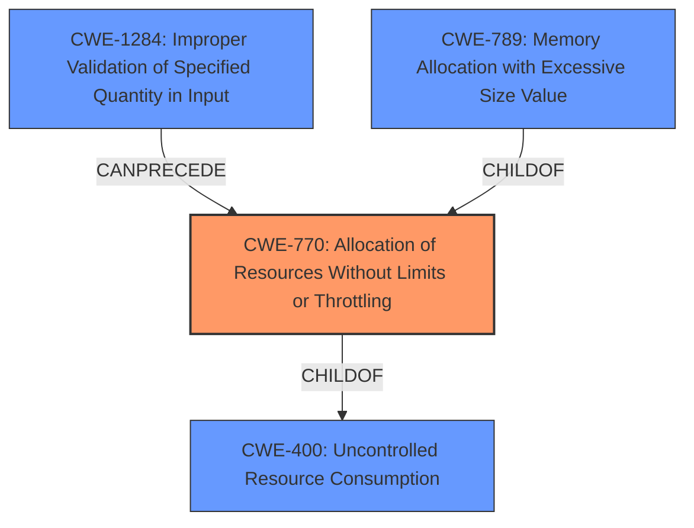

# Analysis Report for CVE-2022-20478

# Vulnerability Analysis Report: CVE-2022-20478

## Description


## Analysis (with Relationship Data)

# Summary
| CWE ID | CWE Name | Confidence | CWE Abstraction Level | CWE Vulnerability Mapping Label | CWE-Vulnerability Mapping Notes |
|---|---|---|---|---|---|
| CWE-770 | Allocation of Resources Without Limits or Throttling | 1.0 | Base | Allowed | Primary CWE |
| CWE-400 | Uncontrolled Resource Consumption | 0.7 | Class | Discouraged | Secondary Candidate |
| CWE-1284 | Improper Validation of Specified Quantity in Input | 0.6 | Base | Allowed | Secondary Candidate |
| CWE-789 | Memory Allocation with Excessive Size Value | 0.5 | Variant | Allowed | Secondary Candidate |

## Evidence and Confidence

*   **Confidence Score:** 1.0
*   **Evidence Strength:** HIGH

## Relationship Analysis
The primary CWE, CWE-770 **Allocation of Resources Without Limits or Throttling**, is a child of CWE-400 **Uncontrolled Resource Consumption**, which is a more general class of weakness. CWE-770 describes a specific scenario where resources are allocated without restrictions, leading to potential exhaustion. CWE-1284 **Improper Validation of Specified Quantity in Input** can precede CWE-770 if the quantity of resources to allocate is taken from untrusted input. CWE-789 **Memory Allocation with Excessive Size Value** is a variant of CWE-770 and specializes in memory allocation.



## Vulnerability Chain
The vulnerability chain starts with the **lack of limits on the size of NotificationChannel and NotificationChannelGroup objects**, potentially stemming from **improper validation of input quantities (CWE-1284)**, leading to **uncontrolled allocation of resources (CWE-770)**, and ultimately causing **resource exhaustion**, which results in the **failure to persist permissions settings**.

## Summary of Analysis
The initial analysis identified CWE-770 as the primary candidate based on the description of **resource exhaustion** due to a **lack of size limits** and the retriever results. The CVE Reference Links Content Summary explicitly states that "The vulnerability stems from a **lack of size limits** on `NotificationChannel` and `NotificationChannelGroup` objects," directly supporting CWE-770.

The vulnerability description key phrases also point to **resource exhaustion**. The retriever results also had CWE-770 high on the list.

CWE-400, **Uncontrolled Resource Consumption**, was considered but deemed too general. While the vulnerability does lead to uncontrolled resource consumption, the root cause is the **unlimited allocation of resources**, making CWE-770 a more precise fit. The mapping guidance for CWE-400 even suggests considering children like CWE-770 for more specific mappings. CWE-789 **Memory Allocation with Excessive Size Value** is a variant of CWE-770 and specializes in memory allocation. It is possible that this could be the rootcause, however, the description doesn't specify memory allocation, but rather notification channels and groups. Therefore, CWE-770 is a better fit.

CWE-1284, **Improper Validation of Specified Quantity in Input**, was also considered as a potential preceding weakness. If the size of the `NotificationChannel` and `NotificationChannelGroup` objects is derived from user input, the lack of validation would contribute to the vulnerability. However, without explicit evidence of untrusted input, CWE-1284 is a secondary consideration.

The selected CWEs are at the optimal level of specificity because CWE-770 directly addresses the **unlimited allocation of resources**, which is the **root cause** of the **resource exhaustion**. More general CWEs like CWE-400 would not capture the specific nature of the weakness.

Relevant CWE Information:

# Enhanced Context (25 CWEs)
## CWE-1021: Improper Restriction of Rendered UI Layers or Frames
**Abstraction Level**: Base
**Similarity Score**: 0.77
**Source**: dense

**Description**:
The web application does not restrict or incorrectly restricts frame objects or UI layers that belong to another application or domain, which can lead to user confusion about which interface the user is interacting with.

**Mapping Guidance**:
- Usage: Allowed
- Rationale: This CWE entry is at the Base level of abstraction, which is a preferred level of abstraction for mapping to the root causes of vulnerabilities.

## CWE-451: User Interface (UI) Misrepresentation of Critical Information
**Abstraction Level**: Class
**Similarity Score**: 0.77
**Source**: dense

**Description**:
The user interface (UI) does not properly represent critical information to the user, allowing the information - or its source - to be obscured or spoofed. This is often a component in phishing attacks.

**Mapping Guidance**:
- Usage: Allowed-with-Review
- Rationale: This CWE entry is a Class and might have Base-level children that would be more appropriate

## CWE-404: Improper Resource Shutdown or Release
**Abstraction Level**: Class
**Similarity Score**: 0.77
**Source**: dense

**Description**:
The product does not release or incorrectly releases a resource before it is made available for re-use.

**Mapping Guidance**:
- Usage: Allowed-with-Review
- Rationale: This CWE entry is a Class and might have Base-level children that would be more appropriate

## CWE-667: Improper Locking
**Abstraction Level**: Class
**Similarity Score**: 0.77
**Source**: dense

**Description**:
The product does not properly acquire or release a lock on a resource, leading to unexpected resource state changes and behaviors.

**Mapping Guidance**:
- Usage: Allowed-with-Review
- Rationale: This CWE entry is a Class and might have Base-level children that would be more appropriate

## CWE-226: Sensitive Information in Resource Not Removed Before Reuse
**Abstraction Level**: Base
**Similarity Score**: 0.76
**Source**: dense

**Description**:
The product releases a resource such as memory or a file so that it can be made available for reuse, but it does not clear or "zeroize" the information contained in the resource before the product performs a critical state transition or makes the resource available for reuse by other entities.

**Mapping Guidance**:
- Usage: Allowed
- Rationale: This CWE entry is at the Base level of abstraction, which is a preferred level of abstraction for mapping to the root causes of vulnerabilities.

## CWE-668: Exposure of Resource to Wrong Sphere
**Abstraction Level**: Class
**Similarity Score**: 0.76
**Source**: dense

**Description**:
The product exposes a resource to the wrong control sphere, providing unintended actors with inappropriate access to the resource.

**Mapping Guidance**:
- Usage: Discouraged
- Rationale: CWE-668 is high-level and is often misused as a catch-all when lower-level CWE IDs might be applicable. It is sometimes used for low-information vulnerability reports [REF-1287]. It is a level-1 Class (i.e., a child of a Pillar). It is not useful for trend analysis.

## CWE-799: Improper Control of Interaction Frequency
**Abstraction Level**: Class
**Similarity Score**: 0.75
**Source**: dense

**Description**:
The product does not properly limit the number or frequency of interactions that it has with an actor, such as the number of incoming requests.

**Mapping Guidance**:
- Usage: Allowed-with-Review
- Rationale: This CWE entry is a Class and might have Base-level children that would be more appropriate

## CWE-754: Improper Check for Unusual or Exceptional Conditions
**Abstraction Level**: Class
**Similarity Score**: 0.75
**Source**: dense

**Description**:
The product does not check or incorrectly checks for unusual or exceptional conditions that are not expected to occur frequently during day to day operation of the product.

**Mapping Guidance**:
- Usage: Allowed-with-Review
- Rationale: This CWE entry is a Class and might have Base-level children that would be more appropriate

## CWE-789: Memory Allocation with Excessive Size Value
**Abstraction Level**: Variant
**Similarity Score**: 0.75
**Source**: dense

**Description**:
The product allocates memory based on an untrusted, large size value, but it does not


## CWE Relationship Analysis

Current CWEs represent these abstraction levels: .


### Vulnerability Chain Analysis

**Chain starting from CWE-400:**
- 400 (Uncontrolled Resource Consumption) - ROOT


**Chain starting from CWE-451:**
- 451 (User Interface (UI) Misrepresentation of Critical Information) - ROOT


### CWE Relationship Diagram

```mermaid
graph TD
    classDef primary fill:#f96,stroke:#333,stroke-width:2px
    classDef secondary fill:#69f,stroke:#333
    classDef tertiary fill:#9e9,stroke:#333
```


*Report generated on 2025-03-31 00:42:25*
