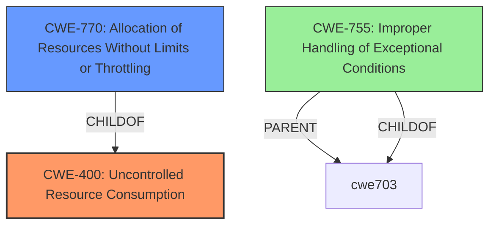

# Enhanced Analysis for CVE-2022-2048

# Summary
| CWE ID | CWE Name | Confidence | CWE Abstraction Level | CWE Vulnerability Mapping Label | CWE-Vulnerability Mapping Notes |
|---|---|---|---|---|---|
| CWE-400 | Uncontrolled Resource Consumption | 0.8 | Class | Primary | Allowed-with-Review |
| CWE-770 | Allocation of Resources Without Limits or Throttling | 0.7 | Base | Secondary | Allowed |
| CWE-755 | Improper Handling of Exceptional Conditions | 0.6 | Class | Secondary | Discouraged |

## Evidence and Confidence

*   **Confidence Score:** 0.8
*   **Evidence Strength:** HIGH

## Relationship Analysis
The primary CWE selected is CWE-400 (Uncontrolled Resource Consumption), which is a class-level CWE. While the description suggests more specific weaknesses, the available information points to a general issue of the server not properly controlling resource allocation, leading to resource exhaustion.

CWE-770 (Allocation of Resources Without Limits or Throttling) is a child of CWE-400 and represents a more specific scenario where resources are allocated without proper limits. This is potentially relevant, as the vulnerability involves improper cleanup of connections and associated resources, effectively allocating resources without limit.

CWE-755 (Improper Handling of Exceptional Conditions) is also considered, given that the **bug in error handling** is the root cause, leading to improper cleanup. However, this is a class-level CWE and is less specific than CWE-400 or CWE-770.



## Vulnerability Chain
The vulnerability chain starts with the **bug in error handling** of invalid HTTP/2 requests, which leads to improper resource cleanup. This results in uncontrolled resource consumption, ultimately causing a Denial of Service (DoS).

Bug in Error Handling -> Improper Resource Cleanup -> Uncontrolled Resource Consumption -> Denial of Service

## Summary of Analysis
The initial analysis focused on identifying the root cause and impact of the vulnerability. The **bug in error handling** and resulting Denial of Service are key indicators. The description explicitly states that the server encounters an invalid HTTP/2 request, and the error handling fails to properly clean up active connections and associated resources.

The selection of CWE-400 as the primary CWE is based on the overall impact of uncontrolled resource consumption. The evidence states that "**This can lead to a Denial of Service scenario where there are no enough resources left to process good requests**." This aligns with the description of CWE-400, which states, "The product does not properly control the allocation and maintenance of a limited resource, thereby enabling an actor to influence the amount of resources consumed, eventually leading to the exhaustion of available resources."

CWE-770 is a secondary consideration because the vulnerability involves allocating resources (connections, associated resources) without proper limits, due to the error handling **bug**.

CWE-755 is also considered as a secondary CWE due to the **bug in error handling**. The vulnerability description explicitly indicates that the vulnerability lies within the error handling.

The graph relationships highlight the hierarchical structure, with CWE-770 being a child of CWE-400, indicating a more specific case of resource consumption.

The selected CWEs are at the optimal level of specificity based on the provided evidence. While a more specific CWE might exist, the current description focuses on the general issue of uncontrolled resource consumption due to a **bug in error handling** and improper resource cleanup, without going into finer details about the exact mechanism of resource allocation or the specific type of resource being exhausted.


## CWE Relationship Analysis

Current CWEs represent these abstraction levels: .


### Vulnerability Chain Analysis

**Chain starting from CWE-755:**
- 755 (Improper Handling of Exceptional Conditions) - ROOT


**Chain starting from CWE-770:**
- 770 (Allocation of Resources Without Limits or Throttling) - ROOT


### CWE Relationship Diagram

```mermaid
graph TD
    classDef primary fill:#f96,stroke:#333,stroke-width:2px
    classDef secondary fill:#69f,stroke:#333
    classDef tertiary fill:#9e9,stroke:#333
```