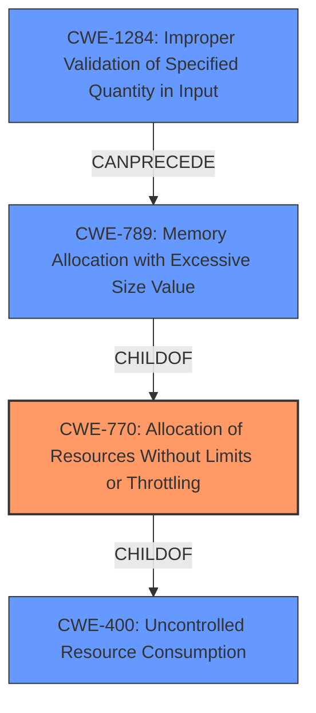

# Analysis for CVE-2022-20480

# Summary
| CWE ID  | CWE Name                                                 | Confidence | CWE Abstraction Level | CWE Vulnerability Mapping Label | CWE-Vulnerability Mapping Notes |
| :-------- | :------------------------------------------------------- | :--------- | :---------------------- | :------------------------------ | :------------------------------ |
| CWE-770   | Allocation of Resources Without Limits or Throttling    | 0.9        | Base                    | Primary                         | Allowed                       |
| CWE-400   | Uncontrolled Resource Consumption                        | 0.7        | Class                   | Secondary                       | Discouraged                    |
| CWE-1284  | Improper Validation of Specified Quantity in Input      | 0.6        | Base                    | Secondary                       | Allowed                       |
| CWE-789   | Memory Allocation with Excessive Size Value             | 0.6        | Variant                 | Secondary                       | Allowed                       |

## Evidence and Confidence

*   **Confidence Score:** 0.8
*   **Evidence Strength:** HIGH

## Relationship Analysis
The primary CWE, CWE-770 **Allocation of Resources Without Limits or Throttling**, is a child of CWE-400 **Uncontrolled Resource Consumption**. CWE-1284 **Improper Validation of Specified Quantity in Input** can precede CWE-789 **Memory Allocation with Excessive Size Value**, which is also a child of CWE-770. These relationships indicate a potential chain where improper input validation leads to excessive memory allocation due to a lack of resource limits, ultimately resulting in uncontrolled resource consumption.

## Vulnerability Chain
The vulnerability chain starts with a potential **missing** or **improper validation** of input quantities (CWE-1284). This **allows** for an excessive amount of resources to be allocated (CWE-770) potentially memory (CWE-789), leading to **resource exhaustion** and **uncontrolled resource consumption** (CWE-400), which ultimately **impacts** the persistence of permission settings.

## Summary of Analysis
The initial assessment points strongly towards CWE-770, supported by both the vulnerability description ("**resource exhaustion**") and the "CWE for similar CVE Descriptions" section. The Retriever Results also list CWE-770 as a top candidate. The "CVE Reference Links Content Summary" confirms the root cause as **insufficient validation or size limits**, leading to potential excessive data structure creation and **resource exhaustion**.

The primary justification for selecting CWE-770 is based on the evidence from:
- **Vulnerability Description Key Phrases:** "**rootcause:** **resource exhaustion**"
- **CVE Reference Links Content Summary:** "**insufficient validation or size limits**... **allowing a malicious application to potentially create excessively large data structures. This can lead to an elevation of privilege by creating a large amount of data and overloading resources.**"
- **CWE for similar CVE Descriptions:** "Primary CWE Match: CWE-770"

The graph relationships influenced the inclusion of CWE-400, CWE-1284, and CWE-789 as secondary CWEs, as they form a plausible chain of events leading to the **resource exhaustion**.

The selected CWEs are at the optimal level of specificity because CWE-770 is a Base-level CWE that directly addresses the **allocation of resources without limits or throttling**, which is the core issue described in the vulnerability. While CWE-400 is related, it is a broader Class-level CWE and less specific. CWE-1284 and CWE-789 are included to represent how the **resource exhaustion** can occur.

Relevant CWE Information:

# Enhanced Context (25 CWEs)
The following CWEs were identified as potentially relevant to this vulnerability:

## CWE-1021: Improper Restriction of Rendered UI Layers or Frames
**Abstraction Level**: Base
**Similarity Score**: 0.78
**Source**: dense

**Description**:
The web application does not restrict or incorrectly restricts frame objects or UI layers that belong to another application or domain, which can lead to user confusion about which interface the user is interacting with.

**Mapping Guidance**:
- Usage: Allowed
- Rationale: This CWE entry is at the Base level of abstraction, which is a preferred level of abstraction for mapping to the root causes of vulnerabilities.

## CWE-451: User Interface (UI) Misrepresentation of Critical Information
**Abstraction Level**: Class
**Similarity Score**: 0.77
**Source**: dense

**Description**:
The user interface (UI) does not properly represent critical information to the user, allowing the information - or its source - to be obscured or spoofed. This is often a component in phishing attacks.

**Mapping Guidance**:
- Usage: Allowed-with-Review
- Rationale: This CWE entry is a Class and might have Base-level children that would be more appropriate

## CWE-404: Improper Resource Shutdown or Release
**Abstraction Level**: Class
**Similarity Score**: 0.77
**Source**: dense

**Description**:
The product does not release or incorrectly releases a resource before it is made available for re-use.

**Mapping Guidance**:
- Usage: Allowed-with-Review
- Rationale: This CWE entry is a Class and might have Base-level children that would be more appropriate

## CWE-667: Improper Locking
**Abstraction Level**: Class
**Similarity Score**: 0.76
**Source**: dense

**Description**:
The product does not properly acquire or release a lock on a resource, leading to unexpected resource state changes and behaviors.

**Mapping Guidance**:
- Usage: Allowed-with-Review
- Rationale: This CWE entry is a Class and might have Base-level children that would be more appropriate

## CWE-226: Sensitive Information in Resource Not Removed Before Reuse
**Abstraction Level**: Base
**Similarity Score**: 0.76
**Source**: dense

**Description**:
The product releases a resource such as memory or a file so that it can be made available for reuse, but it does not clear or "zeroize" the information contained in the resource before the product performs a critical state transition or makes the resource available for reuse by other entities.

**Mapping Guidance**:
- Usage: Allowed
- Rationale: This CWE entry is at the Base level of abstraction, which is a preferred level of abstraction for mapping to the root causes of vulnerabilities.

## CWE-668: Exposure of Resource to Wrong Sphere
**Abstraction Level**: Class
**Similarity Score**: 0.75
**Source**: dense

**Description**:
The product exposes a resource to the wrong control sphere, providing unintended actors with inappropriate access to the resource.

**Mapping Guidance**:
- Usage: Discouraged
- Rationale: CWE-668 is high-level and is often misused as a catch-all when lower-level CWE IDs might be applicable. It is sometimes used for low-information vulnerability reports [REF-1287]. It is a level-1 Class (i.e., a child of a Pillar). It is not useful for trend analysis.

## CWE-799: Improper Control of Interaction Frequency
**Abstraction Level**: Class
**Similarity Score**: 0.75
**Source**: dense

**Description**:
The product does not properly limit the number or frequency of interactions that it has with an actor, such as the number of incoming requests.

**Mapping Guidance**:
- Usage: Allowed-with-Review
- Rationale: This CWE entry is a Class and might have Base-level children that would be more appropriate

## CWE-754: Improper Check for Unusual or Exceptional Conditions
**Abstraction Level**: Class
**Similarity Score**: 0.75
**Source**: dense

**Description**:
The product does not check or incorrectly checks for unusual or exceptional conditions that are not expected to occur frequently during day to day operation of the product.

**Mapping Guidance**:
- Usage: Allowed-with-Review
- Rationale: This CWE entry is a Class and might have Base-level children that would be more appropriate

## CWE-789: Memory Allocation with Excessive Size Value
**Abstraction Level**: Variant
**Similarity Score**: 0.75
**Source**: dense

**Description**:
The product allocates memory based on an untrusted, large size value, but it does not ensure that the size is within expected limits, allowing arbitrary amounts of memory to