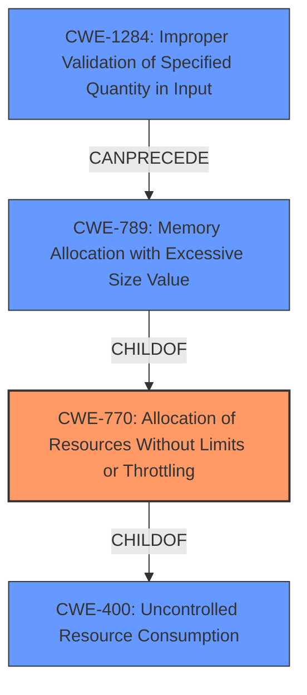

# Analysis Report for CVE-2022-20485

# Vulnerability Analysis Report: CVE-2022-20485

## Description


## Analysis (with Relationship Data)

# Summary
| CWE ID  | CWE Name                                                   | Confidence | CWE Abstraction Level | CWE Vulnerability Mapping Label | CWE-Vulnerability Mapping Notes |
| :------- | :--------------------------------------------------------- | :--------- | :-------------------- | :------------------------------ | :------------------------------ |
| CWE-770 | Allocation of Resources Without Limits or Throttling      | 0.9        | Base                  | Primary CWE                     | Allowed                       |
| CWE-400 | Uncontrolled Resource Consumption                          | 0.7        | Class                 | Secondary CWE                   | Discouraged                    |
| CWE-1284 | Improper Validation of Specified Quantity in Input       | 0.6        | Base                  | Secondary CWE                   | Allowed                       |
| CWE-789 | Memory Allocation with Excessive Size Value                 | 0.5        | Variant               | Secondary CWE                   | Allowed                       |

## Evidence and Confidence

*   **Confidence Score:** 0.8
*   **Evidence Strength:** HIGH

## Relationship Analysis
The primary CWE, CWE-770, is a child of CWE-400, indicating a more specific type of uncontrolled resource consumption. CWE-1284 can precede CWE-789, which in turn is a child of CWE-770. This suggests a chain where improper input validation can lead to excessive memory allocation, contributing to resource exhaustion. The relationships helped to refine the selection from the broader CWE-400 to the more specific CWE-770 and to identify related weaknesses.



## Vulnerability Chain
The vulnerability chain starts with insufficient validation of input (CWE-1284), potentially leading to excessive memory allocation (CWE-789). This, in turn, results in the **allocation of resources without limits or throttling** (CWE-770), ultimately causing **uncontrolled resource consumption** (CWE-400) and a failure to persist permissions settings.

## Summary of Analysis
The initial assessment focused on the provided vulnerability description, which highlighted **resource exhaustion** as the root cause. The primary CWE match from similar CVE descriptions was CWE-770, which aligns with the concept of allocating resources without limits. The analysis also considered the relationships between CWEs, particularly the child-parent relationship between CWE-770 and CWE-400.

The CVE Reference Links Content Summary provided additional details, emphasizing **insufficient input validation** and the potential for elevation of privilege. This information supports the inclusion of CWE-1284 and CWE-789 as contributing factors to the overall vulnerability.

The final decision was based on the evidence pointing to the allocation of resources without proper limits as the primary weakness (CWE-770). The supporting CWEs (CWE-400, CWE-1284, and CWE-789) were included to provide a more comprehensive understanding of the vulnerability chain.

The selected CWEs are at the optimal level of specificity, with CWE-770 being a Base-level CWE that directly addresses the root cause. The relationships between the CWEs and the additional details from the CVE Reference Links Content Summary justify the inclusion of these additional CWEs to provide a more complete picture of the vulnerability.

Relevant CWE Information:

# Enhanced Context (25 CWEs)
The following CWEs were identified as potentially relevant to this vulnerability:

## CWE-1021: Improper Restriction of Rendered UI Layers or Frames
**Abstraction Level**: Base
**Similarity Score**: 0.78
**Source**: dense

**Description**:
The web application does not restrict or incorrectly restricts frame objects or UI layers that belong to another application or domain, which can lead to user confusion about which interface the user is interacting with.

**Mapping Guidance**:
- Usage: Allowed
- Rationale: This CWE entry is at the Base level of abstraction, which is a preferred level of abstraction for mapping to the root causes of vulnerabilities.


## CWE-451: User Interface (UI) Misrepresentation of Critical Information
**Abstraction Level**: Class
**Similarity Score**: 0.77
**Source**: dense

**Description**:
The user interface (UI) does not properly represent critical information to the user, allowing the information - or its source - to be obscured or spoofed. This is often a component in phishing attacks.

**Mapping Guidance**:
- Usage: Allowed-with-Review
- Rationale: This CWE entry is a Class and might have Base-level children that would be more appropriate


## CWE-404: Improper Resource Shutdown or Release
**Abstraction Level**: Class
**Similarity Score**: 0.77
**Source**: dense

**Description**:
The product does not release or incorrectly releases a resource before it is made available for re-use.

**Mapping Guidance**:
- Usage: Allowed-with-Review
- Rationale: This CWE entry is a Class and might have Base-level children that would be more appropriate


## CWE-667: Improper Locking
**Abstraction Level**: Class
**Similarity Score**: 0.76
**Source**: dense

**Description**:
The product does not properly acquire or release a lock on a resource, leading to unexpected resource state changes and behaviors.

**Mapping Guidance**:
- Usage: Allowed-with-Review
- Rationale: This CWE entry is a Class and might have Base-level children that would be more appropriate


## CWE-226: Sensitive Information in Resource Not Removed Before Reuse
**Abstraction Level**: Base
**Similarity Score**: 0.76
**Source**: dense

**Description**:
The product releases a resource such as memory or a file so that it can be made available for reuse, but it does not clear or "zeroize" the information contained in the resource before the product performs a critical state transition or makes the resource available for reuse by other entities.

**Mapping Guidance**:
- Usage: Allowed
- Rationale: This CWE entry is at the Base level of abstraction, which is a preferred level of abstraction for mapping to the root causes of vulnerabilities.


## CWE-668: Exposure of Resource to Wrong Sphere
**Abstraction Level**: Class
**Similarity Score**: 0.75
**Source**: dense

**Description**:
The product exposes a resource to the wrong control sphere, providing unintended actors with inappropriate access to the resource.

**Mapping Guidance**:
- Usage: Discouraged
- Rationale: CWE-668 is high-level and is often misused as a catch-all when lower-level CWE IDs might be applicable. It is sometimes used for low-information vulnerability reports [REF-1287]. It is a level-1 Class (i.e., a child of a Pillar). It is not useful for trend analysis.


## CWE-799: Improper Control of Interaction Frequency
**Abstraction Level**: Class
**Similarity Score**: 0.75
**Source**: dense

**Description**:
The product does not properly limit the number or frequency of interactions that it has with an actor, such as the number of incoming requests.

**Mapping Guidance**:
- Usage: Allowed-with-Review
- Rationale: This CWE entry is a Class and might have Base-level children that would be more appropriate


## CWE-754: Improper Check for Unusual or Exceptional Conditions
**Abstraction Level**: Class
**Similarity Score**: 0.75
**Source**: dense

**Description**:
The product does not check or incorrectly checks for unusual or exceptional conditions that are not expected to occur frequently during day to day operation of the product.

**Mapping Guidance**:
- Usage: Allowed-with-Review
- Rationale: This CWE entry is a Class and might have Base-level children that would be more appropriate


## CWE-789: Memory Allocation with Excessive Size Value
**Abstraction Level**: Variant
**Similarity Score**: 0.75
**Source**: dense

**Description**:
The product allocates memory based on an untrusted, large size value, but it does not ensure that the size is within expected limits, allowing arbitrary amounts of memory to be allocated.

**Mapping Guidance**:
- Usage: Allowed
- Rationale: This CWE entry is at the Variant level of abstraction, which is a preferred level of abstraction for mapping to the root causes of vulnerabilities.


## CWE-653: Improper Isolation or Compartmentalization
**Abstraction Level**: Class
**Similarity Score**: 0.75
**Source**: dense

**Description**:


## CWE Relationship Analysis

Current CWEs represent these abstraction levels: .


### Vulnerability Chain Analysis

**Chain starting from CWE-400:**
- 400 (Uncontrolled Resource Consumption) - ROOT


**Chain starting from CWE-451:**
- 451 (User Interface (UI) Misrepresentation of Critical Information) - ROOT


### CWE Relationship Diagram

```mermaid
graph TD
    classDef primary fill:#f96,stroke:#333,stroke-width:2px
    classDef secondary fill:#69f,stroke:#333
    classDef tertiary fill:#9e9,stroke:#333
```


*Report generated on 2025-03-31 05:23:14*
