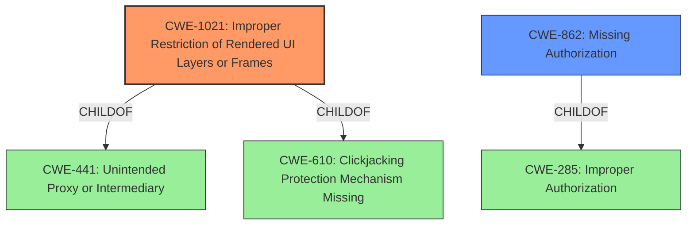

# Analysis for CVE-2022-20529

# Summary
| CWE ID  | CWE Name                                   | Confidence | CWE Abstraction Level | CWE Vulnerability Mapping Label | CWE-Vulnerability Mapping Notes |
| ------- | ------------------------------------------ | ---------- | --------------------- | ----------------------------- | ------------------------------- |
| CWE-1021 | Improper Restriction of Rendered UI Layers or Frames | 0.9        | Base                  | Allowed                       | Primary CWE                     |
| CWE-862 | Missing Authorization                        | 0.6        | Class                 | Allowed-with-Review         | Secondary Candidate             |

## Evidence and Confidence

*   **Confidence Score:** 0.8
*   **Evidence Strength:** HIGH

## Relationship Analysis
The primary CWE selected is CWE-1021 (Improper Restriction of Rendered UI Layers or Frames), a **Base** level CWE. It falls under CWE-441 (Unintended Proxy or Intermediary) and CWE-610 (Clickjacking Protection Mechanism Missing). This suggests that the vulnerability involves a failure to properly restrict the rendering of UI elements, potentially leading to clickjacking or similar UI-redressing attacks.

CWE-862 (Missing Authorization) is considered as a secondary CWE due to the potential for the lockscreen bypass to grant unauthorized access. It is a **Class** level CWE and is a child of CWE-285 (Improper Authorization).

## Vulnerability Chain
The vulnerability chain starts with a **logic error in the code** within WifiDialogActivity.java. This **weakness** leads to the Wi-Fi dialog being displayed even when the device is locked. The **impact** is a limited lockscreen bypass, which could allow for local escalation of privilege in Wi-Fi settings.

Root Cause: **Logic Error** -> UI Rendering Issue -> Lockscreen Bypass -> Potential Privilege Escalation

## Summary of Analysis
The primary selection of CWE-1021 is based on the fact that the **root cause** involves the improper rendering of UI elements (specifically the Wi-Fi dialog) on the lock screen. The CVE Reference Links Content Summary explicitly mentions that the "Wi-Fi dialog was designed to be displayed on the system UI but was not properly dismissed when the device was locked." This directly aligns with the description of CWE-1021, which addresses the improper restriction of rendered UI layers or frames.

CWE-862 is considered a secondary candidate because the lockscreen bypass could potentially allow an attacker to access Wi-Fi settings without proper authorization. However, the primary issue is with the UI rendering, not the authorization mechanism itself.

The evidence for CWE-1021 is strong, as the vulnerability description and CVE summary both highlight the UI rendering issue. The statement "**logic error in the code**" points to an underlying flaw in how the UI is handled. The confidence score for CWE-1021 is 0.9.

The confidence score for CWE-862 is 0.6, as the authorization aspect is a potential consequence of the UI rendering issue, but not the direct **root cause**.

Other CWEs Considered but Not Used:

*   CWE-862: Initially considered as the primary CWE due to the "lockscreen bypass" aspect. However, the root cause is the UI rendering issue, not a direct failure in authorization.
*   CWE-770 (Allocation of Resources Without Limits or Throttling): While resource management might be indirectly involved, it's not the primary weakness.
*   CWE-667 (Improper Locking): Locking issues are not the primary cause of the vulnerability.
*   CWE-927 (Use of Implicit Intent for Sensitive Communication): Not applicable as the vulnerability doesn't involve implicit intents.

The selection of CWE-1021 as the primary CWE is based on its direct relevance to the **root cause** of the vulnerability, which is the improper rendering of UI elements on the lock screen. The **Base** level abstraction is appropriate as it accurately represents the specific weakness. The MITRE mapping guidance allows for the use of CWE-1021.