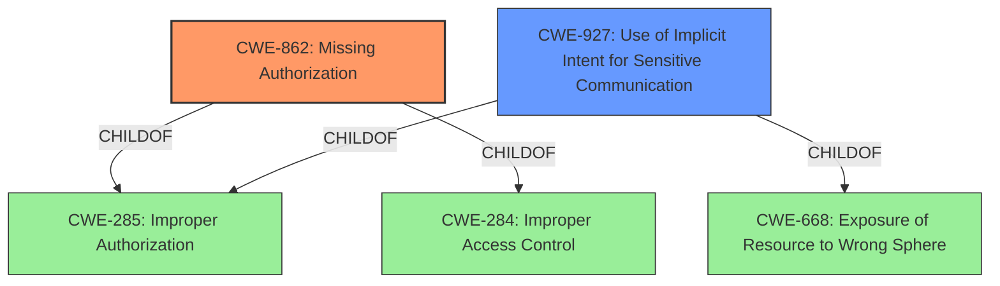

# Raw Analyzer Response for CVE-2022-20533

# Summary
| CWE ID | CWE Name | Confidence | CWE Abstraction Level | CWE Vulnerability Mapping Label | CWE-Vulnerability Mapping Notes |
|---|---|---|---|---|---|
| CWE-862 | Missing Authorization | 1.0 | Class | Allowed-with-Review | Primary CWE |
| CWE-927 | Use of Implicit Intent for Sensitive Communication | 0.7 | Variant | Allowed | Secondary Candidate |

## Evidence and Confidence

*   **Confidence Score:** 0.9
*   **Evidence Strength:** HIGH

## Relationship Analysis
The primary CWE selected is CWE-862 Missing Authorization, a class-level CWE. It has child relationships to CWE-285 and CWE-284. CWE-927 Use of Implicit Intent for Sensitive Communication is a variant and a child of CWE-285 and CWE-668. While CWE-927 is more specific, it's focused on Android intents, which is a possible implementation detail of the **missing permission check**. Therefore, CWE-862 is the better overall fit as it captures the **missing permission check** weakness at a higher level, applicable across different contexts.

## Vulnerability Chain
The vulnerability chain starts with a **missing permission check** (CWE-862), which allows an attacker to connect to new WiFi networks from the guest mode, leading to local escalation of privilege.

## Summary of Analysis
The initial analysis identified CWE-862 as the primary candidate due to the **missing permission check**. The Retriever Results also listed it as the top candidate. The vulnerability description clearly states a **missing permission check**, which directly aligns with the definition of CWE-862: "The product does not perform an authorization check when an actor attempts to access a resource or perform an action."

The evidence from the vulnerability description and CVE Reference Links Content Summary supports this assessment:

*   **Vulnerability Description Key Phrases:** "**rootcause:** **missing permission check**"
*   **CVE Reference Links Content Summary:** "weaknesses: Improper restriction of WifiSlice functionality for guest users."

The relationship analysis confirmed that while more specific CWEs exist (like CWE-927), CWE-862 captures the core issue effectively. CWE-927 is related to Android intents, which is a lower level implementation detail for this vulnerability.

The selection of CWE-862 is at the appropriate level of specificity, capturing the **missing authorization** at its root cause, rather than focusing on the specific implementation details.

Relevant CWE Information:

# Enhanced Context (25 CWEs)
The following CWEs were identified as potentially relevant to this vulnerability:

## CWE-862: Missing Authorization
**Abstraction:** Class
**Similarity Score**: 0.524
**Source**: sparse

**Description**:
The product does not perform an authorization check when an actor attempts to access a resource or perform an action.

**Mapping Guidance**:
- Usage: Allowed-with-Review
- Rationale: This CWE entry is a Class and might have Base-level children that would be more appropriate

## CWE-927: Use of Implicit Intent for Sensitive Communication
**Abstraction:** Variant
**Similarity Score**: 0.526
**Source**: dense

**Description**:
The Android application uses an implicit intent for transmitting sensitive data to other applications.

**Mapping Guidance**:
- Usage: Allowed
- Rationale: This CWE entry is at the Variant level of abstraction, which is a preferred level of abstraction for mapping to the root causes of vulnerabilities.
### CWE Selection:

*   **CWE-862: Missing Authorization**
    *   **Explanation:** The root cause is a **missing permission check**, which directly corresponds to the definition of CWE-862. The vulnerability allows connecting to new WiFi networks from guest mode, indicating unauthorized access.
    *   **Security Implications:** Allows unauthorized actions, leading to privilege escalation.
    *   **Relationship:** Class-level CWE.
    *   **MITRE Mapping Guidance:** Allowed-with-Review, suggesting to examine child entries for a better fit. However, the description directly matches the vulnerability.
    *   **Confidence:** 1.0
*   **CWE-927: Use of Implicit Intent for Sensitive Communication**
    *   **Explanation:** This CWE is a possible, but less likely, secondary factor since the vulnerability is within `WifiSlice.java` which likely uses Android intents. However, the core issue is the **missing permission check**, not necessarily the use of implicit intents.
    *   **Security Implications:** Could lead to exposure of sensitive data.
    *   **Relationship:** Variant-level CWE, ChildOf CWE-285 and CWE-668.
    *   **MITRE Mapping Guidance:** Allowed.
    *   **Confidence:** 0.7

### CWEs Considered But Not Used:

*   **CWE-362: Concurrent Execution using Shared Resource with Improper Synchronization ('Race Condition')**: Considered, but the vulnerability doesn't involve concurrent execution or synchronization issues.
*   **CWE-476: NULL Pointer Dereference**: Considered, but there's no indication of NULL pointer dereference in the vulnerability description.
*   **CWE-1284: Improper Validation of Specified Quantity in Input**: Considered, but the vulnerability isn't about improper input validation of quantities.
*   **CWE-667: Improper Locking**: Considered, but the vulnerability doesn't involve locking mechanisms.
*   **CWE-908: Use of Uninitialized Resource**: Considered, but there's no mention of uninitialized resources.