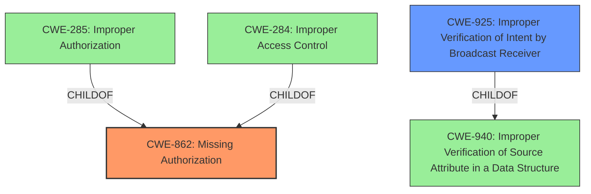

# Analysis Report for CVE-2022-20536

# Vulnerability Analysis Report: CVE-2022-20536

## Description


## Analysis (with Relationship Data)

# Summary
| CWE ID | CWE Name | Confidence | CWE Abstraction Level | CWE Vulnerability Mapping Label | CWE-Vulnerability Mapping Notes |
|---|---|---|---|---|---|
| CWE-862 | Missing Authorization | 1.0 | Class | Allowed-with-Review | Primary CWE |
| CWE-925 | Improper Verification of Intent by Broadcast Receiver | 0.75 | Variant | Allowed | Secondary Candidate |

## Evidence and Confidence

*   **Confidence Score:** 0.9
*   **Evidence Strength:** HIGH

## Relationship Analysis
The primary CWE is CWE-862 which is a Class-level CWE. The Retriever results did not include a Base or Variant alternative. CWE-862 is the parent of CWE-285 (Improper Authorization) and CWE-284 (Improper Access Control). Given the specific context of the vulnerability, it might be possible to narrow the focus further but with the information provided, CWE-862 is the best fit. CWE-925 (Improper Verification of Intent by Broadcast Receiver) is a Variant and a child of CWE-940 (Improper Verification of Source Attribute in a Data Structure). It is being considered due to the vulnerability description referencing a broadcast receiver.



## Vulnerability Chain
The chain of events is as follows:
1.  **Missing permission check** in `registerBroadcastReceiver` (CWE-862).
2.  Unprivileged app changes the preferred TTY mode.
3.  Local escalation of privilege.

## Summary of Analysis
The initial analysis identified the **missing permission check** as the root cause, which directly aligns with CWE-862 (Missing Authorization). The CVE Reference Links Content Summary confirms this, stating, "The vulnerability stems from a missing permission check when registering a receiver for the `ACTION_TTY_PREFERRED_MODE_CHANGE` intent."

The **missing permission check** allows an unprivileged application to change the preferred TTY mode, leading to a local escalation of privilege. This matches the description of CWE-862, where the product does not perform an authorization check when an actor attempts to perform an action.

CWE-925 (Improper Verification of Intent by Broadcast Receiver) was considered since a broadcast receiver is involved. The evidence suggests that the core issue is the **missing permission check** rather than the improper verification of the intent itself. Therefore, CWE-862 is a more precise and suitable classification.

The selection of CWE-862 is at the optimal level of specificity. While it's a Class, the retriever results did not identify a Base or Variant alternative. Given the provided evidence, the **missing authorization** is the core weakness, and CWE-862 accurately captures this.

Relevant CWE Information:

# Enhanced Context (25 CWEs)
The following CWEs were identified as potentially relevant to this vulnerability:

## CWE-862: Missing Authorization
**Abstraction:** Class
**Status:** Incomplete

### Description
The product does not perform an authorization check when an actor attempts to access a resource or perform an action.

### Extended Description
Not provided

### Alternative Terms
AuthZ: "AuthZ" is typically used as an abbreviation of "authorization" within the web application security community. It is distinct from "AuthN" (or, sometimes, "AuthC") which is an abbreviation of "authentication." The use of "Auth" as an abbreviation is discouraged, since it could be used for either authentication or authorization.

### Relationships
ChildOf -> CWE-285
ChildOf -> CWE-284

### Mapping Guidance
**Usage:** Allowed-with-Review
**Rationale:** This CWE entry is a Class and might have Base-level children that would be more appropriate
**Comments:** Examine children of this entry to see if there is a better fit
**Reasons:**
- Abstraction

### Additional Notes
**[Terminology]** Assuming a user with a given identity, authorization is the process of determining whether that user can access a given resource, based on the user's privileges and any permissions or other access-control specifications that apply to the resource.

### Observed Examples
- **CVE-2022-24730:** Go-based continuous deployment product does not check that a user has certain privileges to update or create an app, allowing adversaries to read sensitive repository information
- **CVE-2009-3168:** Web application does not restrict access to admin scripts, allowing authenticated users to reset administrative passwords.
- **CVE-2009-3597:** Web application stores database file under the web root with insufficient access control (CWE-219), allowing direct request.


## CWE Relationship Analysis

Current CWEs represent these abstraction levels: .


### Vulnerability Chain Analysis

**Chain starting from CWE-862:**
- 862 (Missing Authorization) - ROOT


**Chain starting from CWE-925:**
- 925 (Improper Verification of Intent by Broadcast Receiver) - ROOT


### CWE Relationship Diagram

```mermaid
graph TD
    classDef primary fill:#f96,stroke:#333,stroke-width:2px
    classDef secondary fill:#69f,stroke:#333
    classDef tertiary fill:#9e9,stroke:#333
```


*Report generated on 2025-03-30 14:10:51*
