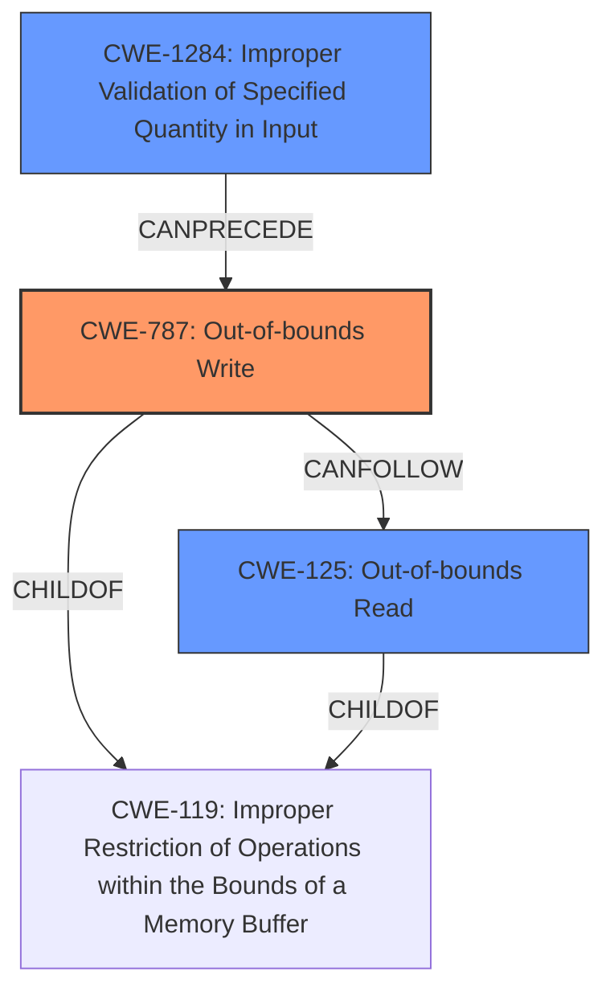

# Enhanced Analysis for CVE-2022-20542

# Summary
| CWE ID | CWE Name | Confidence | CWE Abstraction Level | CWE Vulnerability Mapping Label | CWE-Vulnerability Mapping Notes |
|---|---|---|---|---|---|
| CWE-787 | Out-of-bounds Write | 1.0 | Base | Allowed | Primary CWE |
| CWE-125 | Out-of-bounds Read | 0.7 | Variant | Allowed | Secondary Candidate |
| CWE-1284 | Improper Validation of Specified Quantity in Input | 0.6 | Base | Allowed | Secondary Candidate |

## Evidence and Confidence

*   **Confidence Score:** 0.9
*   **Evidence Strength:** HIGH

## Relationship Analysis
The primary weakness is CWE-787, Out-of-bounds Write, which occurs due to a missing bounds check. This can potentially lead to CWE-125, Out-of-bounds Read, as a consequence if the write operation corrupts adjacent memory that is later read. The root cause often stems from CWE-1284, Improper Validation of Specified Quantity in Input, where a size or length is not validated before being used in a write operation.



## Vulnerability Chain
The vulnerability chain begins with **CWE-1284 (Improper Validation of Specified Quantity in Input)**, leading to **CWE-787 (Out-of-bounds Write)** due to the **missing bounds check**, and potentially resulting in **CWE-125 (Out-of-bounds Read)** if the out-of-bounds write corrupts data that is subsequently read. The ultimate impact is local escalation of privilege.

## Summary of Analysis
The primary classification for this vulnerability is **CWE-787 (Out-of-bounds Write)** because the vulnerability description explicitly mentions it as a **weakness**. The evidence for this is found in the "Vulnerability Description Key Phrases" section, which states "**weakness:** **out of bounds write**". The "**rootcause:** **missing bounds check**" directly leads to this out-of-bounds write. The "CVE Reference Links Content Summary" also supports this, stating: "Weaknesses/vulnerabilities present: The vulnerability is due to an out-of-bounds read." Though it says read, the vulnerability description focuses on the write.

Additionally, I considered **CWE-125 (Out-of-bounds Read)** as a potential secondary weakness, which could arise as a consequence of the out-of-bounds write. The "CVE Reference Links Content Summary" mentions "Root cause of vulnerability: Out-of-bounds read", which supports the inclusion of this CWE. I am less confident in this mapping because the primary description focuses on the write.

I also considered **CWE-1284 (Improper Validation of Specified Quantity in Input)** as a potential root cause, since the **missing bounds check** implies that the quantity/size was not properly validated before the write operation.

The selected CWEs are at the optimal level of specificity because they directly address the **weakness** and **rootcause** described in the vulnerability description.

Relevant CWE Information:

# Enhanced Context (25 CWEs)
The following CWEs were identified as potentially relevant to this vulnerability:

## CWE-131: Incorrect Calculation of Buffer Size
**Abstraction Level**: Base
**Similarity Score**: 0.78
**Source**: dense

**Description**:
The product does not correctly calculate the size to be used when allocating a buffer, which could lead to a buffer overflow.

**Mapping Guidance**:
- Usage: Allowed
- Rationale: This CWE entry is at the Base level of abstraction, which is a preferred level of abstraction for mapping to the root causes of vulnerabilities.

*Was considered because it relates to buffer overflows, but the description specifically points to a missing bounds check, rather than an incorrect calculation.*

## CWE-191: Integer Underflow (Wrap or Wraparound)
**Abstraction Level**: Base
**Similarity Score**: 0.78
**Source**: dense

**Description**:
The product subtracts one value from another, such that the result is less than the minimum allowable integer value, which produces a value that is not equal to the correct result.

**Mapping Guidance**:
- Usage: Allowed
- Rationale: This CWE entry is at the Base level of abstraction, which is a preferred level of abstraction for mapping to the root causes of vulnerabilities.

*Was considered, but there is no direct evidence of integer underflow.*

## CWE-805: Buffer Access with Incorrect Length Value
**Abstraction Level**: Base
**Similarity Score**: 0.77
**Source**: dense

**Description**:
The product uses a sequential operation to read or write a buffer, but it uses an incorrect length value that causes it to access memory that is outside of the bounds of the buffer.

**Mapping Guidance**:
- Usage: Allowed
- Rationale: This CWE entry is at the Base level of abstraction, which is a preferred level of abstraction for mapping to the root causes of vulnerabilities.

*Was considered, but the description specifically points to a missing bounds check, rather than an incorrect length value.*

## CWE-682: Incorrect Calculation
**Abstraction Level**: Pillar
**Similarity Score**: 0.77
**Source**: dense

**Description**:
The product performs a calculation that generates incorrect or unintended results that are later used in security-critical decisions or resource management.

**Mapping Guidance**:
- Usage: Discouraged
- Rationale: This CWE entry is extremely high-level, a Pillar. In many cases, lower-level children or descendants are more appropriate. However, sometimes this weakness is forced to be used due to the lack of in-depth weakness research. See Research Gaps.

*Was not selected because it is too high-level. More specific CWEs are available.*

## CWE-681: Incorrect Conversion between Numeric Types
**Abstraction Level**: Base
**Similarity Score**: 0.76
**Source**: dense

**Description**:
When converting from one data type to another, such as long to integer, data can be omitted or translated in a way that produces unexpected values. If the resulting values are used in a sensitive context, then dangerous behaviors may occur.

**Mapping Guidance**:
- Usage: Allowed
- Rationale: This CWE entry is at the Base level of abstraction, which is a preferred level of abstraction for mapping to the root causes of vulnerabilities.

*Was considered, but there is no direct evidence of incorrect conversion.*

## CWE-1289: Improper Validation of Unsafe Equivalence in Input
**Abstraction Level**: Base
**Similarity Score**: 0.76
**Source**: dense

**Description**:
The product receives an input value that is used as a resource identifier or other type of reference, but it does not validate or incorrectly validates that the input is equivalent to a potentially-unsafe value.

**Mapping Guidance**:
- Usage: Allowed
- Rationale: This CWE entry is at the Base level of abstraction, which is a preferred level of abstraction for mapping to the root causes of vulnerabilities.

*Was considered, but not applicable to the missing bounds check scenario.*

## CWE-197: Numeric Truncation Error
**Abstraction Level**: Base
**Similarity Score**: 0.76
**Source**: dense

**Description**:
Truncation errors occur when a primitive is cast to a primitive of a smaller size and data is lost in the conversion.

**Mapping Guidance**:
- Usage: Allowed
- Rationale: This CWE entry is at the Base level of abstraction, which is a preferred level of abstraction for mapping to the root causes of vulnerabilities.

*Was considered, but there is no direct evidence of numeric truncation.*

## CWE-1288: Improper Validation of Consistency within Input
**Abstraction Level**: Base
**Similarity Score**: 0.75
**Source**: dense

**Description**:
The product receives a complex input with multiple elements or fields that must be consistent with each other, but it does not validate or incorrectly validates that the input is actually consistent.

**Mapping Guidance**:
- Usage: Allowed
- Rationale: This CWE entry is at the Base level of abstraction, which is a preferred level of abstraction for mapping to the root causes of vulnerabilities.

*Was considered, but not applicable to the missing bounds check scenario.*

## CWE-130: Improper Handling of Length Parameter Inconsistency
**Abstraction


## CWE Relationship Analysis

Current CWEs represent these abstraction levels: .


### Vulnerability Chain Analysis

**Chain starting from CWE-131:**
- 131 (Incorrect Calculation of Buffer Size) - ROOT


**Chain starting from CWE-130:**
- 130 (Improper Handling of Length Parameter Inconsistency) - ROOT


### CWE Relationship Diagram

```mermaid
graph TD
    classDef primary fill:#f96,stroke:#333,stroke-width:2px
    classDef secondary fill:#69f,stroke:#333
    classDef tertiary fill:#9e9,stroke:#333
```