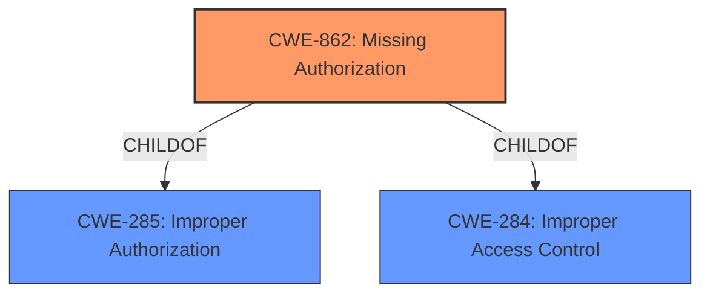

# Enhanced Analysis for CVE-2022-20547

# Summary
| CWE ID | CWE Name | Confidence | CWE Abstraction Level | CWE Vulnerability Mapping Label | CWE-Vulnerability Mapping Notes |
|---|---|---|---|---|---|
| CWE-862 | Missing Authorization | 1.0 | Class | Primary | Allowed-with-Review |

## Evidence and Confidence

*   **Confidence Score:** 1.0
*   **Evidence Strength:** HIGH

## Relationship Analysis
The primary relationship that impacted my decision was the parent-child relationship between CWE-862 (Missing Authorization) and its potential base-level children. Since the vulnerability description specifically mentions a **missing permission check**, CWE-862 is the most fitting Class-level CWE.



## Vulnerability Chain
The vulnerability chain consists of a **missing permission check**, leading to the ability to manipulate Bluetooth state and a potential local escalation of privilege.

Root Cause: **Missing permission check** (CWE-862)
Impact: Manipulation of Bluetooth state, local escalation of privilege

## Summary of Analysis
The initial analysis focused on the **missing permission check** as the root cause of the vulnerability. The key phrase "missing permission check" directly points to an authorization issue. The CVE Reference Links Content Summary confirms this, stating "The vulnerability is due to a **missing permission check** in a Bluetooth method" and "Missing permission enforcement in a Bluetooth method."

The Retriever Results also support this, with CWE-862 (Missing Authorization) being the top-ranked CWE.

The description of CWE-862, "The product does not perform an authorization check when an actor attempts to access a resource or perform an action," aligns perfectly with the vulnerability description. The vulnerability allows manipulation of Bluetooth state due to this **missing check**.

The CWE is at the optimal level of specificity because it precisely describes the **lack of authorization** that leads to the vulnerability.

Relevant CWE Information:

# Enhanced Context (25 CWEs)

## CWE-862: Missing Authorization
**Abstraction:** Class
**Status:** Incomplete

### Description
The product does not perform an authorization check when an actor attempts to access a resource or perform an action.

### Extended Description
Not provided

### Alternative Terms
AuthZ: "AuthZ" is typically used as an abbreviation of "authorization" within the web application security community. It is distinct from "AuthN" (or, sometimes, "AuthC") which is an abbreviation of "authentication." The use of "Auth" as an abbreviation is discouraged, since it could be used for either authentication or authorization.

### Relationships
ChildOf -> CWE-285
ChildOf -> CWE-284

### Mapping Guidance
**Usage:** Allowed-with-Review
**Rationale:** This CWE entry is a Class and might have Base-level children that would be more appropriate
**Comments:** Examine children of this entry to see if there is a better fit
**Reasons:**
- Abstraction

### Additional Notes
**[Terminology]** Assuming a user with a given identity, authorization is the process of determining whether that user can access a given resource, based on the user's privileges and any permissions or other access-control specifications that apply to the resource.

### Observed Examples
- **CVE-2022-24730:** Go-based continuous deployment product does not check that a user has certain privileges to update or create an app, allowing adversaries to read sensitive repository information
- **CVE-2009-3168:** Web application does not restrict access to admin scripts, allowing authenticated users to reset administrative passwords.
- **CVE-2009-3597:** Web application stores database file under the web root with insufficient access control (CWE-219), allowing direct request.


## CWE Relationship Analysis

Current CWEs represent these abstraction levels: .


### Vulnerability Chain Analysis

**Chain starting from CWE-862:**
- 862 (Missing Authorization) - ROOT


**Chain starting from CWE-285:**
- 285 (Improper Authorization) - ROOT


### CWE Relationship Diagram

```mermaid
graph TD
    classDef primary fill:#f96,stroke:#333,stroke-width:2px
    classDef secondary fill:#69f,stroke:#333
    classDef tertiary fill:#9e9,stroke:#333
```