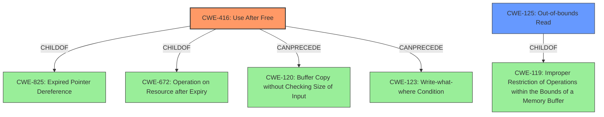

# Analysis Report for CVE-2022-20552

# Vulnerability Analysis Report: CVE-2022-20552

## Description


## Analysis (with Relationship Data)

# Summary
| CWE ID | CWE Name | Confidence | CWE Abstraction Level | CWE Vulnerability Mapping Label | CWE-Vulnerability Mapping Notes |
|---|---|---|---|---|---|
| CWE-416 | Use After Free | 1.0 | Variant | Allowed | Primary CWE. Matches the **rootcause** and summary information. |
| CWE-125 | Out-of-bounds Read | 0.7 | Base | Allowed-with-Review | Matches the **weakness**, but caused by the primary **rootcause**. |

## Evidence and Confidence

*   **Confidence Score:** 1.0
*   **Evidence Strength:** HIGH

## Relationship Analysis
The primary CWE is CWE-416, which is a Variant of CWE-825 (Expired Pointer Dereference), and CWE-672 (Operation on Resource after Expiry). CWE-416 can precede CWE-120 (Buffer Copy without Checking Size of Input) or CWE-123 (Write-what-where Condition). CWE-125 is a child of CWE-119 (Improper Restriction of Operations within the Bounds of a Memory Buffer).



## Vulnerability Chain
The vulnerability chain starts with a **use after free** (CWE-416), which leads to an **out of bounds read** (CWE-125), resulting in information disclosure.

## Summary of Analysis
The vulnerability description clearly states that there is a possible **out of bounds read** due to a **use after free**. The CVE Reference Links Content Summary confirms this with "Root cause of vulnerability: Heap use-after-free" and "Weaknesses/vulnerabilities present: Use-after-free". The impact is information disclosure.

CWE-416 (Use After Free) is selected as the primary CWE because it is the **rootcause** of the vulnerability. The vulnerability description key phrases also identify "**rootcause:** **use after free**". The Retriever Results also list CWE-416 as the fifth best match. The usage is "Allowed" and the Abstraction level is "Variant".

CWE-125 (Out-of-bounds Read) is selected as a secondary CWE because it is the **weakness** that results from the **use after free**. The vulnerability description states "**weakness:** **out of bounds read**".

CWE-908 (Use of Uninitialized Resource) was considered because it was the top result in the Retriever Results. However, the provided evidence strongly points to a **use after free** rather than use of an uninitialized resource. Therefore, CWE-908 was not selected.

CWE-362 (Concurrent Execution using Shared Resource with Improper Synchronization ('Race Condition')) was considered because it was the second result in the Retriever Results and because CWE-362 can precede CWE-416. However, there is no mention of concurrency or synchronization issues in the vulnerability description or CVE Reference Links Content Summary. Therefore, CWE-362 was not selected.


## CWE Relationship Analysis

Current CWEs represent these abstraction levels: .


### Vulnerability Chain Analysis

**Chain starting from CWE-825:**
- 825 (Expired Pointer Dereference) - ROOT


**Chain starting from CWE-362:**
- 362 (Concurrent Execution using Shared Resource with Improper Synchronization ('Race Condition')) - ROOT


### CWE Relationship Diagram

```mermaid
graph TD
    classDef primary fill:#f96,stroke:#333,stroke-width:2px
    classDef secondary fill:#69f,stroke:#333
    classDef tertiary fill:#9e9,stroke:#333
```


*Report generated on 2025-03-31 06:53:20*
