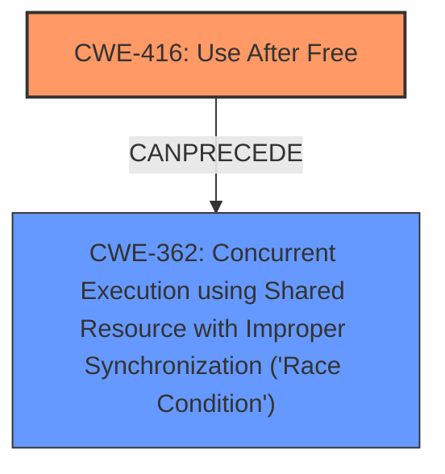

# Analysis Report for CVE-2022-20567

# Vulnerability Analysis Report: CVE-2022-20567

## Description


## Analysis (with Relationship Data)

# Summary
| CWE ID | CWE Name | Confidence | CWE Abstraction Level | CWE Vulnerability Mapping Label | CWE-Vulnerability Mapping Notes |
|---|---|---|---|---|---|
| CWE-416 | Use After Free | 1.0 | Variant | Allowed | Primary CWE |
| CWE-362 | Concurrent Execution using Shared Resource with Improper Synchronization ('Race Condition') | 1.0 | Class | Allowed-with-Review | Secondary CWE |

## Evidence and Confidence

*   **Confidence Score:** 1.0
*   **Evidence Strength:** HIGH

## Relationship Analysis
The primary weakness is CWE-416 Use After Free which is caused by a race condition, CWE-362. CWE-416 is a variant, while CWE-362 is a class. The relationship is that CWE-362 can precede CWE-416. This means that the race condition creates the conditions for the use-after-free to occur.



## Vulnerability Chain
The vulnerability chain starts with a **race condition** (CWE-362) that leads to a **use after free** (CWE-416). The impact is local escalation of privilege.

## Summary of Analysis
The vulnerability is a **use after free** caused by a **race condition** in the Android kernel. The primary weakness is CWE-416, and the secondary weakness is CWE-362.

The vulnerability description states, "In pppol2tp_create of l2tp_ppp.c, there is a possible **use after free** due to a **race condition**." The CVE Reference Links Content Summary elaborates on the root cause: "The root cause lies in the improper management of the socket reference within the pppol2tp_release function...This leads to a **race condition** where the session object can be freed while the RCU callback for the socket release is still scheduled but not yet executed." The summary also states the weaknesses as "Race condition due to improper socket reference management" and "**Use** of call_rcu without guaranteeing the session object's validity".

CWE-416 (Use After Free) is a Variant level CWE, which is a preferred level of abstraction. The description matches the vulnerability description: "The product reuses or references memory after it has been freed." The mapping guidance states, "This CWE entry is at the Variant level of abstraction, which is a preferred level of abstraction for mapping to the root causes of vulnerabilities."

CWE-362 (Concurrent Execution using Shared Resource with Improper Synchronization ('Race Condition')) is a Class level CWE. The description matches the vulnerability description: "The product contains a concurrent code sequence that requires temporary, exclusive access to a shared resource, but a timing window exists in which the shared resource can be modified by another code sequence operating concurrently." The mapping guidance states, "This CWE entry is a Class and might have Base-level children that would be more appropriate." However, there are no more specific child entries that fit the description better.

CWE-415 (Double Free) was considered but is not appropriate because the vulnerability is a **use after free**, not a double free.

CWE-667 (Improper Locking) was considered but is not appropriate because the **race condition** is not caused by improper locking, but by improper management of the socket reference.

CWE-908 (Use of Uninitialized Resource) was considered but is not appropriate because the vulnerability is a **use after free**, not a use of an uninitialized resource.


## CWE Relationship Analysis

Current CWEs represent these abstraction levels: .


### Vulnerability Chain Analysis

**Chain starting from CWE-908:**
- 908 (Use of Uninitialized Resource) - ROOT


**Chain starting from CWE-415:**
- 415 (Double Free) - ROOT


### CWE Relationship Diagram

```mermaid
graph TD
    classDef primary fill:#f96,stroke:#333,stroke-width:2px
    classDef secondary fill:#69f,stroke:#333
    classDef tertiary fill:#9e9,stroke:#333
```


*Report generated on 2025-03-30 15:34:49*
