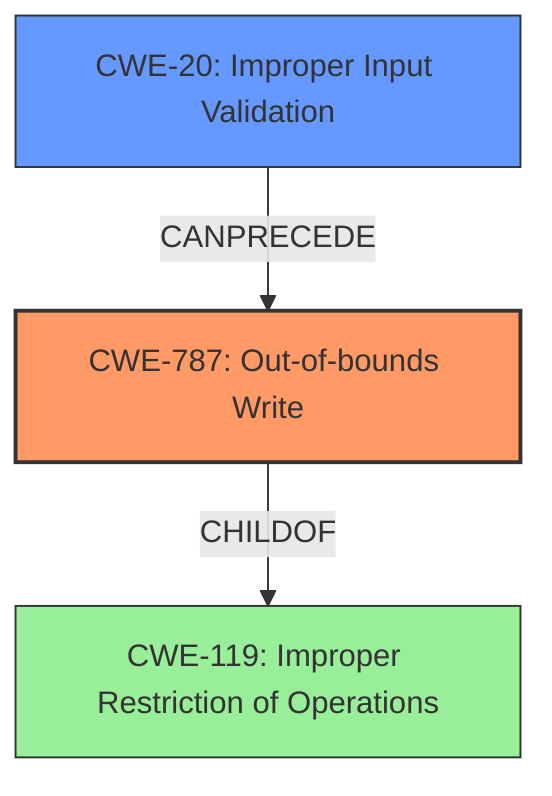

# Enhanced Analysis for CVE-2022-20582

# Summary
| CWE ID  | CWE Name                                                                              | Confidence | CWE Abstraction Level | CWE Vulnerability Mapping Label | CWE-Vulnerability Mapping Notes |
| ------- | ------------------------------------------------------------------------------------- | ---------- | ----------------------- | ------------------------------- | --------------------------------- |
| CWE-787 | Out-of-bounds Write                                                                   | 0.9        | Base                    | Primary CWE                     | Allowed                           |
| CWE-20  | Improper Input Validation                                                               | 0.7        | Class                    | Secondary Candidate             | Discouraged                       |

## Evidence and Confidence

*   **Confidence Score:** 0.8
*   **Evidence Strength:** HIGH

## Relationship Analysis
The primary CWE, CWE-787, is a base-level weakness that directly describes the **out-of-bounds write**. It is related to CWE-119 (Improper Restriction of Operations within the Bounds of a Memory Buffer), which is a parent class. The secondary CWE, CWE-20, is a class-level weakness that broadly describes the **improper input validation** that led to the vulnerability. This is a more general weakness, and while relevant, CWE-787 provides a more specific classification of the actual coding error. There is a clear cause-and-effect relationship, where **improper input validation** (CWE-20) can lead to an **out-of-bounds write** (CWE-787).



## Vulnerability Chain
The vulnerability chain starts with **improper input validation** (CWE-20), which allows for an **out-of-bounds write** (CWE-787). This then leads to local escalation of privilege.
  - Root Cause: **Improper Input Validation** (CWE-20)
  - Weakness: **Out-of-Bounds Write** (CWE-787)
  - Impact: Local Escalation of Privilege

## Summary of Analysis
The primary weakness is clearly an **out-of-bounds write**, as explicitly stated in the vulnerability description: "there is a possible **out of bounds write** due to **improper input validation**." This aligns well with CWE-787. The root cause is **improper input validation**, which is a broader category covered by CWE-20. While CWE-20 is relevant as a contributing factor, CWE-787 more precisely describes the technical flaw. The Retriever Results also list CWE-787 as the top CWE for similar CVE descriptions.

The relationship analysis shows that CWE-20 can precede CWE-787, indicating that **improper input validation** can lead to an **out-of-bounds write**. This supports classifying both CWEs, with CWE-787 being the primary weakness and CWE-20 being a secondary contributing factor.

The final decision is based on the explicit mention of "**out of bounds write**" and "**improper input validation**" in the vulnerability description and the alignment of these phrases with the definitions of CWE-787 and CWE-20 respectively. CWE-787 is at the optimal level of specificity because it directly represents the type of coding error that occurred, while CWE-20 represents the broader class of **input validation** issues that contributed to the vulnerability.

Relevant CWE Information:

# Enhanced Context (25 CWEs)

## CWE-131: Incorrect Calculation of Buffer Size
**Abstraction Level**: Base
**Similarity Score**: 0.78
**Source**: dense

**Description**:
The product does not correctly calculate the size to be used when allocating a buffer, which could lead to a buffer overflow.

**Mapping Guidance**:
- Usage: Allowed
- Rationale: This CWE entry is at the Base level of abstraction, which is a preferred level of abstraction for mapping to the root causes of vulnerabilities.

*Reason for not selecting:* Although it is possible that an incorrect calculation of buffer size was involved, the vulnerability description does not provide enough information to confirm that. The description only mentions "**improper input validation**" leading to an **out of bounds write**, so CWE-131 is not the most appropriate choice.

## CWE-191: Integer Underflow (Wrap or Wraparound)
**Abstraction Level**: Base
**Similarity Score**: 0.78
**Source**: dense

**Description**:
The product subtracts one value from another, such that the result is less than the minimum allowable integer value, which produces a value that is not equal to the correct result.

**Mapping Guidance**:
- Usage: Allowed
- Rationale: This CWE entry is at the Base level of abstraction, which is a preferred level of abstraction for mapping to the root causes of vulnerabilities.

*Reason for not selecting:* There is no evidence to suggest an integer underflow. The vulnerability description focuses on **improper input validation** and an **out of bounds write**, which are not directly related to integer underflow.

## CWE-805: Buffer Access with Incorrect Length Value
**Abstraction Level**: Base
**Similarity Score**: 0.77
**Source**: dense

**Description**:
The product uses a sequential operation to read or write a buffer, but it uses an incorrect length value that causes it to access memory that is outside of the bounds of the buffer.

**Mapping Guidance**:
- Usage: Allowed
- Rationale: This CWE entry is at the Base level of abstraction, which is a preferred level of abstraction for mapping to the root causes of vulnerabilities.

*Reason for not selecting:* CWE-805 is similar to CWE-787, but CWE-787 is more general. Also, CWE-787 appears in the "Primary CWE Match" from the `CWE for similar CVE Descriptions` section.

## CWE-682: Incorrect Calculation
**Abstraction Level**: Pillar
**Similarity Score**: 0.77
**Source**: dense

**Description**:
The product performs a calculation that generates incorrect or unintended results that are later used in security-critical decisions or resource management.

**Mapping Guidance**:
- Usage: Discouraged
- Rationale: This CWE entry is extremely high-level, a Pillar. In many cases, lower-level children or descendants are more appropriate. However, sometimes this weakness is forced to be used due to the lack of in-depth weakness research. See Research Gaps.

*Reason for not selecting:* This is a high-level (Pillar) CWE, and more specific CWEs like CWE-787 and CWE-20 are more appropriate.

## CWE-667: Improper Locking
**Abstraction Level**: Class
**Similarity Score**: 0.77
**Source**: dense

**Description**:
The product does not properly acquire or release a lock on a resource, leading to unexpected resource state changes and behaviors.

**Mapping Guidance**:
- Usage: Allowed-with-Review
- Rationale: This CWE entry is a Class and might have Base-level children that would be more appropriate

*Reason for not selecting:* The vulnerability description does not mention anything about locking or concurrent access to resources.

## CWE-404: Improper Resource Shutdown or Release
**Abstraction Level**: Class
**Similarity Score**: 0.76
**Source**: dense

**Description**:
The product does not release or incorrectly releases a resource before it is made available for re-use.

**Mapping Guidance**:
- Usage: Allowed-with-Review
- Rationale: This CWE entry is a Class and might have Base-level children that would be more appropriate

*Reason for not selecting:* The vulnerability description does not mention anything about resource shutdown or release.

## CWE-124: Buffer Underwrite ('Buffer Underflow')
**Abstraction Level**: Base
**Similarity Score**: 0.76
**Source**: dense

**Description**:
The product writes to a buffer using an index or pointer that references a memory location prior to the beginning of the buffer.

**Mapping Guidance**:
- Usage: Allowed
- Rationale: This CWE entry is at the Base level of abstraction, which is a preferred level of abstraction for mapping to the root causes of vulnerabilities.

*Reason for not selecting:* The vulnerability description explicitly mentions an **out of bounds write**, not an underwrite.

## CWE-681: Incorrect Conversion between Numeric Types
**Abstraction Level**: Base
**Similarity Score**: 0.76
**Source**: dense

**Description**:
When converting from one data type to another, such as long to integer, data can be omitted or translated in a way that produces unexpected values. If the resulting values are used in a sensitive context, then dangerous behaviors may occur.

**Mapping Guidance**:
-


## CWE Relationship Analysis

Current CWEs represent these abstraction levels: .


### Vulnerability Chain Analysis

**Chain starting from CWE-131:**
- 131 (Incorrect Calculation of Buffer Size) - ROOT


**Chain starting from CWE-805:**
- 805 (Buffer Access with Incorrect Length Value) - ROOT


### CWE Relationship Diagram

```mermaid
graph TD
    classDef primary fill:#f96,stroke:#333,stroke-width:2px
    classDef secondary fill:#69f,stroke:#333
    classDef tertiary fill:#9e9,stroke:#333
```