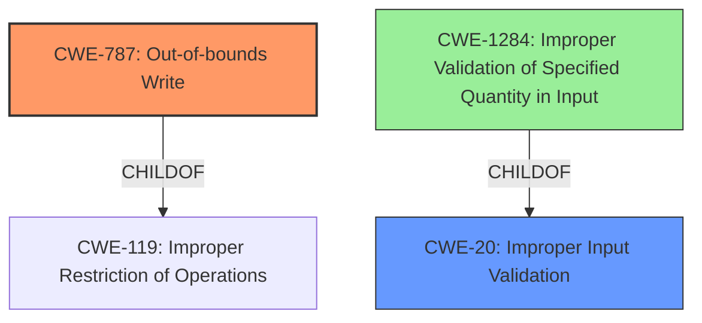

# Analysis for CVE-2022-20583

# Summary
| CWE ID | CWE Name | Confidence | CWE Abstraction Level | CWE Vulnerability Mapping Label | CWE-Vulnerability Mapping Notes |
|---|---|---|---|---|---|
| CWE-787 | Out-of-bounds Write | 1.0 | Base | Primary | Allowed |
| CWE-20 | Improper Input Validation | 0.7 | Class | Secondary | Discouraged |

## Evidence and Confidence

*   **Confidence Score:** 0.85
*   **Evidence Strength:** HIGH

## Relationship Analysis
The primary CWE, CWE-787, is a base-level CWE describing an out-of-bounds write. It is a child of CWE-119 (Improper Restriction of Operations within the Bounds of a Memory Buffer). The secondary CWE, CWE-20, is a class-level CWE representing improper input validation. It is related to CWE-1284 (Improper Validation of Specified Quantity in Input), which could be a more specific alternative.

## Vulnerability Chain
The vulnerability chain starts with **improper input validation** (CWE-20) which leads to an **out-of-bounds write** (CWE-787). This results in local escalation of privilege.

## Summary of Analysis
The vulnerability description clearly states an **out of bounds write** due to **improper input validation**. The primary CWE match from similar CVE descriptions is CWE-787 (Out-of-bounds Write), and **improper input validation** is also mentioned in the description.

Based on the evidence:
- Vulnerability Description Key Phrases:
  - **rootcause:** **improper input validation**
  - **weakness:** **out of bounds write**

The best CWE to describe the **weakness** is CWE-787 and the best CWE to describe the **rootcause** is CWE-20.

The CWE-787 is the more specific **Base** level CWE, while CWE-20 is a **Class** level CWE, but it describes the **rootcause**.

The evidence supports CWE-787 as the primary CWE with high confidence. CWE-20 is a contributing factor, but is less specific. While CWE-20 is discouraged it shows the root cause of the vulnerability, which is **improper input validation**.

Relevant CWE Information:

# Enhanced Context (25 CWEs)

## CWE-191: Integer Underflow (Wrap or Wraparound)
**Abstraction Level**: Base
**Similarity Score**: 0.79
The product subtracts one value from another, such that the result is less than the minimum allowable integer value, which produces a value that is not equal to the correct result.

## CWE-680: Integer Overflow to Buffer Overflow
**Abstraction Level**: Compound
**Similarity Score**: 0.77
The product performs a calculation to determine how much memory to allocate, but an integer overflow can occur that causes less memory to be allocated than expected, leading to a buffer overflow.

## CWE-197: Numeric Truncation Error
**Abstraction Level**: Base
**Similarity Score**: 0.75
Truncation errors occur when a primitive is cast to a primitive of a smaller size and data is lost in the conversion.

## CWE-681: Incorrect Conversion between Numeric Types
**Abstraction Level**: Base
**Similarity Score**: 0.75
When converting from one data type to another, such as long to integer, data can be omitted or translated in a way that produces unexpected values. If the resulting values are used in a sensitive context, then dangerous behaviors may occur.

## CWE-124: Buffer Underwrite ('Buffer Underflow')
**Abstraction Level**: Base
**Similarity Score**: 0.75
The product writes to a buffer using an index or pointer that references a memory location prior to the beginning of the buffer.

## CWE-190: Integer Overflow or Wraparound
**Abstraction Level**: Base
**Similarity Score**: 0.75
The product performs a calculation that can produce an integer overflow or wraparound when the logic assumes that the resulting value will always be larger than the original value.

## CWE-131: Incorrect Calculation of Buffer Size
**Abstraction Level**: Base
**Similarity Score**: 0.74
The product does not correctly calculate the size to be used when allocating a buffer, which could lead to a buffer overflow.

## CWE-667: Improper Locking
**Abstraction Level**: Class
**Similarity Score**: 0.74
The product does not properly acquire or release a lock on a resource, leading to unexpected resource state changes and behaviors.

## CWE-404: Improper Resource Shutdown or Release
**Abstraction Level**: Class
**Similarity Score**: 0.73
The product does not release or incorrectly releases a resource before it is made available for re-use.

## CWE-805: Buffer Access with Incorrect Length Value
**Abstraction Level**: Base
**Similarity Score**: 0.73
The product uses a sequential operation to read or write a buffer, but it uses an incorrect length value that causes it to access memory that is outside of the bounds of the buffer.

## CWE-190: Integer Overflow or Wraparound
**Abstraction Level**: Base
**Similarity Score**: 7404.04

## CWE-1284: Improper Validation of Specified Quantity in Input
**Abstraction Level**: Base
**Similarity Score**: 6977.98

## CWE-191: Integer Underflow (Wrap or Wraparound)
**Abstraction Level**: Base
**Similarity Score**: 6912.76

## CWE-125: Out-of-bounds Read
**Abstraction Level**: Base
**Similarity Score**: 6820.60

## CWE-667: Improper Locking
**Abstraction Level**: Class
**Similarity Score**: 6779.65

## CWE-41: Improper Resolution of Path Equivalence
**Abstraction Level**: base
**Similarity Score**: 5.03

## CWE-123: Write-what-where Condition
**Abstraction Level**: base
**Similarity Score**: 4.82

## CWE-120: Buffer Copy without Checking Size of Input ('Classic Buffer Overflow')
**Abstraction Level**: base
**Similarity Score**: 4.82

## CWE-22: Improper Limitation of a Pathname to a Restricted Directory ('Path Traversal')
**Abstraction Level**: base
**Similarity Score**: 4.33

## CWE-770: Allocation of Resources Without Limits or Throttling
**Abstraction Level**: base
**Similarity Score**: 4.33

## CWE-73: External Control of File Name or Path
**Abstraction Level**: base
**Similarity Score**: 4.33

## CWE-1284: Improper Validation of Specified Quantity in Input
**Abstraction Level**: base
**Similarity Score**: 4.33

## CWE-476: NULL Pointer Dereference
**Abstraction Level**: base
**Similarity Score**: 4.33

## CWE-416: Use After Free
**Abstraction Level**: variant
**Similarity Score**: 4.20

## CWE-128: Wrap-around Error
**Abstraction Level**: base
**Similarity Score**: 3.57

## Technical Explanation for CWE-787
CWE-787 (Out-of-bounds Write) describes a vulnerability where the software writes data past the end, or before the beginning, of the intended buffer. The vulnerability description explicitly mentions an "out of bounds write" due to "improper input validation". This aligns perfectly with CWE-787. The security implication is potential code execution or privilege escalation, which is also mentioned in the description ("local escalation of privilege"). CWE-787 is a base-level CWE, which is appropriate given the specificity of the weakness.

## Technical Explanation for CWE-20
CWE-20 (Improper Input Validation) describes a vulnerability where the software does not validate or incorrectly validates input. The vulnerability description explicitly states "improper input validation" as the root cause. This aligns with the definition of CWE-20. While CWE-20 is a class-level CWE and is discouraged, it is included because it is specified as the **rootcause** of the vulnerability. This CWE sets the stage for the **out-of-bounds write** (CWE-787). A more specific child of CWE-2