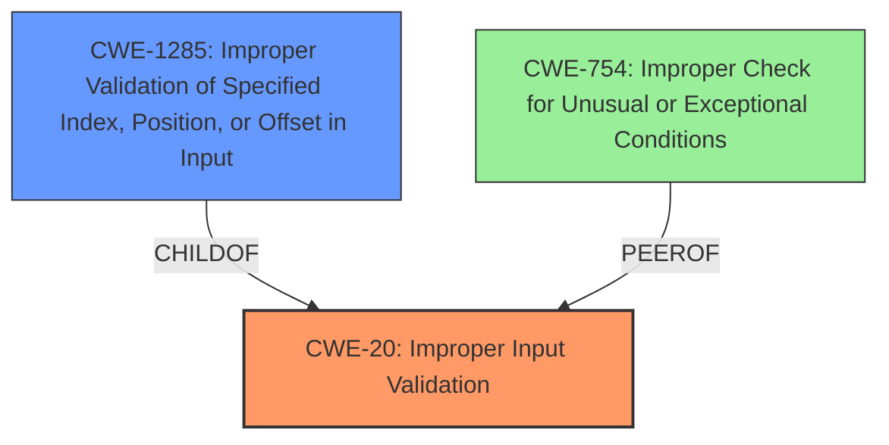

# Analysis Report for CVE-2022-20587

# Vulnerability Analysis Report: CVE-2022-20587

## Description


## Analysis (with Relationship Data)

# Summary
| CWE ID | CWE Name | Confidence | CWE Abstraction Level | CWE Vulnerability Mapping Label | CWE-Vulnerability Mapping Notes |
|---|---|---|---|---|---|
| CWE-20 ([CWE-20: Improper Input Validation](https://cwe.mitre.org/data/definitions/20.html)) | Improper Input Validation | 0.9 | Class | Discouraged | The vulnerability description explicitly states "**improper input validation**" as the root cause. Though discouraged, it is the most appropriate high level classification.|
| CWE-1285 ([CWE-1285: Improper Validation of Specified Index, Position, or Offset in Input](https://cwe.mitre.org/data/definitions/1285.html)) | Improper Validation of Specified Index, Position, or Offset in Input | 0.7 | Base | Allowed |  A more specific form of input validation related to indices, positions, or offsets. Considered as a secondary candidate due to its relevance in resource access contexts. |
| CWE-754 ([CWE-754: Improper Check for Unusual or Exceptional Conditions](https://cwe.mitre.org/data/definitions/754.html)) | Improper Check for Unusual or Exceptional Conditions | 0.5 | Class | Allowed-with-Review | Considered as tertiary candidate because **improper input validation** can be associated with an improper check for unusual conditions.|

## Evidence and Confidence

*   **Confidence Score:** 0.7
*   **Evidence Strength:** MEDIUM

## Relationship Analysis
The primary weakness, CWE-20 ([CWE-20: Improper Input Validation](https://cwe.mitre.org/data/definitions/20.html)), is a class-level CWE. CWE-1285 ([CWE-1285: Improper Validation of Specified Index, Position, or Offset in Input](https://cwe.mitre.org/data/definitions/1285.html)) is a base-level CWE and a child of CWE-20 ([CWE-20: Improper Input Validation](https://cwe.mitre.org/data/definitions/20.html)). CWE-754 ([CWE-754: Improper Check for Unusual or Exceptional Conditions](https://cwe.mitre.org/data/definitions/754.html)) is a Class level of abstraction and is considered a tertiary candidate.
The child relationship between CWE-1285 ([CWE-1285: Improper Validation of Specified Index, Position, or Offset in Input](https://cwe.mitre.org/data/definitions/1285.html)) and CWE-20 ([CWE-20: Improper Input Validation](https://cwe.mitre.org/data/definitions/20.html)) suggests that the vulnerability could be a specific instance of improper input validation related to indices or offsets, but that is not explicitly stated.



## Vulnerability Chain
The vulnerability chain starts with **improper input validation** (CWE-20 ([CWE-20: Improper Input Validation](https://cwe.mitre.org/data/definitions/20.html))) which leads to a potential Elevation of Privilege (EoP). The specific mechanism that transforms the **improper input validation** into EoP is not specified, so there are missing links.

## Summary of Analysis
The initial analysis identified the **improper input validation** as the primary root cause. The vulnerability description explicitly mentions this weakness.
The selection of CWE-20 ([CWE-20: Improper Input Validation](https://cwe.mitre.org/data/definitions/20.html)) is primarily based on the phrase "**improper input validation**" in the vulnerability description. While CWE-20 ([CWE-20: Improper Input Validation](https://cwe.mitre.org/data/definitions/20.html)) is discouraged, it is the most appropriate based on the information provided because the vulnerability description explicitly mentions "**improper input validation**" and there is no further information to select a more specific CWE.
The analysis considered CWE-1285 ([CWE-1285: Improper Validation of Specified Index, Position, or Offset in Input](https://cwe.mitre.org/data/definitions/1285.html)) as a secondary candidate because it is a child of CWE-20 ([CWE-20: Improper Input Validation](https://cwe.mitre.org/data/definitions/20.html)) and deals with validation of indices and offsets, which could be relevant in the context of the "ppmp_validate_wsm" function in "drm_fw.c." However, without more information it is not possible to confirm whether this is the case.
The analysis considered CWE-754 ([CWE-754: Improper Check for Unusual or Exceptional Conditions](https://cwe.mitre.org/data/definitions/754.html)) as a tertiary candidate because **improper input validation** can be associated with an improper check for unusual conditions.

The selected CWEs are at the appropriate level of specificity given the available information. While CWE-20 ([CWE-20: Improper Input Validation](https://cwe.mitre.org/data/definitions/20.html)) is a class-level CWE, the lack of specific details prevents a more granular selection.

Relevant CWE Information:
```
## Vulnerability Description
In ppmp_validate_wsm of drm_fw.c, there is a possible EoP due to **improper input validation**. This could lead to local escalation of privilege with no additional execution privileges needed. User interaction is not needed for exploitation.Product AndroidVersions Android kernelAndroid ID A-238720411References N/A

### Vulnerability Description Key Phrases
- **rootcause:** **improper input validation**
- **impact:** local escalation of privilege
- **product:** Android
- **version:** Android kernel
- **component:** ppmp_validate_wsm of drm_fw.c
```


## CWE Relationship Analysis

Current CWEs represent these abstraction levels: .


### Vulnerability Chain Analysis

**Chain starting from CWE-754:**
- 754 (Improper Check for Unusual or Exceptional Conditions) - ROOT


**Chain starting from CWE-20:**
- 20 (Improper Input Validation) - ROOT


### CWE Relationship Diagram

```mermaid
graph TD
    classDef primary fill:#f96,stroke:#333,stroke-width:2px
    classDef secondary fill:#69f,stroke:#333
    classDef tertiary fill:#9e9,stroke:#333
```


*Report generated on 2025-03-31 00:18:52*
